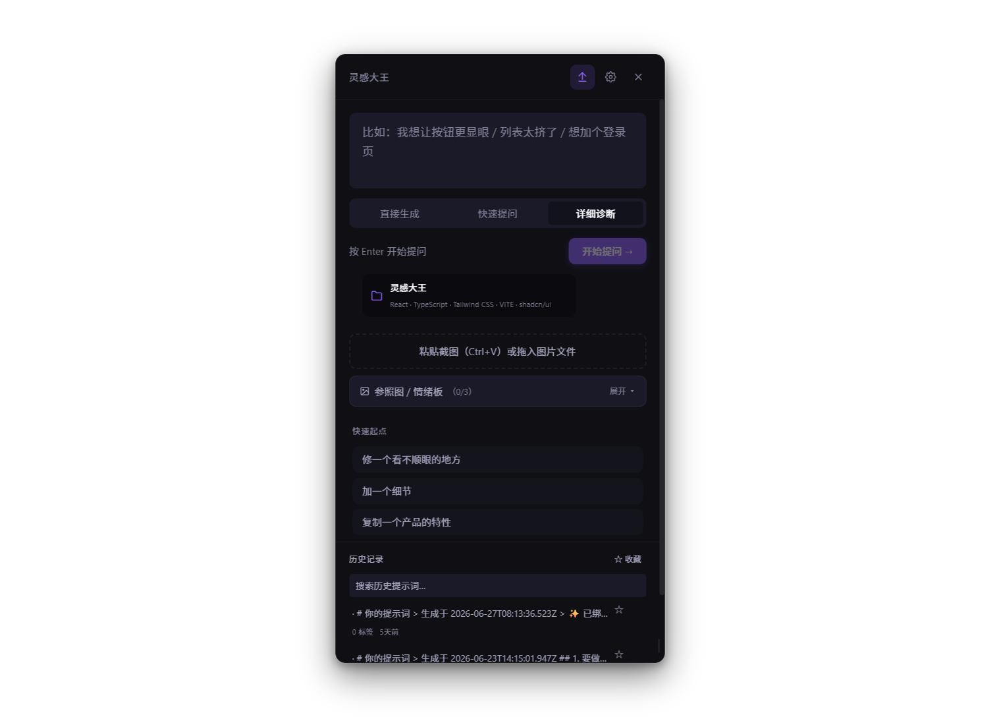
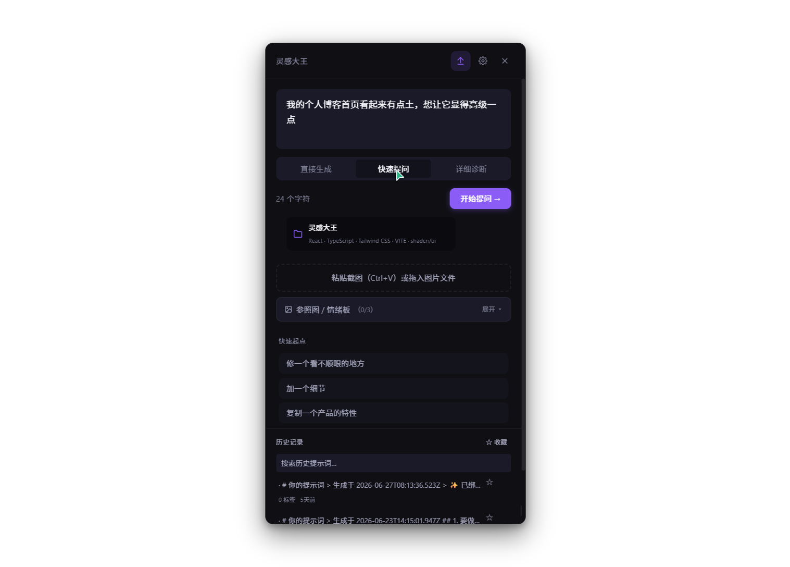
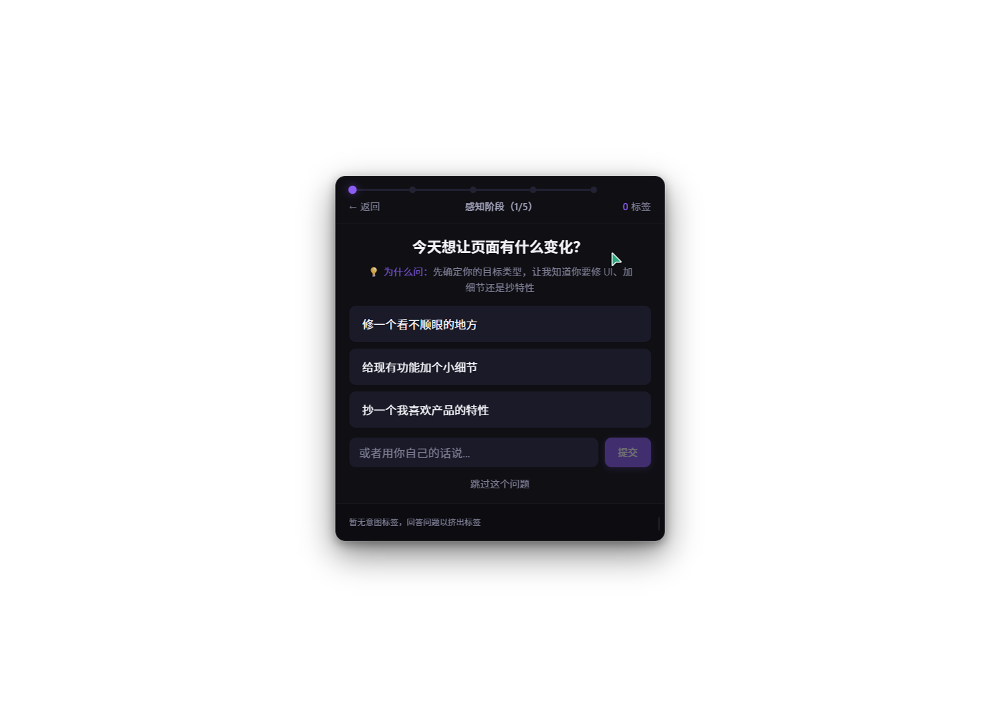
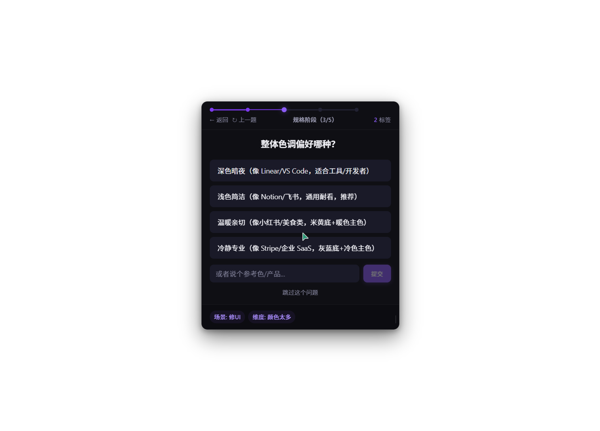
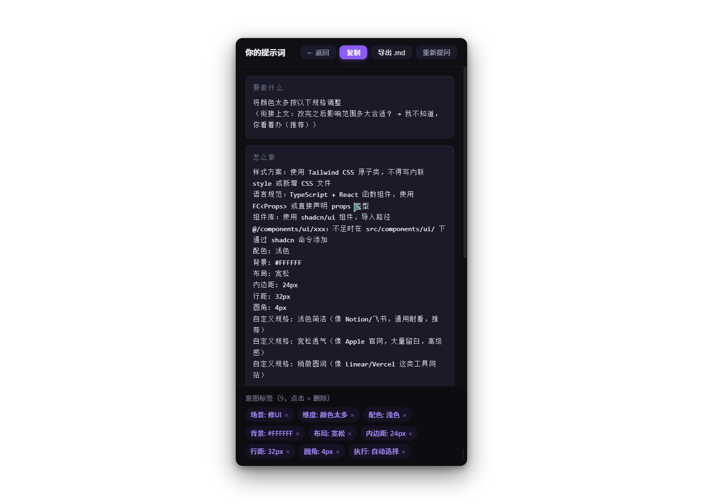

【学习工作赛道】灵感大王：Vibe Coding 时代的「反向审问」提示词助手——把模糊灵感精准挤压成 AI 能听懂的指令

参赛赛道：学习工作 / AI 开发工具
附加赛题：无
作品形态：桌面悬浮窗工具（Web Demo 可直接体验）
体验地址：http://localhost:5173/ （开发中版本）/ 双击 `linggandawang-demo.html` 离线体验
创作者：个人开发者
参赛日期：2026年7月

---

【配图方案 1：封面图】

---

## 一、Demo 简介

### 1.1 作品是什么

灵感大王是一款面向 Vibe Coding 时代开发者的「反向审问」提示词助手。它不是又一个 AI 聊天机器人，也不是提示词模板库——它是一个常驻桌面的悬浮窗工具，核心机制是**先问后答**：当你输入一句模糊的需求（如"这个按钮太丑了""页面看起来很挤"），它不会急着生成提示词，而是通过结构化的多轮提问，一层层把你脑中说不清的「感觉」挤压成精准、可执行的四段式指令（动作 / 规格 / 约束 / 验证），然后直接复制给 Cursor、Trae、Windsurf 等任意 AI 编程助手使用。

灵感大王的命名来源于西游记中孙悟空的称号——它不是替你写代码的师傅，而是在你灵感卡住时，帮你「大闹天宫」打破僵局的那个催化剂。它回答一个核心问题：**当开发者脑中只有模糊的「感觉」而没有精确的「描述」时，如何让 AI 真正理解意图，而不是反复在错误方向上浪费 tokens？**

传统提示词工具的思路是「教你怎么写提示词」，而灵感大王的思路是「替你把话说清楚」。它不要求你先学会设计术语、间距像素、色彩理论——你只需要说感觉，它来帮你翻译成 AI 能执行的工程语言。

### 1.2 面向谁

灵感大王面向三类真实用户：

- **Vibe Coding 新人**：刚接触 AI 辅助编程，对前端设计术语（如内边距、圆角半径、字重层级）不熟悉，只能说"感觉不对""太土了""不够高级"
- **独立开发者与全栈工程师**：需要频繁与 AI 协作写代码，但经常因为提示词不够精确导致 AI 反复改不对，浪费大量时间在来回纠正上
- **产品经理与非设计背景创业者**：对视觉有审美判断但缺乏设计表达能力，无法把"想要高级感""要像 Linear 那种感觉"转化为 AI 可执行的规格

这三类用户有一个共同痛点：**他们不是没有想法，而是无法把想法精确地「说」给 AI 听。**

### 1.3 主要功能

灵感大王包含六大核心功能模块：

| 功能模块 | 核心能力 | 解决痛点 |
|---------|---------|---------|
| 三档提问模式 | 直接生成 / 快速提问（7题）/ 详细诊断（31题），按需选择深度 | 轻量需求不想被问20个问题，复杂需求又需要充分对齐 |
| 结构化反向提问 | 五大阶段（感知→命名→规格→执行→验证）智能选题，4维归一化评分算法 | 不知道该描述什么，AI 问到点子上才答得出来 |
| 四段式提示词生成 | 自动输出「动作/规格/约束/验证」结构，可直接复制给任意 AI 编程工具 | 写出来的提示词 AI 看不懂、执行偏 |
| 截图视觉诊断 | 拖入截图即可识别 UI 问题，支持图片提示词拆解（需视觉模型） | 看到别人的好设计却说不出哪里好 |
| 项目上下文感知 | 自动扫描项目技术栈（React/Vue/Tailwind等），生成适配项目的提示词 | AI 总是用错技术栈、不符合项目规范 |
| 历史记录与收藏 | SQLite 本地存储，搜索历史提示词，收藏常用模板 | 好提示词用完就丢，下次还得重新想 |

【配图方案 2：产品功能总览图】

上图：灵感大王主界面，输入需求后选择「快速提问」模式

---

## 二、痛点与需求分析

### 2.1 Vibe Coding 的「表达鸿沟」

2024 年以来，AI 编程工具（Cursor、Trae、Windsurf、GitHub Copilot）的普及催生了一种全新的编程范式——Vibe Coding：开发者不再逐行写代码，而是通过自然语言描述意图，让 AI 生成代码。Andrej Karpathy 在 2025 年初预言"未来 80% 的代码将由 AI 编写"，这一预言正在快速成为现实。

然而，一个被严重忽视的问题随之浮现：**大多数人并不会「说」代码。**

当你对 AI 说"这个页面太挤了"，AI 不知道：
- 你指的是哪个区域的间距？
- "不挤"的标准是什么——内边距从 8px 调到 16px 还是 24px？
- 是整体留白不足还是某个组件太紧凑？
- 要不要同步调整字号和行距？

于是 AI 只能猜测——一次改内边距、一次调字号、一次换布局，5-6 轮对话下来，token 花了不少，结果还是不对。开发者从「写代码」变成了「纠正 AI 的错误」，效率反而降低了。

### 2.2 现有解决方案的不足

市面上的提示词工具普遍存在三个问题：

**问题一：模板化，不对话。** 大多数工具提供的是静态模板（如"你是一个资深前端工程师..."），不会根据用户的具体需求动态追问。但用户的需求千差万别，一套模板不可能覆盖所有场景。

**问题二：要求用户先学会「说术语」。** 设计系统类提示词要求用户理解 8px 栅格、4px 圆角、H1-H4 层级——但如果用户已经知道这些，就不需要工具了。

**问题三：不理解项目上下文。** 通用提示词不知道你的项目用的是 React 还是 Vue、Tailwind 还是 CSS Modules、shadcn/ui 还是 Ant Design，生成的指令经常与项目规范冲突。

### 2.3 「反向审问」机制为什么有效

灵感大王的核心洞察来自一个简单的类比：**好的产品经理不会一次就把需求说完美，而是需要好的工程师反复追问。**

当产品经理说"这个按钮要更显眼"，优秀的工程师不会直接改——他会问：
- "显眼是指变大、变色、还是加动效？"（感知→规格）
- "只是这个按钮，还是同类按钮都要改？"（执行→影响范围）
- "改完之后怎么判断效果？"（验证）

灵感大王扮演的就是这个「会追问的工程师」角色。它不是替你做决定，而是通过结构化提问，帮你把脑中模糊的直觉一步步逼成明确的决策。

【配图方案 3：用户故事场景图】

（在此插入一张对比图：左边是传统方式——用户输入"按钮太丑了"→AI 生成 5 次都不对→用户崩溃；右边是灵感大王方式——用户输入"按钮太丑了"→3 轮提问→生成精准提示词→一次到位）

---

## 三、Demo 创作思路

### 3.1 灵感来源

灵感大王的灵感来自我自己用 AI 写前端时的真实挫败感。

有一次，我想让 AI 帮我调整一个卡片组件的样式。我输入："这个卡片看起来有点平，想要一点层次感。" AI 第一次加了个阴影，太重了；第二次改成边框，又太轻了；第三次调了背景色，还是不对。来回折腾了七八次，最后我放弃了，自己手动写 CSS——因为我发现，与其反复跟 AI 描述"我要的那种层次感"，不如直接写 `box-shadow: 0 1px 3px rgba(0,0,0,0.08)` 更快。

但这让我思考：**如果 AI 能在我说出"想要层次感"之后，先反问我几个问题呢？**

比如：
- "层次感是指阴影还是边框还是色彩对比？"
- "想要轻微悬浮感还是明显的投影深度？"
- "只改这个卡片还是所有卡片统一风格？"

如果 AI 先问这三个问题，我只需要点选答案，就能得到一个精确的提示词——不需要我知道 `box-shadow` 的参数怎么写，也不需要反复试错。

这个想法就是灵感大王的起点：**不是让用户学会对 AI 说术语，而是让 AI 学会用普通人能回答的方式追问。**

### 3.2 想解决的问题

灵感大王聚焦解决五个核心问题：

**问题一：把「说不清楚」变成「选得明白」**
用户不需要提前知道设计术语，只需要回答选择题——"边角喜欢圆润还是方方正正？""密密麻麻还是宽松透气？"像有人在对话中引导你一样，一步步把模糊的感觉明确化。

**问题二：三档深度，避免过度提问**
不是所有需求都需要 31 个问题。"帮我把按钮改大一点"这种简单需求直接生成即可；"重新设计首页风格"才需要详细诊断。三档模式让用户自己决定要花多少时间对齐。

**问题三：项目上下文感知，不说外行话**
扫描项目后自动识别技术栈，生成提示词时自动注入项目规范——用 Tailwind 就输出 class 调整，用 styled-components 就输出 CSS-in-JS，不会出现让 React 项目用 Vue 语法的低级错误。

**问题四：四段式结构，结果可直接用**
生成的提示词固定分为「要做什么（动作）/ 具体改成什么样（规格）/ 不要改什么（约束）/ 怎么验证改对了（验证）」四段，AI 拿到就能执行，不用二次整理。

**问题五：本地优先，隐私安全**
所有数据（API Key、历史记录、项目扫描结果）都存在本地 SQLite 数据库和 Windows Credential Manager 中，不上传任何服务器，截图数据仅存内存不写磁盘。

### 3.3 为什么做这个方向

选择这个方向基于四个判断：

**判断一：Vibe Coding 是不可逆的趋势**
AI 编程工具的渗透率正在指数级增长。2026 年，越来越多的人——不仅仅是职业程序员——开始用 AI 写代码。但「提示词能力」成为了新的门槛，这个门槛需要工具来降低。

**判断二：「反向提问」是被忽视的范式**
市场上几乎所有提示词工具都在做「模板」和「自动生成」，没有人认真做「智能追问」。但对话式需求对齐才是人类沟通的自然方式——你不会一次性把所有需求说给同事听，而是在问答中逐步明确。

**判断三：工程化实现可验证**
灵感大王不是一个概念产品——它的核心机制（问题库、选题算法、LLM 意图分析、提示词生成）全部可以工程化实现，不需要依赖尚未成熟的技术。

**判断四：个人开发者的真实需求**
作为一个独立开发者，我自己每天都在用这个工具。它不是为比赛而做的概念作品，而是从我自己的工作流中长出来的、真实解决问题的工具。

---

## 四、Demo 体验地址

### 4.1 在线体验

灵感大王 Web Demo 可通过以下方式体验：

- **离线单文件**：双击 `deliverables/linggandawang-demo.html` 即可在浏览器中打开，无需部署、无需联网、无需安装
- **开发模式**：在项目目录运行 `npm run dev` 后访问 http://localhost:5173/ （需配置 LLM API Key 才能使用 AI 功能，无 Key 时可体验规则引擎模式）

### 4.2 体验指引

为了让评审老师快速理解产品价值，建议按以下路径体验：

**路径一：直接生成模式（1分钟）**
1. 打开 Demo，默认展开输入卡片
2. 选择「直接生成」模式
3. 在输入框中输入："帮我把按钮改得更显眼一点"
4. 点击「直接生成 →」
5. 查看生成的四段式提示词，点击复制

**路径二：快速提问模式（2分钟）**
1. 选择「快速提问」模式
2. 输入："我的个人博客首页看起来有点土，想让它显得高级一点"
3. 依次回答 7 个核心问题（需求类型、乱在哪、风格方向、间距、圆角、色调、影响范围）
4. 查看最终生成的结构化提示词

**路径三：详细诊断模式（3分钟）**
1. 选择「详细诊断」模式
2. 输入："列表页信息密度太高，看着很累，想重新设计"
3. 体验完整的 31 题诊断流程（可随时点跳过）
4. 观察提示词如何随着回答逐步精确

**路径四：项目上下文感知（2分钟）**
1. 点击右下角技术栈标签区域的项目按钮
2. 在浏览器模式下会自动运行演示扫描
3. 观察识别到的技术栈（React / TypeScript / Tailwind 等）
4. 生成提示词时自动注入项目上下文

【配图方案 4：体验路径流程图】

（在此插入操作流程图：打开 → 选模式 → 输入模糊需求 → 回答问题 → 获得四段式提示词 → 复制给 AI）

---

## 五、TRAE 实践过程

### 5.1 开发工具与模式

灵感大王的开发全程使用 TRAE IDE 完成，主要使用了以下能力：

**TRAE IDE - Builder 模式**
用于核心功能开发。通过自然语言描述功能需求，AI 辅助生成 React 组件、TypeScript 类型定义、Zustand store 等代码。整个开发过程深度依赖 TRAE 的代码补全、错误诊断和快速迭代能力。

**TRAE IDE - Chat 模式**
用于架构设计和问题排查。在设计问题库选题算法、LLM 适配器模式、SQLite 数据层等核心模块时，通过与 AI 多轮对话来理清思路、选择方案。

**TRAE IDE - MCP 浏览器工具**
用于前端调试和全流程 QA 测试。在开发过程中实时在浏览器中验证交互效果，通过 Chrome DevTools MCP 检查 DOM 结构、网络请求、控制台错误。

### 5.2 关键开发步骤

**步骤一：核心引擎与问题库设计（6月17日）**
使用 TRAE IDE 搭建项目骨架，设计五大阶段（perceive→name→spec→execute→verify）31 道问题的 YAML 题库，实现基于标签匹配和触发词组的 Selector 选题算法。

关键技术决策：问题与引擎解耦，所有问题内容存储在 `bank.yaml` 中，引擎负责选题和流程控制，不硬编码任何题目。

**步骤二：Tauri 桌面壳与全局热键（6月18日）**
接入 Tauri 2.0 实现无框透明窗口、全局热键 Alt+Shift+Space 唤起/隐藏、原生窗口拖动。TRAE 辅助完成 Rust 端 Tauri command 注册和前端事件监听。

踩坑记录：Tauri v2 的 `data-tauri-drag-region` 不继承到子元素，需要在每个可拖动区域手动处理 `startDragging()` 调用。

**步骤三：SQLite 本地存储（6月22日）**
接入 `tauri-plugin-sql`，将提示词历史、用户偏好、热键配置从 localStorage 迁移到 SQLite 数据库。TRAE 辅助完成 Rust 端迁移命令和前端异步适配。

**步骤四：问题库用户化改写（6月24日）**
用户反馈"问题太技术化看不懂"后，将 31 道题的选项全部改写为口语化描述加参照物（如"方方正正，像 Apple 官网"代替"锐利 0px"），技术参数隐藏在 tags 中不影响用户阅读。

这是 TRAE 辅助完成的大规模重构——批量改写 YAML 文件中的 label、text、placeholder，同时保持 tags 的技术准确性。

**步骤五：LLM 接入层与三档模式（6月24-25日）**
设计统一 LLM 适配器接口（支持 OpenAI/DeepSeek/通义等 OpenAI 兼容格式），实现流式 SSE 响应、API Key 安全存储（keyring crate → Windows Credential Manager）。在此基础上实现三档提问模式（直接生成/快速提问/详细诊断）。

**步骤六：智能化提问升级（6月26日）**
四阶段升级 LLM 智能化：Phase 1 用 LLM 替代关键词提取做意图分析；Phase 2 上下文存储回读闭环（recent_qa 从 3 条扩到 20 条）；Phase 3 动态追问（高歧义/连续自定义/阶段切换跳过时自动插入追问题）；Phase 4 评分归一化（4 维加权评分替代简单累加）。

【配图方案 5：TRAE 开发过程截图】

（在此插入 3-4 张 TRAE IDE 开发截图：1）TRAE Chat 辅助架构设计的对话截图；2）TRAE Builder 生成组件代码的截图；3）浏览器 MCP 调试界面截图；4）Git 提交记录截图）

### 5.3 开发数据

- 开发周期：6月17日 - 7月2日（16天）
- 代码量：前端 47+ 文件，约 8000 行 TypeScript/React；Rust 端约 800 行
- 问题库：31 道核心题 + 动态追问题，覆盖 UI 调整、功能新增、重构、Bug 修复等场景
- 测试：31 个单元测试用例全通过（vitest）
- 打包：NSIS 安装包 3.3MB，无需额外运行时依赖

---

## 六、核心功能详解

### 6.1 三档提问模式

灵感大王最明显的交互入口是输入框上方的三档分段选择器。这不是简单的"简单/中等/复杂"分类——每一档背后是不同的引擎行为：

**直接生成模式**：不提问，仅基于输入文本做关键词提取和意图识别，直接套用模板生成提示词。适用场景：需求非常明确（如"把按钮颜色改成蓝色"）、只是需要强化措辞。

**快速提问模式**：从 31 题中精选 7 道核心题（需求类型/问题类型/风格方向/间距/圆角/色调/影响范围），覆盖最影响提示词质量的关键决策点。适用场景：有大致方向但需要确认核心规格。

**详细诊断模式**：完整 31 题流程，五大阶段逐步深入。适用场景：方向不确定、需要深度诊断、高风险改动（如重构整个页面）。

三档模式的设计哲学是：**让用户决定投入多少时间来对齐需求，而不是一刀切。**

【配图方案 6：三档模式截图】

上图：进入提问流程后，第一题询问需求类型（修UI/加细节/抄特性），每个问题附带「为什么问」的说明

上图：风格方向题，选项全部用参照物描述（像 Linear/像 Notion/像小红书），技术细节隐藏在背后

### 6.2 结构化反向提问引擎

提问引擎是灵感大王的核心，采用四层架构：

1. **意图理解层**：通过 LLM 分析用户输入（或关键词提取兜底），输出场景、痛点、维度、歧义度等结构化意图
2. **选题评分层**：4 维归一化评分（tagMatch 40% + cluster 30% + llmConfidence 20% + orderBonus 10%），动态选择当前最该问的问题
3. **流程控制层**：管理五大阶段（perceive→name→spec→execute→verify）的流转，支持跳转、跳过、撤回、动态追问插入
4. **动态追问层**：三种触发条件（高歧义度/连续自定义回答/阶段切换时跳过）触发 LLM 生成个性化追问题

所有问题的设计遵循一个原则：**用用户能回答的方式提问，用技术精确的语言输出。** 比如问"密密麻麻还是宽松透气"而不是"内边距 8px 还是 24px"，但用户选择后背后映射到精确的像素值写入提示词。

### 6.3 四段式提示词生成

生成的提示词固定分为四段，这四段结构来自大量真实 AI 编程场景的总结：

1. **要做什么（动作段）**：清晰描述需要执行的操作，如"调整卡片组件的阴影样式"
2. **具体改成什么样（规格段）**：精确的视觉/交互规格，包含具体数值和参照物，如"阴影改为 0 2px 8px rgba(0,0,0,0.06)，类似 Linear 卡片的轻微悬浮感"
3. **不要改什么（约束段）**：明确边界，防止 AI 过度修改，如"只改卡片容器，不影响内部文字和按钮样式"
4. **怎么验证改对了（验证段）**：给出验收标准，如"改完后卡片在浅色/深色模式下都自然，不显得突兀"

这个结构的好处是：AI 拿到就知道「做什么、怎么做、别碰什么、怎么算对」，极大减少歧义和过度发挥。

【配图方案 7：四段式提示词结果截图】

上图：快速提问完成后生成的结构化提示词，包含「要做什么」和「怎么做」（动作+规格），底部显示已提取的意图标签，可一键复制给任意 AI 编程工具

### 6.4 截图视觉诊断与图片提示词拆解

在输入区下方可以拖入参考截图：

- **截图诊断**：拖入当前页面截图，工具通过 Canvas 分析 UI 布局问题（如间距不一致、对比度不足），给出诊断建议
- **图片提示词拆解**：拖入参考图片（如 Dribbble/Behance 上的好设计），通过多模态 LLM（视觉模型）分析图片内容，拆解出结构化提示词（场景/主体/风格/色彩/构图/氛围），生成可直接用于 Midjourney/Stable Diffusion 的英文提示词，或反向提取 UI 设计风格参数

【配图方案 8：图片拆解功能截图】

（在此插入图片提示词拆解结果的截图）

### 6.5 项目上下文感知

点击右下角技术栈标签可以启动项目扫描。在 Tauri 桌面端，工具会递归扫描项目目录：
- 分析 `package.json` 识别依赖（React/Vue/Next.js/Tailwind/shadcn/ui 等）
- 解析 `tsconfig.json` 理解路径别名
- 读取目录结构了解项目组织方式

在浏览器模式下自动降级为演示扫描。扫描结果会自动注入到提示词开头的「0. 项目上下文」段，确保 AI 用正确的技术栈和项目规范来执行任务。

### 6.6 隐私安全基线

灵感大王从第一天起就把隐私安全作为 P0 级需求：

- **API Key 安全存储**：通过 `keyring` crate 存储在 Windows Credential Manager 中，不写明文配置文件
- **截图数据不写磁盘**：截图诊断的图片数据仅存内存，使用后立即释放
- **敏感文件黑名单**：项目扫描时自动跳过 `.env`、`*.pem`、`*.key` 等敏感文件
- **本地数据 SQLite 存储**：历史记录和偏好设置存本地数据库，不上传任何服务器
- **首次启动隐私说明**：明确告知用户数据处理方式，用户确认后才开始使用

---

## 七、总结

灵感大王不是一个「大而全」的 AI 平台，而是一个「小而精」的开发者工具。它专注于解决一个具体、高频、真实的痛点：**Vibe Coding 时，模糊意图无法精确传达给 AI。**

通过「反向审问」机制——结构化提问 + 三档深度 + 项目感知 + 四段输出——灵感大王让不擅长写提示词的开发者也能精准驱动 AI，把 Vibe Coding 从「碰运气」变成「可复用的工程能力」。

这个工具是我作为独立开发者在真实工作流中长出来的。每一个功能、每一道问题、每一个交互细节，都来自我自己用 AI 写代码时的真实挫败感和解决这些挫败感后的真实爽感。我希望它也能帮到其他在 Vibe Coding 中挣扎的开发者——因为好的工具不是替你做决定，而是帮你把想法说清楚。
