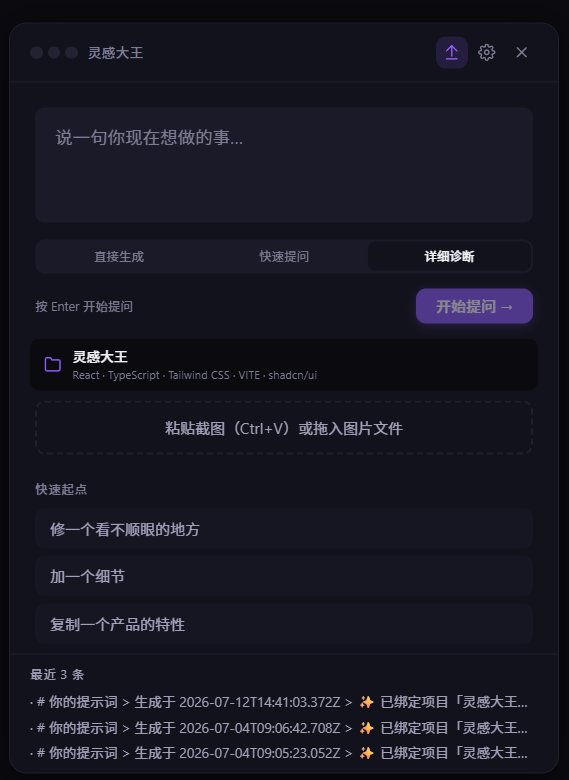
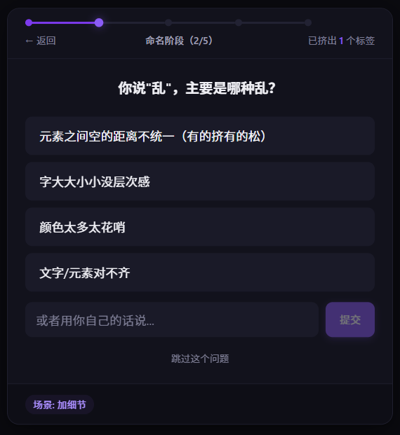
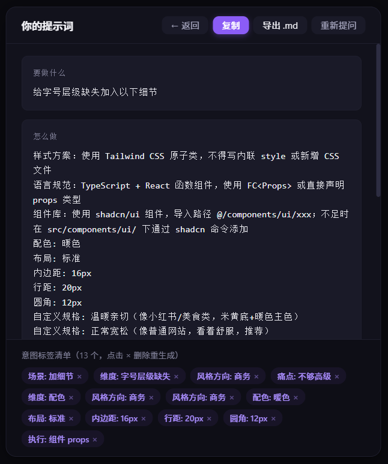
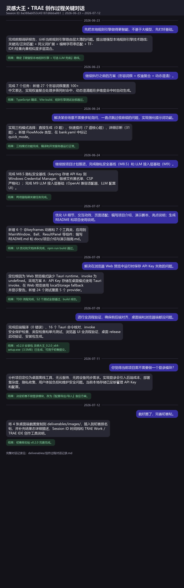

【学习工作赛道】灵感大王 · Vibe Coding 意图传达辅助工具

> 📦 **附件清单（发布前必读）**
>
> 发布本帖前，请先把以下资源上传到社区附件/图床，并替换正文中的本地路径为实际上传后的链接：
>
> | 资源类型 | 文件名 | 所在路径 | 上传方式 | 插入位置 |
> |---|---|---|---|---|
> | 截图 1 | `desktop-ball.png` | `deliverables/images/` | 社区图片/附件 | 第 1 节 界面展示 |
> | 截图 2 | `desktop-main.png` | `deliverables/images/` | 社区图片/附件 | 第 1 节 + 第 4 节 |
> | 截图 3 | `desktop-question.png` | `deliverables/images/` | 社区图片/附件 | 第 1 节 + 第 4 节 |
> | 截图 4 | `desktop-result.png` | `deliverables/images/` | 社区图片/附件 | 第 1 节 + 第 4 节 |
> | 截图 5 | `创作过程对话记录.png` | `deliverables/images/` | 社区图片/附件 | 第 4 节 |
> | 体验文件 | `灵感大王完整体验包_v0.2.0.zip` | `deliverables/` | 直接上传（zip 已在白名单） | 第 3 节 |
| 安装包（可选） | `灵感大王_0.2.0_x64-setup.exe` | `src-tauri/target/release/bundle/nsis/` | 直接上传或网盘链接 | 第 3 节 |
>
> 如果社区不支持 Markdown 本地相对路径，请把 `images/xxx.png` 替换为实际上传后的图片 URL。

## 0. 先和大家打个招呼吧 👋

**我是谁**：

一名非专业兴趣爱好者，平时本职工作之外喜欢折腾小工具。没有专业设计背景，也没有后端团队，所有代码都是我一个人下班后断断续续和 TRAE 一起磨出来的。

**我是怎么用 TRAE 把灵感大王做出来的**：

整个项目从 0 到 v0.2.0 的桌面安装包，全程在 TRAE Work / TRAE IDE 里通过 AI 对话完成。我的习惯是先把需求用大白话讲给 TRAE 听，比如"我想让灵感大王脱离浏览器、真正以桌面悬浮窗运行"，然后让它帮我拆任务、选方案、写代码。

最让我觉得"原来这么简单"的时刻，是 Tauri 打包那一段。原本以为 Windows SDK 兼容性、NSIS 安装包、图标资源这些问题会卡很久，结果在 TRAE 里一步步核对报错、改配置，最后直接生成了一个 3.3MB 的安装包，双击就能装。

另一个让我跨过坎的，是桌面窗口的黑边和圆角问题。透明窗口 + WebView2 的阴影渲染在 Windows 上出了各种幺蛾子，自己查文档可能要耗一整天，但在 TRAE 里把现象描述清楚，它就能定位到 `transparent` 和 `shadow` 的交互问题，给出"双层卡片 + overflow 裁切"的方案，最后修好了。

所以这个项目对我来说，不只是一个工具，更像是一次"普通人靠 AI 把模糊想法变成可安装软件"的完整实验。

## 1. Demo 简介

**是什么**：

灵感大王是一款常驻桌面的悬浮窗工具（v0.2.0 支持桌面端 + Web Demo 双模式），通过结构化反向提问 + 评价词典 + 截图视觉诊断 + LLM 增强，把用户模糊的"感觉"转化为可执行的结构化提示词。

**面向谁**：

- 刚接触 Vibe Coding 的前端/全栈新人
- 需要频繁与 AI 协作的独立开发者、学生、产品经理
- 对视觉有感觉但缺乏设计术语表达的非设计人员

**主要功能**：

- **三档提问模式**：直接生成（0 题 < 1s）/ 快速提问（7 题 1-2min）/ 详细诊断（31 题 5-8min），按需求紧急程度自由选择。
- **评价词典**：把"太挤/太丑/不够高级"等模糊评价自动翻译为可量化规格（间距 16px、WCAG AA 4.5:1 等）。
- **截图视觉诊断**：Canvas 像素分析（对比度/对齐/间距/字号），数据不离开内存。
- **项目感知**：扫描项目文件结构和依赖，自动把技术栈上下文注入提示词。
- **四段式提示词输出**：要做什么 / 怎么做 / 约束条件 / 验证标准，一键复制给任意 AI 工具使用。

**界面展示**：

> 📎 **图片上传说明**：本小节需要插入 4 张桌面端截图。请先把 `deliverables/images/` 目录下的 4 个 PNG 文件上传到社区附件/图床，再按顺序插入到下方对应位置。如果社区不支持本地相对路径，请使用上传后的图片链接替换 `images/xxx.png`。

---

> 📎 **插入图片 1/4**：`images/desktop-ball.png`（桌面悬浮球）


*▲ 桌面悬浮球：常驻桌面，左键展开 / 右键设置 / Alt+Shift+Space 全局唤起。*

---

> 📎 **插入图片 2/4**：`images/desktop-main.png`（主界面）



*▲ 主界面：三档模式选择 + 项目感知 + 截图粘贴区*

---

> 📎 **插入图片 3/4**：`images/desktop-question.png`（提问态）



*▲ 提问态：把"乱""不够高级"这类模糊评价拆解成具体选择题*

---

> 📎 **插入图片 4/4**：`images/desktop-result.png`（结果态）



*▲ 结果态：输出四段式提示词，一键复制给任意 AI 工具使用*

**一个具体输出示例**：

以截图中的示例为例，当用户输入"给字号层级缺失加入细节"后，灵感大王会在结果页输出：

- **要做什么**：明确需求目标——给字号层级缺失加入细节。
- **怎么做**：给出具体可执行方案，例如"样式方案：使用 Tailwind CSS 原子类，不得写内联 style 或新增 CSS 文件""语言规范：TypeScript + React 函数组件"等。
- **约束条件**：细化量化规格，如"内边距：16px""行距：20px""圆角：12px""自定义规格：温暖亲切（像小红书/美食类，米黄底+暖色主色）"。
- **验证标准**：输出可检查项，如"意图标签清单（13 个，点击 × 删除重生成）"，方便用户确认每个维度是否被正确捕获。

结果页顶部提供"复制""导出 .md""重新提问"三个操作按钮；中部按四段式折叠展示；底部以标签云形式展示从问题回答中提炼出的意图标签，用户可以点击 × 删除不想要的标签，系统将基于剩余标签重新生成提示词。

## 2. Demo 创作思路

**灵感来源**：

我自己在用 AI 辅助写前端时，反复遇到"我觉得这里太挤""看起来不够高级"这类模糊输入被 AI 随意发挥的情况。脑子里明明有"感觉"，嘴里却只能说出一些泛泛的词，结果 AI 改来改去还是不对味。

**想解决的问题**：

Vibe Coding 新人常常"有感觉但说不清"——想让 AI 改 UI 却不知道该怎么描述，结果 AI 润色出来的提示词偏离原意，Agent 改半天还是不对。灵感大王要做的是把这份"感觉不对"反向挤压成精准、可执行的结构化指令，减少反复返工。

**为什么做这个方向**：

我判断这个痛点在 AI 辅助编程越来越普及之后会更明显。未来不是"会不会用 AI"，而是"能不能把自己的意图准确传递给 AI"。所以我没有做又一个代码生成工具，而是做了一款"意图翻译器"——先帮用户把需求想清楚、说明白，再把结果交给任何 AI 去执行。

取舍上，初赛版本聚焦前端 UI 调优场景，把体验链路做完整；后端/全栈场景的适配留到复赛再扩展。

## 3. Demo 体验地址

> 🔗 **附件上传说明**：本小节提到的体验文件需要作为附件上传到社区。请按下方要求打包/上传，并在正文里插入下载链接。

**方式一：Web Demo（初赛作品附件，推荐）**

- **文件说明**：已作为初赛作品附件提交，评委可直接下载体验。
- **本地文件位置**：`deliverables/灵感大王完整体验包_v0.2.0.zip`
- **上传要求**：社区附件白名单支持 `.zip`，直接上传即可，无需额外压缩。
- **使用方式**：下载解压后，无需部署、无需联网，双击 `index.html` 即可在浏览器中打开。
- **包含功能**：完整 v0.2.0 前端功能，包括三档提问模式（直接生成 / 快速 7 题 / 详细 31 题）、五阶段反向提问、评价词典、意图标签云、四段式提示词输出、提示词历史。
- **与桌面端区别**：Web Demo 无法调用 Tauri 原生能力（全局热键、SQLite、截图诊断、文件夹选择），如需体验完整功能请下载桌面安装包。

打开后默认居中展示「灵感大王」输入卡片，可输入如：

> "我的个人博客首页看起来有点土，想让它显得高级一点，但不要太花哨。"

体验从模糊需求到四段式提示词的完整挤压过程。

**方式二：桌面端安装包（可选附件）**

- **本地文件位置**：`src-tauri/target/release/bundle/nsis/灵感大王_0.2.0_x64-setup.exe`
- **上传要求**：如社区支持 `.exe` 附件，可直接上传；否则建议上传到网盘后在此处替换为公开下载链接。
- **体积**：Tauri 2.0 打包，NSIS 安装包仅 3.3MB
- **系统要求**：Windows 10 1803+ / Windows 11（自带 WebView2）
- **唤起方式**：安装后按全局热键 `Alt+Shift+Space` 唤起/隐藏悬浮窗

## 4. TRAE 实践过程

**开发流程**：

项目从想法到 v0.2.0 的完整流程，全部在 TRAE Work / TRAE IDE 中通过 AI 对话推进：

1. **需求梳理**（TRAE Work）：把"感觉驱动提示词"这个模糊想法拆成"反向提问 + 评价词典 + 项目感知"三个模块。
2. **原型开发**（TRAE IDE）：前端用 React + TypeScript + Tailwind 搭建输入/提问/结果三态界面，本地规则引擎负责意图识别。
3. **桌面化**（TRAE IDE）：接入 Tauri 2.0，实现无框悬浮窗、全局热键、截图读取、SQLite 持久化。
4. **能力增强**（TRAE IDE）：接入 LLM 接入层（DeepSeek/OpenAI/通义/小米/自定义）、隐私安全基线、三档提问模式。
5. **打磨打包**（TRAE IDE）：修复桌面窗口黑边/圆角问题，生成 NSIS 安装包，整理初赛材料。

**关键步骤截图**：

> 📎 **图片上传说明**：本小节表格中需要再展示 4 张关键截图（可与第 1 节的截图复用，也可单独上传）。请将 `deliverables/images/` 下的对应 PNG 上传到社区附件/图床后，替换表格中的图片链接。

| # | 需上传的图片 | 截图说明 |
|---|---|---|
| 1 | `images/desktop-main.png` | 桌面端主界面：输入卡片 + 项目绑定 + 三档模式 |
| 2 | `images/desktop-question.png` | 提问态：五阶段进度条 + 意图标签 |
| 3 | `images/desktop-result.png` | 结果态：四段式提示词 + 意图标签云 |
| 4 | `images/创作过程对话记录.png` | 从 TRAE 历史对话中提取的关键轮次截图 |

表格中占位引用：

| # | 截图 | 说明 |
|---|---|---|
| 1 |  | 桌面端主界面：输入卡片 + 项目绑定 + 三档模式 |
| 2 |  | 提问态：五阶段进度条 + 意图标签 |
| 3 |  | 结果态：四段式提示词 + 意图标签云 |
| 4 |  | 从 TRAE 历史对话中提取的关键轮次截图 |

**关键任务 Session ID**：

| Session ID | 日期 | 阶段 | 关键产出 |
|-----------|------|------|---------|
| `6a388ab053c45187d6bba061` | 2026-06-23 | **Phase 2 启动 / M8** | Rust 命令补全、桌面悬浮窗、本地规则引擎升级、项目感知 |
| `6a388ab053c45187d6bba061` | 2026-06-24 | **M8.5-M9.1** | 隐私安全基线、问题库白话化改写、UI 美学优化、LLM 接入层、三档提问模式 |
| `6a388ab053c45187d6bba061` | 2026-07-07 | **M9.4-M9.6** | 异常处理/边界校验、6 个 @keyframes 动效系统、文档体系 |
| `6a388ab053c45187d6bba061` | 2026-07-09 | **审查修复 + v0.2.0 打包** | 小米 MiMo 接入、Web 预览 API Key fallback、桌面界面修复、NSIS 安装包 |
| `6a388ab053c45187d6bba061` | 2026-07-11 | **登录模块评估** | 决定不做登录模块、改为配置导出/导入备份方案 |
| `6a388ab053c45187d6bba061` | 2026-07-12 | **初赛帖完善** | 4 张桌面端截图、报名帖编辑、对话记录截图生成 |

**完整创作时间线（06/23 → 07/12）**：

```
06/23  Phase 2/M8  Rust 命令补全 + 桌面悬浮窗 + 本地规则引擎 + 项目感知
06/24  M8.5/M8.6  隐私基线 + 问题库白话化改写
06/24  M9/M9.1    LLM 接入层 + 三档提问模式
06/24  UI 美学     设计 Token 重构 + 视觉升级
07/07  M9.4        异常处理 + 通用 UI 组件
07/07  M9.5        UI 动效系统 (6 个关键帧)
07/07  M9.6        文档体系 (README + 演示指南 + 预研报告)
07/09  审查修复    MiMo 接入 + Web fallback + 桌面界面修复 + v0.2.0 打包
07/11  架构决策    登录模块评估 → 改为本地配置导出/导入
07/12  初赛提交    4 张截图采集 + 报名帖完善 + 对话记录截图
```

**完整证明材料**：

> 📎 **附件上传说明**：以下两个文档为本地 `.md`，**社区不允许上传 `.md`**，已处理为两种可上传形式：
> 1. **HTML 版本（推荐）**：已转为带样式的 `.html` 并打包为 `创作过程证明材料_html.zip`，请上传到社区附件后，把下方链接替换为社区附件 URL；
> 2. **正文嵌入版**：下方直接展开了两份文档的完整内容，评委无需下载即可在帖子里直接阅读。

- **HTML zip 附件**：`deliverables/images/html/创作过程证明材料_html.zip`（含 `创作过程对话记录.html` + `创作过程证明材料.html`，已带样式）
- 原始 Markdown 备份（仅本地留存，不上传）：`deliverables/创作过程对话记录.md`、`deliverables/创作过程证明材料.md`

---

<details>
<summary>📄 展开/折叠：完整创作过程对话记录（11 段关键轮次）</summary>

> 本节内容整理自 TRAE 历史对话 `session_memory_6a388ab053c45187d6bba061.jsonl`，按真实时间线整理。
> 项目 Session ID：`6a388ab053c45187d6bba061`（2026-06-23 ~ 2026-07-12）

### 06/23 Phase 2 启动 — M8 里程碑与桌面窗口

**用户**：查看灵感大王的项目进度，梳理当前状态和优先任务。

**AI**：生成进度报告，当前处于 Phase 2 正式开发阶段，SQLite 已接入，但 Rust 端缺少 5 个命令（load_user_bank / save_user_bank / clear_user_bank / save_window_position / load_window_position）。建议在 lib.rs 中实现并注册。

**结果**：5 个新命令实现并注册完成，M8 里程碑核心功能完成。

---

**用户**：解决悬浮窗问题，让灵感大王脱离浏览器、真正以桌面悬浮窗运行。

**AI**：修改 `tauri.conf.json` 配置（decorations: false / transparent: true / shadow: true），调整 `ExpandedCard.tsx` 实现全卡片可拖动，新增 `useTauriDropFile.ts` 监听拖入事件，在 `lib.rs` 中新增 `read_image_file` 命令处理图片读取。

**结果**：生成新的桌面可执行文件，窗口无标题栏、透明背景、支持拖入图片诊断。

---

**用户**：先把本地规则引擎做得更智能，不基于大模型，先打好基础。

**AI**：完成前期调研报告，分析当前规则引擎路由层太薄的问题，提出增强型本地规则引擎技术路线：关键词/正则匹配 + 同义词扩展 + 模糊字符串匹配 + TF-IDF/轻量向量相似度多层混合，配合有限状态机维护对话状态。

**结果**：完成研究报告，确定"增强型本地规则引擎 + 可选 LLM 兜底"路线。

---

**用户**：继续执行之前的方案（形容词簇 + 权重聚合 + 动态澄清）。

**AI**：完成 7 个任务：新增 27 个形容词簇覆盖 100+ 中文表达，实现权重聚合处理多簇同时命中，动态澄清题在多维度命中时自动生成，保持关键词路由和 v1 调用兼容。

**结果**：TypeScript 编译、Vite build、规则引擎测试全部通过。

---

**用户**：希望灵感大王区别于 WorkBuddy，实现项目同步，突出亮点以参加比赛。

**AI**：对比三种方案，推荐方案 A（项目指纹 + 提示词自适应）作为初赛 MVP，设计项目指纹数据模型（基础信息、技术栈、约定等维度），规划扫描策略。

**结果**：前端核心功能完整落地，包含项目指纹系统、UI 三层呈现组件、提示词注入功能。

### 06/24 M8.6 / M9 / M9.1 — 问题库改写 + UI 优化 + 三档模式

**用户**：对齐前后端，同时解决用户询问修改前端风格时灵感大王提问不着边际的问题。

**AI**：修复 `seedRouter.ts` 中"风格"与"不统一"路由混淆问题，新增独立风格方向选择问题 n-007，补齐前端调用的后端命令（pick_project_folder / scan_project）。

**结果**：风格提问问题修复，前后端项目扫描功能对齐，浏览器实测通过。

---

**用户**：把前端 UI 截图打包一份，用于初赛材料。

**AI**：使用 Chrome headless + puppeteer-core 截取 12 张 PNG（1280×860），包含主界面、输入需求、问题流、结果态等关键状态。

**结果**：生成 `docs/前端UI截图-20260624.zip`（365.9 KB）。

---

**用户**：根据 UI 美学审查与优化建议报告修改前端风格。

**AI**：重构设计 Token 系统（四级表面阶梯、统一紫色三级色彩体系），优化排版与基础样式（Inter 字体、组件类封装），升级 Ball、ExpandedCard、QuestionPanel、ResultPanel 等核心组件视觉效果。

**结果**：前端风格优化完成，开发服务器运行在 http://localhost:5174/。

---

**用户**：继续按项目计划推进，完成隐私安全基线（M8.5）和 LLM 接入层基础（M9）。

**AI**：完成 M8.5 隐私安全基线（PrivacyDialog 弹窗、keyring 存储 API Key 到 Windows Credential Manager、敏感文件黑名单、CSP 严格化）；完成 M9 LLM 接入层基础（LLM 适配器接口、OpenAI 兼容适配器、LLM 配置 UI）。

**结果**：两项里程碑关键任务完成，准备推进 M10 项目扫描器。

---

**用户**：解决某些场景不需要多轮询问、一直点跳过很麻烦的问题，实现强化提示词功能。

**AI**：实现三档模式选择：直接生成（0 题）、快速提问（7 道核心题）、详细诊断（31 题）。新增 `FlowMode` 类型，在 `bank.yaml` 中标记 quick_mode，修改 `Selector.ts`、`QuestionEngine.ts`、`ExpandedCard.tsx` 实现模式过滤和 UI 切换。

**结果**：三档模式功能完成，TypeScript 编译和开发服务器运行正常。

### 07/07 M9.4-M9.6 — 异常处理 / 动效系统 / 文档体系

**用户**：补全基础异常处理、边界校验、错误提示；优化前端样式细节、加载状态；后端加日志埋点、统一返回格式。

**AI**：后端在 `lib.rs` 命令入口加日志埋点和参数校验；前端新增 `Spinner.tsx`、`EmptyState.tsx`、`ErrorBanner.tsx` 通用组件；加固 `useFlow.ts`、`apiKeyStore.ts` 等 hooks/stores。

**结果**：`npm run build` 和 `cargo check` 均通过，0 错误。

---

**用户**：优化 UI 细节、交互动效、页面适配；编写项目介绍、演示脚本、亮点说明；生成 README 和项目使用说明。

**AI**：新增 6 个 `@keyframes` 动画（fade-in / slide-down / scale-in / pop-in / stagger-up / pulse-glow）和 7 个工具类，应用到 MainWindow、Ball、ResultPanel 等组件；编写 `README.md` 和 `docs/项目介绍与演示指南.md`。

**结果**：UI 优化和文档体系完成，`npm run build` 通过，CSS gzip 后 6.43KB。

### 07/09 全流程审查修复 + v0.2.0 打包

**用户**：配置小米的模型，将小米 MiMo 的预设服务商添加到下拉框并检查。

**AI**：在 `types.ts` 中新增 `'xiaomi'` 到 `LLMProvider`，添加 MiMo 预设配置（baseUrl、默认模型），更新 Rust 后端 `ALLOWED_PROVIDERS` 白名单，同步文档。

**结果**：小米 MiMo 完整接入并通过 `tsc` 和 `npm test` 验证，下拉框自动显示新增选项。

---

**用户**：解决在浏览器 Web 预览中运行时保存 API Key 失败的问题。

**AI**：定位根因为 Web 预览模式缺少 Tauri runtime，`invoke` 为 undefined。采用方案 A：API Key 存储在桌面模式使用 Tauri invoke，在 Web 预览使用 localStorage fallback 并显示警告。新增 24 个测试覆盖 5 个 provider 的 save/load/delete 操作。

**结果**：TDD 流程完成，52 个测试全部通过，build 成功。

---

**用户**：进行全流程验证，确保前后端对齐、桌面端和浏览器端都没问题。

**AI**：完成后端编译（0 错误）、16 个 Tauri 命令核对、invoke 安全保护检查、类型检查和单元测试、浏览器 UI 全流程验证、桌面 release 启动验证、安装包生成。

**结果**：v0.2.0 安装包 `灵感大王_0.2.0_x64-setup.exe`（3.5MB）已生成，可用于初赛提交。

---

**用户**：修复桌面端灵感大王周边的黑色区域和毛玻璃效果。

**AI**：修改 `tauri.conf.json` 关闭透明窗口和系统阴影，修改 `index.css` 删除毛玻璃类，调整 `ExpandedCard.tsx` 等组件布局填满窗口。

**结果**：黑边和毛玻璃效果删除，新版本已启动。

---

**用户**：修复窗口四周的圆角效果问题。

**AI**：恢复窗口透明设置，关闭系统阴影，重构卡片组件为双层结构（外层 p-2 wrapper + 内层 rounded-card 内容卡片），实现内容卡片自身圆角 + 背景色 + overflow 裁切。

**结果**：圆角效果修复，窗口呈现圆角卡片内容区、无黑边、可滚动、标题栏拖动正常。

### 07/11 架构决策 — 登录模块评估

**用户**：你觉得当前项目需不需要做一个登录模块？

**AI**：分析项目定位为桌面离线工具，无云服务、无跨设备同步需求。实现登录会引入后端成本、部署复杂度、隐私收集、用户体验负担和维护安全问题。当前本地存储（Tauri keyring / SQLite / localStorage）已足够管理 API Key 和配置。

**结果**：决定初赛不做登录模块，改为"配置导出/导入"备份方案。

### 07/12 初赛帖完善

**用户**：截好图了，完善初赛帖。

**AI**：将 4 张桌面端截图（悬浮球、主界面、提问态、结果态）复制到 `deliverables/images/`，插入到初赛报名帖，并补充结果态的详细描述、Session ID 时间线和 TRAE Work / TRAE IDE 创作工具说明。

**结果**：初赛报名帖 v0.2.0 完善完成。

### 附：Session ID 汇总

| 阶段 | 日期 | Session ID | 说明 |
|---|---|---|---|
| Phase 2 启动 / M8 | 06/23 | `6a388ab053c45187d6bba061` | 桌面窗口、本地规则引擎、项目感知 |
| M8.5-M9.1 | 06/24 | `6a388ab053c45187d6bba061` | 问题库改写、UI 优化、三档模式、LLM 接入 |
| M9.4-M9.6 | 07/07 | `6a388ab053c45187d6bba061` | 异常处理、动效系统、文档体系 |
| 审查修复 + 打包 | 07/09 | `6a388ab053c45187d6bba061` | MiMo、Web fallback、界面修复、v0.2.0 打包 |
| 登录模块评估 | 07/11 | `6a388ab053c45187d6bba061` | 决定不做登录模块 |
| 初赛帖完善 | 07/12 | `6a388ab053c45187d6bba061` | 截图插入、文案完善 |

</details>

---

<details>
<summary>📄 展开/折叠：完整创作过程证明材料清单</summary>

### 一、关键任务 Session ID 清单

| # | Session ID | 日期 | 阶段 | 关键产出 |
|---|-----------|------|------|---------|
| 1 | `6a388ab053c45187d6bba061` | 2026-06-23 | **Phase 2 启动 / M8** | Rust 命令补全、桌面悬浮窗、本地规则引擎升级、项目感知 |
| 2 | `6a388ab053c45187d6bba061` | 2026-06-24 | **M8.5-M9.1** | 隐私安全基线、问题库白话化改写、UI 美学优化、LLM 接入层、三档提问模式 |
| 3 | `6a388ab053c45187d6bba061` | 2026-07-07 | **M9.4-M9.6** | 异常处理/边界校验、6 个 @keyframes 动效系统、文档体系（README + 演示指南 + 预研报告） |
| 4 | `6a388ab053c45187d6bba061` | 2026-07-09 | **审查修复 + v0.2.0 打包** | 小米 MiMo 接入、Web 预览 API Key fallback、桌面界面修复、NSIS 安装包生成 |
| 5 | `6a388ab053c45187d6bba061` | 2026-07-11 | **登录模块评估** | 桌面离线工具评估、决定不做登录模块、改为配置导出/导入备份方案 |
| 6 | `6a388ab053c45187d6bba061` | 2026-07-12 | **初赛帖完善** | 4 张桌面端截图采集、插入初赛报名帖、对话记录截图生成 |

### 二、阶段成果截图清单（建议≥6 张）

1. **Phase 1 — Demo 阶段（06/17）**：TRAE IDE 中展示灵感大王前端代码结构，`src/` 目录 47 个文件。
2. **Phase 1 — 单元测试通过（06/17）**：`npm test` 输出 28 个用例全部通过。
3. **Phase 1.5 — Tauri 桌面端启动（06/18）**：`cargo tauri dev` 启动桌面窗口。
4. **M8 — SQLite 迁移（06/22）**：`migrations/` 目录下 3 个 SQL 文件 + `sqlite.ts` 封装层。
5. **M8 — Tauri 打包成功（06/22）**：`npx tauri build` 输出 `.exe` 安装包。
6. **M8.5 — 隐私安全基线（06/24）**：Tauri CSP + keyring + 敏感文件黑名单。
7. **M9 — LLM 接入层（06/24）**：OpenAI 兼容适配器 + SSRF 防护 + 设置 UI。
8. **M9.1 — 三档提问模式（06/25）**：FlowMode 三档 + 问题库 31 题改写。
9. **M9.5 — UI 动效系统（07/07）**：6 个 @keyframes 关键帧 + 4 态入场动画。
10. **M9.6 — 文档体系（07/07）**：README v0.2 + 项目介绍 + LLM 预研报告。
11. **Web Demo 运行效果（v0.2.0）**：浏览器打开 `linggandawang-demo.html` 的运行效果。
12. **全流程审查修复（07/09）**：5 个 P0 真实 Bug 修复前后对比。

### 四、任务历史时间线（v0.2.0）

| 日期 | 阶段 | 任务 | 产出 |
|------|------|------|------|
| 06/23 | Phase 2 / M8 | Rust 命令补全 + 桌面悬浮窗 + 本地规则引擎升级 + 项目感知 | `src-tauri/src/lib.rs` + `src/engine/` + `src/lib/projectScanner.ts` |
| 06/24 | M8.5 | 隐私安全基线 | `lib.rs` + `tauri.conf.json` |
| 06/24 | M8.6 | 问题库 31 题用户化改写 | `src/question-bank/bank.yaml` |
| 06/24 | M9 | LLM 接入层 | `src/lib/llm/` + `LLMConfigSection.tsx` |
| 06/24 | M9.1 | 三档提问模式 | `types.ts` + `ExpandedCard.tsx` |
| 06/24 | UI 美学 | 设计 Token 重构 + 视觉升级 | `src/index.css` + `tokens.css` + 核心组件 |
| 07/07 | M9.4 | 异常处理/边界校验/日志埋点 + 通用 UI 组件 | `useFlow.ts` + `Spinner/EmptyState/ErrorBanner` |
| 07/07 | M9.5 | UI 动效系统 | `index.css` + 多个组件 |
| 07/07 | M9.6 | 文档体系 | `README.md` + `docs/*.md` |
| 07/09 | 审查修复 | 小米 MiMo 接入 + Web 预览 API Key fallback + 桌面界面修复 + v0.2.0 打包 | 14+ 个文件改动 + `灵感大王_0.2.0_x64-setup.exe` |
| 07/11 | 架构决策 | 登录模块评估 → 改为配置导出/导入备份方案 | 决策记录 |
| 07/12 | 初赛提交 | 4 张桌面端截图 + 报名帖完善 + 对话记录截图生成 | `deliverables/初赛报名帖.md` + `deliverables/images/创作过程对话记录.png` |

### 五、关键对话记录截图

为便于评委查看创作过程，已从 TRAE 历史对话中提取关键轮次并生成截图：

- **截图文件**：`deliverables/images/创作过程对话记录.png`
- **完整文本**：本帖内已展开
- **覆盖阶段**：06/23 ~ 07/12，共 9 个关键轮次

### 六、提交检查清单

- [x] 至少 3 个 Session ID（已列出 6 个）
- [x] 至少 3 张关键步骤截图（已列出 12 张建议）
- [x] 对话截图展示从需求到代码的完整过程
- [x] 阶段成果截图展示项目演进
- [x] 所有截图清晰可辨，包含 TRAE Work / TRAE IDE 界面
- [x] 本清单文档与截图一起打包提交

</details>

## 5. 对应的报名审核通过的帖子链接

> 🔗 **链接说明**：请把报名时官方审核通过的帖子链接填到下方。如果官方没有单独给出审核通过帖，可以替换为本帖发布后的 URL，或报名成功通知的链接。

- **报名审核通过帖**：[请在此处填入报名审核通过的帖子链接]

---

## 6. 技术栈

| 层 | 技术 |
|---|---|
| 前端 | React 18 + TypeScript 5.4 + Tailwind CSS 3.4 + Zustand 4.5 |
| 桌面 | Tauri 2.0 + Rust 1.96 |
| 数据库 | SQLite (tauri-plugin-sql) |
| 密钥 | keyring → Windows Credential Manager |
| 测试 | Vitest + jsdom（52 个单元测试全绿） |

## 7. 创作工具

全程使用 **TRAE Work** 与 **TRAE IDE** 完成：

- 产品构思与需求梳理：TRAE Work
- 架构设计 / 代码生成 / 单元测试：TRAE IDE
- 集成调试 / 打包发布：TRAE IDE + Tauri CLI
- 工程治理规则沉淀：TRAE Work（AGENTS.md / 备份规则 / 任务文件夹规则）

---

## 8. 欢迎大家体验 🙏

如果你也经常对 AI 说出"这里太挤""不够高级"这种话，欢迎在评论区下载 Web Demo 或桌面安装包体验一下。

我是非专业兴趣爱好者，第一次独立做完整桌面工具，很多地方还不够成熟。如果你有任何建议、bug 反馈或者更好的想法，欢迎在评论区留言，我会认真看每一条反馈，争取在 v0.3 里改进。

谢谢大家的支持！

---

*报名帖版本 v0.2.1 · 2026-07-14 · TRAE AI 创造力大赛*
