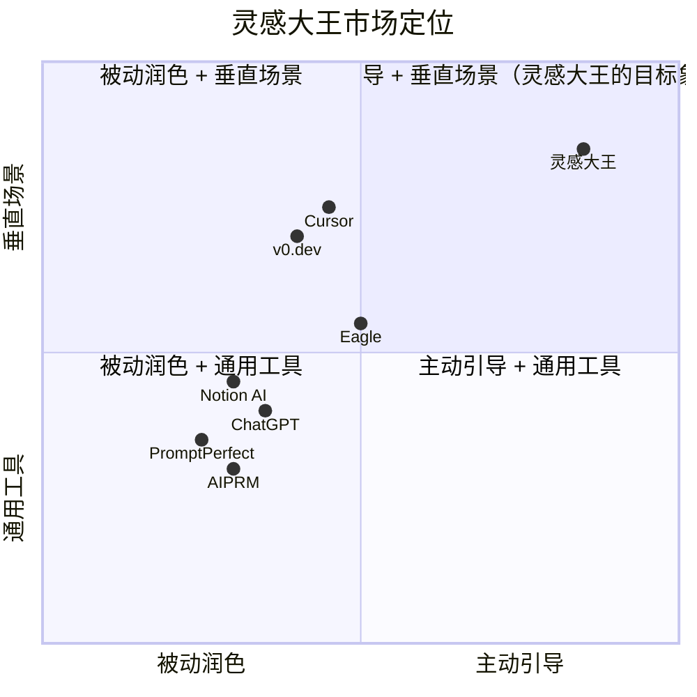

# 灵感大王 PRD（产品需求文档）

| 字段 | 值 |
|---|---|
| 版本 | v1.0 |
| 产出人 | 许清楚（产品经理） |
| 日期 | 2026-06-17 |
| 阶段 | Phase 1 - 端侧 Demo |
| 状态 | 待团队评审 / 待用户拍板 |

---

## 0. 文档说明

本 PRD 覆盖「灵感大王」项目的**第一阶段（端侧 Demo）**完整需求，并展望后续云端与大赛阶段。文档面向：团队成员（架构师、工程师、QA、主理人）与 TRAEAI 创造力大赛评委。

**结论先行（TL;DR）**：
- 灵感大王是一款**桌面悬浮窗**，通过**反向提问**把 vibe coding 新人的模糊灵感"挤"成精准提示词。
- 与传统润色工具的本质区别：**不补全，只提问**；产物是用户的特异性，而不是 AI 的统计默认值。
- Phase 1（Demo）只做 **P0 六项**：悬浮窗常驻、一键唤起、本地规则提问引擎、结构化提示词生成、跨工具上下文暂存、基础截图诊断。
- 最大卖点：**意图传达管线**（感知 → 命名 → 规格 → 执行 → 验证），尤其解决"感觉不对却说不清"与"agent 改不对"两类顽疾。

---

## 1. 产品目标

### 1.1 一句话定位

> **灵感大王是一个桌面悬浮窗，通过反向提问把 vibe coding 新人的模糊灵感挤成精准提示词，让 AI 真正按你的意思干活。**

### 1.2 北极星指标

| 阶段 | 北极星指标 | 目标值 |
|---|---|---|
| Demo（内部验收） | 单次提问引导平均挤出的「用户隐性意图标签」数 | ≥ 3 个 |
| Demo（内部验收） | 从唤起到生成提示词的全流程耗时 | < 60 秒 |
| Demo（内部验收） | 提示词结构化率（含动作段 + 规格段） | 100% |
| 大赛阶段 | Demo 现场可用率（无崩溃、无卡死） | 100% |
| 大赛阶段 | 评委可感知"提问引导"差异化的占比 | ≥ 70% |
| 大赛阶段 | 评委主观评分中"解决真实痛点"维度 | ≥ 4 / 5 |

### 1.3 非目标（明确不做）

- **不做云端 LLM 接入**（Phase 1 完全端侧、离线可用）
- **不做账号体系 / 登录**（本地匿名使用）
- **不做代码生成**（只产出提示词，不替用户写代码）
- **不做通用聊天**（不是 ChatGPT 替代品）
- **不做多语言界面**（Demo 阶段仅中文）
- **不做付费功能**（Demo 阶段无商业化）

---

## 2. 用户故事

覆盖四类核心痛点场景。格式：「作为 \<角色\>，我希望 \<动作\>，以便 \<价值\>」。

### 2.1 痛点一：灵感空白（脑中无物）

**US-01**：作为刚打开编辑器却不知道做什么的 vibe coding 新手，我希望悬浮窗一唤起就给我一个**引导性首问**（如"你今天想看到什么变化？"），以便我没有灵感也能开始一场对话而不是面对空白输入框。

**US-02**：作为完全没有起点的开发者，我希望悬浮窗提供**3 个起点模板**（"修一个看不顺眼的 UI"、"给现有功能加一个细节"、"复制一个我喜欢的产品的小特性"），以便我破冰启动。

### 2.2 痛点二：AI 润色后失真

**US-03**：作为被 AI 润色坑过多次的开发者，我希望工具**不要替我"美化"措辞**，而是用提问把我的原意挤出来，以便最终提示词里出现的每一个形容词都是我说的，而不是 AI 的统计默认值。

**US-04**：作为对前端细节有强偏好的开发者，我希望工具**逐项确认我的具体偏好**（如"间距是紧凑还是宽松"、"圆角是 4px 还是 12px"），以便 AI 不会用"现代化、美观"这类空话替代我的特异性。

### 2.3 痛点三：感觉不够好却说不清

**US-05**：作为前端审美先于语言的新手，我希望工具提供**截图诊断**功能——我截图贴进来，它给我一份"视觉问题清单"（对齐、间距、层级、对比度、节奏），以便我把"感觉不对"翻译成具体可执行的词汇。

**US-06**：作为有模糊感觉的开发者，我希望工具给我一份**前端语义词典**（在提问中以选项形式出现，如"你说'乱'，是指：① 间距不统一 ② 字号层级缺失 ③ 颜色太多 ④ 对齐错位"），以便我能给感觉命名。

### 2.4 痛点四：agent 改不对或没改

**US-07**：作为被 agent 反复改不对的开发者，我希望工具把我说的**"评价"自动转成"动作规格"**（如"卡片太挤" → "卡片内边距由 8px 增加至 16px；卡片间垂直间距由 12px 增加至 20px"），以便 agent 能落地执行而不是猜测。

**US-08**：作为常被 agent 漏改的开发者，我希望工具产出**结构化提示词**（明确分「动作段 / 规格段 / 约束段 / 验证段」），以便 agent 不会遗漏任何一条指令。

**US-09**：作为需要快速复用指令的开发者，我希望工具保存我的**指令风格库**（如"我偏好紧凑布局 + 深色 + 高对比"），以便下次同类型改动一键复用，不用每次重复说。

**US-10**：作为在多个 vibe coding 工具间切换的开发者（Trae / Claude Code / WorkBuddy），我希望工具**暂存我的上下文**（当前项目、当前痛点、已确认的偏好），以便我切换工具时灵感不丢、不重复说。

---

## 3. 需求池

优先级定义：
- **P0**：Demo 必做，不交付则 Demo 不成立
- **P1**：Demo 可选，做了加分，不做不扣分
- **P2**：后续阶段，Demo 不做

### 3.1 P0（Demo 必做）

#### FR-001 悬浮窗常驻
- **用户故事映射**：US-01, US-10
- **描述**：桌面右下角常驻一个轻量悬浮球（默认收起态），点击/快捷键展开为悬浮窗。最小化时不占用注意力，可拖动到任意位置。
- **验收标准**：
  1. 启动应用后悬浮球自动出现，无需手动开启
  2. 悬浮球可拖动到屏幕任意边缘，位置持久化
  3. 收起态占用屏幕面积 ≤ 64×64 px
  4. 在任何桌面应用全屏时悬浮球仍可见（置顶）
  5. 内存占用 ≤ 150 MB
- **优先级理由**：常驻是"一键唤起"的前提，是产品形态的根基。

#### FR-002 一键唤起
- **用户故事映射**：US-01, US-02
- **描述**：支持全局快捷键（默认 `Alt+Space`）一键唤起/收起悬浮窗，无需鼠标点击。
- **验收标准**：
  1. 快捷键可在设置中自定义
  2. 唤起响应时间 < 200ms
  3. 焦点自动落到输入框
  4. 在任何应用前台时快捷键都生效（全局热键）
- **优先级理由**：灵感是瞬时的，唤起摩擦必须趋近于零。

#### FR-003 本地规则提问引擎
- **用户故事映射**：US-01, US-03, US-04, US-06, US-07
- **描述**：基于**本地规则模板**（不接云端 LLM）的多轮提问引擎。一次只问一个问题，问题根据上一轮回答动态选择。问题库覆盖：意图感知、细节命名、规格量化、约束确认、验证标准。
- **验收标准**：
  1. 默认问题库 ≥ 30 条，覆盖 5 个阶段（感知 / 命名 / 规格 / 执行 / 验证）
  2. 每个问题以选项 + 自定义输入两种方式呈现（选项降低表达门槛）
  3. 单轮提问引导平均挤出 ≥ 3 个用户隐性意图标签（北极星）
  4. 用户可随时跳过当前问题
  5. 提问规则文件可热更新（无需重新打包）
- **优先级理由**：这是产品差异化核心，没有它就退化成普通润色工具。

#### FR-004 结构化提示词生成
- **用户故事映射**：US-03, US-07, US-08
- **描述**：基于提问收集到的用户回答，生成结构化提示词，明确分四段：**动作段（做什么） / 规格段（怎么做） / 约束段（不能怎么） / 验证段（如何确认）**。绝不使用"现代化、美观、流畅"等空话。
- **验收标准**：
  1. 100% 输出包含四段结构
  2. 评价类语句必须附带可量化规格（如"太挤" → "内边距 16px"）
  3. 用户原话保留在提示词注释中（保留原意可追溯）
  4. 一键复制为 Markdown
  5. 一键导出为 .md 文件
- **优先级理由**：直接对治"agent 改不对"——把评价转成动作规格。

#### FR-005 跨工具上下文暂存
- **用户故事映射**：US-10
- **描述**：将当前会话上下文（项目名、痛点、已确认偏好、最近 3 条提问回答）暂存到本地文件，供 Trae / Claude Code / WorkBuddy 等工具读取。
- **验收标准**：
  1. 上下文写入 `~/.linggandawang/context.json`，JSON 格式
  2. 切换工具后新工具可读取并续接对话
  3. 上下文包含时间戳，过期（>24h）自动归档
  4. 用户可手动清空上下文
- **优先级理由**：vibe coding 用户多工具切换是常态，这是项目背景里强调的硬需求。

#### FR-006 基础截图诊断
- **用户故事映射**：US-05, US-06
- **描述**：用户可截屏贴入悬浮窗，工具基于**本地规则**识别基础视觉问题（颜色对比度、对齐、间距一致性、字号层级），产出"视觉问题清单"。
- **验收标准**：
  1. 支持系统截图粘贴（Ctrl+V）和拖入图片文件
  2. 识别 ≥ 4 类基础视觉问题：对比度不足、对齐错位、间距不统一、字号层级缺失
  3. 每个问题给出可执行修改建议（如"标题与正文对比度 3.2，低于 WCAG AA 4.5，建议加深标题颜色"）
  4. 处理单张截图耗时 < 5 秒
  5. 识别结果可一键插入到提示词的"规格段"
- **优先级理由**：对治"感觉不对却说不清"，是大赛差异化亮点。

### 3.2 P1（Demo 可选）

#### FR-007 参照库
- **用户故事映射**：US-04
- **描述**：本地保存用户偏好的参考图 / 设计截图 / 灵感链接，生成提示词时可引用参照库中的元素。
- **验收标准**：支持图片拖入、链接保存、按标签检索；生成提示词时可引用最多 3 个参照。
- **优先级理由**：锦上添花，做不完可砍。

#### FR-008 设计原则文档
- **用户故事映射**：US-04, US-09
- **描述**：用户可维护一份"我的设计原则"文档（如"我偏好紧凑布局、深色、高对比、无圆角"），生成提示词时自动注入约束段。
- **验收标准**：支持 Markdown 编辑；提示词生成时自动追加到约束段；可一键开关启用。
- **优先级理由**：减少重复表达，提升个性化，但 Demo 阶段可省。

#### FR-009 指令风格库
- **用户故事映射**：US-09
- **描述**：保存用户历史高频指令风格（如"前端紧凑布局修改"、"后端接口对齐"），下次同类改动一键复用。
- **验收标准**：自动归档用户使用过的提示词模板；按场景分类；支持一键应用。
- **优先级理由**：复用价值高，但依赖使用积累，Demo 阶段价值有限。

#### FR-010 历史记录
- **用户故事映射**：US-09
- **描述**：本地存储所有生成的提示词历史，支持搜索、复制、再编辑。
- **验收标准**：本地 SQLite 存储；按时间倒序；支持全文搜索；保留 90 天。
- **优先级理由**：基础体验，做了不加分，不做扣分。

### 3.3 P2（后续阶段）

| ID | 名称 | 简述 |
|---|---|---|
| FR-011 | 云端 LLM 接入 | 接入 GPT/Claude/通义，提问引擎升级为 LLM 驱动 |
| FR-012 | 账号体系 | 注册登录、数据云端备份 |
| FR-013 | 跨设备同步 | 多设备间上下文 / 参照库 / 风格库同步 |
| FR-014 | 社区分享 | 用户分享提问模板 / 设计原则 / 提示词片段 |
| FR-015 | 多语言界面 | 英文版，面向海外 vibe coding 社区 |
| FR-016 | 插件市场 | 第三方扩展（如 Figma 插件、Trae 插件） |

---

## 4. UI 设计说明

### 4.1 设计原则

1. **极简**：参考 Linear / Vercel / Raycast，深色背景、高对比、克制留白。
2. **轻量**：悬浮窗是工具不是舞台，视觉权重永远低于用户当前正在做的内容。
3. **即时反馈**：所有操作 ≤ 200ms 有视觉响应。
4. **可逃离**：任何状态都能一键 ESC 回到收起态。

### 4.2 四态设计

#### 4.2.1 收起态（默认）
- 形态：右下角圆形悬浮球，直径 48px
- 视觉：深紫渐变 `#6E56CF → #8B6FE8`，中央一个发光的"灯泡"图标
- 悬停：放大到 56px，显示"按 Alt+Space 唤起"tooltip
- 交互：单击展开 / 拖动移位 / 右键菜单（设置 / 退出）

#### 4.2.2 展开态
- 形态：圆角卡片，宽 380px，高自适应（最高 560px）
- 布局：
  - 顶部：标题栏（"灵感大王" + 关闭按钮 + 设置按钮）
  - 中部：输入框（多行，placeholder："说一句你现在想做的事…"）
  - 中下：3 个起点模板按钮（"修一个看不顺眼的 UI" / "加一个细节" / "复制一个产品的特性"）
  - 底部：最近 3 条提示词快速复用入口
- 视觉：背景 `#0F0F12`，卡片描边 `#1F1F25`，主文字 `#EDEDF0`，次文字 `#8B8B95`

#### 4.2.3 提问态
- 形态：展开态基础上，输入框被替换为单问题对话气泡
- 布局：
  - 顶部：进度条（5 阶段，当前阶段高亮）+ 阶段名（如"命名阶段"）
  - 中部：当前问题（大字号，居中，最多 2 行）
  - 中下：3-5 个选项按钮（圆角胶囊形）+ "自定义输入"输入框 + "跳过"链接
  - 底部：累计挤出的意图标签（紫色 chip，如"紧凑布局 / 深色 / 16px 圆角"）
- 交互：选择选项后自动进入下一题；自定义输入回车提交

#### 4.2.4 结果态
- 形态：右侧滑出面板，宽 480px，覆盖屏幕右侧 60% 高度
- 布局：
  - 顶部：标题"你的提示词" + 一键复制按钮 + 导出 .md 按钮 + 重新提问按钮
  - 中部：结构化提示词（四段，每段有小标题，规格段支持语法高亮）
  - 中下：用户原话对照（折叠面板，默认收起）
  - 底部：意图标签清单（可点击删除某项后重新生成）
- 视觉：保持深色，提示词主体用等宽字体（如 JetBrains Mono）

### 4.3 关键状态机

```
[收起态] ──(快捷键/点击)──> [展开态]
   ↑                              │
   │                              │ (用户输入或选模板)
   │                              ↓
   │                          [提问态] ←──┐
   │                              │       │
   │                              │ (完成 5 阶段或用户停止)
   │                              ↓       │
   │                          [结果态]    │
   │                              │       │
   │                              │ (重新提问)
   └──────────────────────────────┴───────┘
   
任意状态 ──(ESC)──> [收起态]
任意状态 ──(全局快捷键)──> [收起态] 或 [展开态] 切换
```

### 4.4 视觉风格规范

| 元素 | 值 |
|---|---|
| 主背景 | `#0F0F12` |
| 卡片背景 | `#16161B` |
| 描边 | `#1F1F25` |
| 主色 | `#6E56CF`（紫） |
| 主色 hover | `#8B6FE8` |
| 强调色 | `#FFD580`（暖黄，用于意图标签 chip） |
| 主文字 | `#EDEDF0` |
| 次文字 | `#8B8B95` |
| 字体（界面） | 系统默认（PingFang SC / Inter） |
| 字体（代码/提示词） | JetBrains Mono |
| 圆角 | 卡片 12px / 按钮 8px / chip 999px |
| 阴影 | `0 8px 32px rgba(0,0,0,0.4)` |

---

## 5. 竞品分析

### 5.1 PromptPerfect
- **定位**：提示词自动优化工具
- **核心功能**：用户输入原始 prompt，AI 自动改写为"更优"prompt
- **优点**：使用门槛低、一键优化、支持多模型
- **不足**：**典型的被动润色**——用 AI 统计默认值补全用户意图，必然失真；不理解用户场景
- **与灵感大王差异化**：我们不优化用户的话，而是用提问挤用户的意图。产物是用户特异性，而非 AI 通用最优解。

### 5.2 AIPRM
- **定位**：ChatGPT 提示词模板社区
- **核心功能**：海量提示词模板库，按场景分类，一键使用
- **优点**：模板丰富、社区活跃、覆盖场景广
- **不足**：模板是别人的，不是用户的；用通用模板替代个人意图；不解决"说不清"问题
- **与灵感大王差异化**：我们不卖模板，我们帮用户生成属于自己的提示词。模板是起点不是终点。

### 5.3 Cursor
- **定位**：AI 代码编辑器
- **核心功能**：IDE 内 AI 编程助手，支持代码生成、补全、对话
- **优点**：编程能力强、上下文理解深、生态成熟
- **不足**：**前提是用户能说清要什么**——不解决意图传达损耗；重代码生成轻意图澄清
- **与灵感大王差异化**：Cursor 是"听指令干活"，灵感大王是"帮你想清楚指令"。互补关系，灵感大王的产物可直接粘贴给 Cursor。

### 5.4 v0.dev
- **定位**：UI 生成工具（Vercel 出品）
- **核心功能**：文本描述生成 React/Next.js UI
- **优点**：生成质量高、视觉好、迭代快
- **不足**：依赖用户描述精准；用户说不清时生成"通用好看"的 UI，不贴合用户偏好
- **与灵感大王差异化**：v0.dev 是"描述 → UI"，灵感大王是"模糊感觉 → 精准描述"。灵感大王是 v0.dev 的前置环节。

### 5.5 Eagle
- **定位**：设计素材管理工具
- **核心功能**：本地图片素材库、标签管理、灵感收藏
- **优点**：素材管理强、本地优先、设计师友好
- **不足**：只管理不生成；不解决"看到参考如何转成指令"
- **与灵感大王差异化**：Eagle 收集灵感，灵感大王把灵感转成指令。可互补——灵感大王 P1 参照库功能可对接 Eagle。

### 5.6 Notion AI
- **定位**：通用 AI 写作助手
- **核心功能**：文档内 AI 写作、润色、总结、翻译
- **优点**：场景融合好、文档生态强、易用
- **不足**：通用写作导向，不懂 vibe coding 场景；润色逻辑仍是"AI 改写"
- **与灵感大王差异化**：Notion AI 是通用写作，灵感大王是 vibe coding 垂直场景专用。

### 5.7 ChatGPT（含 GPTs）
- **定位**：通用 AI 对话
- **核心功能**：多模态对话、代码、写作、推理
- **优点**：能力最全面、生态最大
- **不足**：通用即不专；对话式交互对"说不清"的用户依然有门槛；用户仍要自己组织语言
- **与灵感大王差异化**：ChatGPT 等用户说话，灵感大王主动提问让用户说话。对"感觉不对"的用户，提问比等待更有效。

### 5.8 竞品对比总表

| 维度 | PromptPerfect | AIPRM | Cursor | v0.dev | Eagle | Notion AI | ChatGPT | **灵感大王** |
|---|---|---|---|---|---|---|---|---|
| 主动提问 | ✗ | ✗ | ✗ | ✗ | ✗ | ✗ | ✗ | **✓** |
| 垂直 vibe coding | ✗ | ✗ | ✓ | 半 | ✗ | ✗ | ✗ | **✓** |
| 保留用户原意 | ✗ | ✗ | - | ✗ | ✓ | ✗ | ✗ | **✓** |
| 视觉诊断 | ✗ | ✗ | ✗ | ✗ | 半 | ✗ | ✗ | **✓** |
| 桌面常驻 | ✗ | ✗ | ✗ | ✗ | ✓ | ✗ | ✗ | **✓** |
| 离线可用 | ✗ | ✗ | ✗ | ✗ | ✓ | ✗ | ✗ | **✓（Demo）** |

---

## 6. 市场定位

### 6.1 象限图



### 6.2 定位说明

灵感大王位于**第一象限右上方**——"主动引导 + 垂直场景"。

- **横轴 0.85（主动引导）**：唯一一款不靠"用户写、AI 改"，而是"AI 问、用户答"的产品。
- **纵轴 0.85（垂直场景）**：专为 vibe coding 新人设计，尤其针对前端"感觉不对"与 agent 改不对的细分痛点。

这一象限目前**无直接竞品**——这是灵感大王最大的市场机会，也是参赛的核心叙事点。

---

## 7. 团队问题清单 + 改进计划

### 7.1 PRD 编写过程中遇到的问题

| # | 问题 | 我的初步建议 |
|---|---|---|
| Q1 | 本地规则提问引擎的"问题库"由谁维护？如何保证问题质量？ | 产品出初版问题库（我负责），架构师设计热更新规则文件格式，工程师实现加载逻辑。问题库 v1 由我在 W1 末交付。 |
| Q2 | 截图诊断"基础版"识别范围如何界定？太宽做不到，太窄没价值 | 建议先做 4 类：对比度（WCAG 数值化）、对齐（边缘检测）、间距一致性（聚类）、字号层级（DOM-like 文本块分析）。颜色和间距是 vibe coding 新手最高频痛点。 |
| Q3 | 上下文暂存格式如何与架构师对齐？跨工具同步方案是占位文件 | 建议架构师在 T3 阶段同步定义 `~/.linggandawang/context.json` schema，我在 PRD 中给出字段需求（项目名、痛点、偏好、最近回答、时间戳）。 |
| Q4 | Demo 阶段是否需要演示账号体系？ | 不做。Demo 本地匿名，避免登录摩擦影响评委体验。账号体系留到 P2。 |
| Q5 | 参赛 Demo 现场网络环境不确定，是否需要离线包？ | 必须完全离线。Phase 1 北极星指标之一就是"端侧可用"。所有依赖必须本地化。 |
| Q6 | 提示词四段结构（动作/规格/约束/验证）是否过于工程化，新手看不懂？ | 在结果态用通俗标签替代工程术语：「要做什么 / 怎么做 / 不能怎么 / 怎么算做好了」。 |
| Q7 | P0 范围是否过大？6 项在 Demo 周期内能否做完？ | 建议架构师评估。我的倾向：截图诊断可降为 P1，若周期紧则先做前 5 项。 |

### 7.2 改进计划

1. **W1 末**：我交付问题库 v1（≥30 条），同步给架构师评审。
2. **W2 中**：与架构师对齐 `context.json` schema。
3. **W3 中**：与工程师联调提示词四段结构的渲染。
4. **W4**：参与 Demo 内测，收集真实用户反馈迭代问题库。

---

## 8. 时间线

### 8.1 Phase 1 - 端侧 Demo（当前阶段）

| 里程碑 | 周次 | 产出 | 负责人 |
|---|---|---|---|
| M1：PRD 定稿 | W1 | 本文档 + 用户拍板待确认问题 | 许清楚 |
| M2：架构设计完成 | W1 末 - W2 初 | 架构设计文档 + 任务分解 | 高见远 |
| M3：悬浮窗骨架 + 提问引擎骨架 | W2 末 | 可点击的悬浮窗 + 问题库可加载 | 寇豆码 |
| M4：提示词生成 + 截图诊断 | W3 末 | 端到端可用流程 | 寇豆码 |
| M5：集成 + 自测 | W4 中 | Demo 包 + 自测报告 | 寇豆码 + 严过关 |
| M6：Demo 内测 + 演练 | W4 末 - W5 | 内测反馈 + 演练视频 | 全员 |
| M7：Demo 冻结 | W5 末 | 可参赛的 Demo | 主理人验收 |

### 8.2 Phase 2 - 云端部署（W6 - W8）

- 云端 LLM 接入（FR-011）
- 账号体系（FR-012）
- 跨设备同步（FR-013）
- 提问引擎从规则模板升级为 LLM 驱动

### 8.3 Phase 3 - 大赛冲刺（W9 - W10）

- UI 终极打磨（动效、过渡、空状态）
- 演示视频录制
- 答辩材料准备（含本 PRD 的市场定位叙事）
- 评委 Q&A 预演

---

## 9. 待用户拍板的关键决策点

以下 5 项需用户在 W1 内拍板，否则影响后续工作：

### D1：技术栈选型
端侧 Demo 用 **Electron** 还是 **Tauri**？
- Electron：生态成熟、开发快、但包体大（≥80MB）、内存高
- Tauri：包体小（≤10MB）、性能好、但生态新、Rust 学习成本
- **我的倾向**：Tauri，包体小更适合参赛演示。但请架构师拍板。

### D2：截图诊断在 Demo 中的优先级
P0 还是 P1？
- 列 P0：差异化亮点更强，但风险高（识别准确率难保证）
- 列 P1：Demo 必稳，但少一个亮点
- **我的倾向**：列为 P0，但 W3 末做"go/no-go"评审，准确率 < 60% 则降级为 P1。

### D3：问题库的初始范围
Demo 阶段问题库覆盖几个场景？
- 仅前端 UI（窄而深，≥30 条）
- 前端 UI + 后端接口（宽而浅，每场景 ≥15 条）
- **我的倾向**：仅前端 UI。vibe coding 新人最高频痛点集中在前端，Demo 阶段聚焦比覆盖更重要。

### D4：参赛 Demo 时长与形式
- 现场演示时长？（影响功能展示深度）
- 评委现场体验还是看录屏？（影响交互容错设计）
- **我的倾向**：建议主理人尽快确认大赛规则，我据此调整 Demo 优先级。

### D5：是否在 Demo 阶段就接 Trae / WorkBuddy 的插件接口
- 接：跨工具上下文暂存（FR-005）更有说服力
- 不接：FR-005 退化为本地文件读写，演示时手动展示
- **我的倾向**：不接，Demo 阶段用本地文件读写模拟，避免依赖外部工具 API 不稳定。接插件接口留到 Phase 2。

---

## 附录 A：术语表

| 术语 | 定义 |
|---|---|
| vibe coding | 通过自然语言与 AI 协作写代码的新范式 |
| 意图传达损耗 | 用户的真实意图到 AI 执行之间每一层信息的丢失 |
| 反向提问 | AI 不直接回答，而是通过提问引导用户表达清楚 |
| 意图传达管线 | 感知 → 命名 → 规格 → 执行 → 验证 五阶段框架 |
| 动作段 / 规格段 | 提示词四段结构中的"做什么" / "怎么做"段 |
| 隐性意图标签 | 通过提问挤出的用户偏好（如"紧凑布局"、"深色"） |

## 附录 B：变更记录

| 版本 | 日期 | 变更 | 作者 |
|---|---|---|---|
| v1.0 | 2026-06-17 | 初版 | 许清楚 |

---

**文档结束。等待团队评审与用户拍板。**
