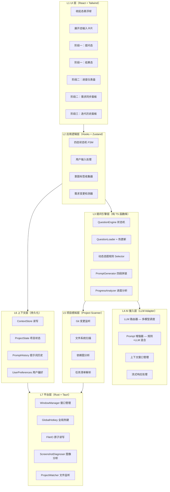
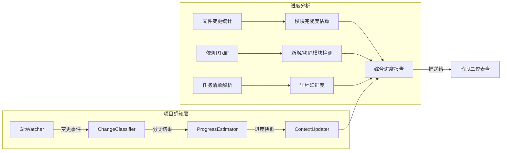
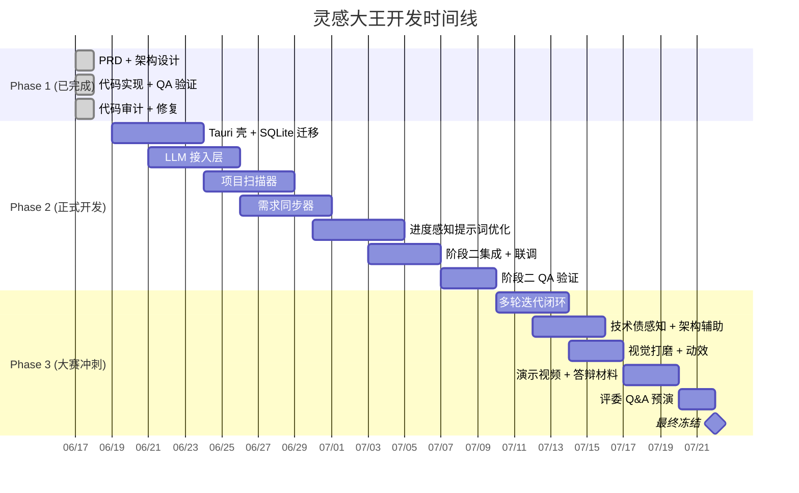

# 灵感大王 · 完整开发计划书（Demo 后正式版）

> **指导文档**：本计划书是「灵感大王」项目 Demo 阶段后正式开发的权威指导文档，明确项目目标、范围、进度和质量要求，确保项目有序推进并最终实现预期功能。
>
> **核心定位**：灵感大王不只是一个"一次性提问→生成提示词"的工具，而是一个**贯穿项目全生命周期的开发者意图传达助手**——从项目开始时帮你厘清所想，到开发过程中实时跟踪进度并优化提示词，始终让 AI agent 精准理解你的意思。

| 字段 | 值 |
|---|---|
| 版本 | v2.0（正式版） |
| 前序文档 | `docs/PRD.md` v1.0 · `docs/架构设计.md` v1.0 · `docs/QA报告.md` v1.0 |
| 产出人 | 齐活林（交付总监） · 许清楚（PM） · 高见远（架构师） |
| 日期 | 2026-06-18 |
| 阶段 | Demo 后正式开发（Phase 2 + Phase 3） |

---

## 目录

- [0. 项目概述](#0-项目概述)
- [1. 系统架构设计](#1-系统架构设计)
- [2. 产品需求文档（PRD）](#2-产品需求文档prd)
- [3. 三阶段功能详细设计](#3-三阶段功能详细设计)
- [4. 验收标准](#4-验收标准)
- [5. 开发里程碑与时间表](#5-开发里程碑与时间表)
- [6. 测试计划](#6-测试计划)
- [7. 风险管理计划](#7-风险管理计划)
- [8. 交付物清单](#8-交付物清单)
- [9. 维护与迭代计划](#9-维护与迭代计划)
- [附录 A：术语表](#附录-a术语表)
- [附录 B：变更记录](#附录-b变更记录)

---

## 0. 项目概述

### 0.1 一句话定位

> **灵感大王是一个贯穿项目全生命周期的桌面悬浮窗助手，通过反向提问帮你把模糊灵感挤成精准提示词，并在开发过程中实时跟踪项目进度、持续优化提示词，让 AI agent 始终精准理解你的意思。**

### 0.2 Demo 已完成的基线

| 维度 | 现状 |
|------|------|
| 核心闭环 | 唤起→提问→生成提示词→复制，全流程 ≈30s |
| 代码规模 | 47 源文件 + 28 单测，IS_PASS: YES |
| 北极星 | 挤出标签 7 个（目标 3），结构化率 100% |
| 技术栈 | Vite + React 18 + TypeScript + Tailwind + Zustand（纯前端降级版） |
| 已知降级 | 19 处 `// DOWNGRADE`（Rust/Tauri 不可用，前端模拟） |
| 质量 | QA 2 轮验证 0 失败，代码审计 1 高危 + 3 中危已修复 |
| 可预览 | 已部署 CloudStudio（`https://75cf1ccce33b44f1afe2b746b56e65e2.app.codebuddy.work`） |

### 0.3 正式开发的核心扩展

Demo 阶段只做了**阶段一**的端侧版本。正式开发需实现完整的三阶段功能：

| 阶段 | 名称 | 核心能力 |
|------|------|---------|
| **阶段一** | 灵感捕获与提示词生成 | 用户输出内心所想→AI 灵活提问→生成初始开发阶段提示词 |
| **阶段二** | 项目进度感知与实时同步 | 实时读取项目开发进度→同步用户新需求→从编程精细化角度分析→随项目进度优化提示词 |
| **阶段三** | 全生命周期智能伴随 | 多轮迭代闭环→需求变更自动重校准→技术债感知→架构决策辅助 |

### 0.4 项目目标

| 目标类型 | 具体目标 | 量化指标 |
|----------|---------|---------|
| 功能目标 | 三阶段功能全部上线 | P0 需求 100% 交付 |
| 性能目标 | 桌面端丝滑体验 | 唤起 < 200ms，提示词生成 < 2s，进度扫描 < 10s |
| 质量目标 | 生产级稳定性 | 单测覆盖率 ≥ 80%，P0 Bug 0 个 |
| 用户目标 | 解决 vibe coding 新人意图传达损耗 | 用户满意度 ≥ 4/5，重复使用率 ≥ 60% |
| 参赛目标 | TRAEAI 创造力大赛获奖 | 评委评分 ≥ 4/5 |

---

## 1. 系统架构设计

### 1.1 整体架构（七层）

Demo 阶段是五层架构（纯前端降级版）。正式开发升级为**七层分层架构**，补全 Rust 后端 + AI 接入层 + 项目感知层：



### 1.2 技术栈选型

| 层级 | 技术 | 版本 | 用途 | 选型理由 |
|------|------|------|------|---------|
| 桌面壳 | Tauri | 2.0+ | 桌面应用框架 | 包体 ≤ 20MB，Rust 后端性能好，参赛加分 |
| 前端 UI | React | 18.x | 组件化 UI | 生态成熟，hooks 契合状态机 |
| 类型系统 | TypeScript | 5.x | 全栈类型安全 | 问题库 schema、LLM 返回结构强类型 |
| 样式 | Tailwind CSS | 3.4+ | 原子化样式 | 视觉 token 映射，深色主题原生支持 |
| 构建 | Vite | 5.x | 开发/构建 | Tauri 官方推荐，HMR 快 |
| 状态管理 | Zustand | 4.x | 全局状态 | 轻量，契合中小型应用 |
| 单测 | Vitest | 1.x | 测试框架 | Vite 原生集成 |
| 后端语言 | Rust | 1.75+ | 平台层 | Tauri 标配，文件监听/图像处理性能优 |
| LLM 接入 | OpenAI SDK | - | AI 接口 | 兼容 GPT/Claude/通义（统一 OpenAI 格式） |
| 数据库 | SQLite | - | 本地数据存储 | 轻量、离线、嵌入式，Tauri tauri-plugin-sql 原生支持 |
| 文件监听 | notify crate | 6.x | Rust 文件系统监听 | 项目文件变更实时感知 |

### 1.3 API 接口设计

#### 1.3.1 Tauri 命令（前端 ↔ Rust 后端）

| 命令 | 方向 | 参数 | 返回 | 用途 |
|------|------|------|------|------|
| `save_context` | 前端→Rust | `Context` | `Result<()>` | 原子写入 context.json |
| `load_context` | 前端→Rust | 无 | `Result<Context>` | 读取 context.json |
| `archive_context` | 前端→Rust | 无 | `Result<()>` | 过期归档 |
| `save_window_position` | 前端→Rust | `{ x: f64, y: f64 }` | `Result<()>` | 持久化窗口位置 |
| `load_window_position` | 前端→Rust | 无 | `Result<Position>` | 读取窗口位置 |
| `register_hotkey` | 前端→Rust | `{ key: String }` | `Result<()>` | 注册全局热键 |
| `diagnose_screenshot` | 前端→Rust | `Vec<u8>` | `Result<DiagnosisReport>` | 截图诊断 |
| `scan_project` | 前端→Rust | `{ path: String }` | `Result<ProjectSnapshot>` | 扫描项目结构 |
| `watch_project` | 前端→Rust | `{ path: String }` | `Result<()>` | 开始监听项目变更 |
| `get_git_status` | 前端→Rust | `{ path: String }` | `Result<GitStatus>` | 获取 Git 状态 |
| `read_file_content` | 前端→Rust | `{ path: String }` | `Result<String>` | 安全读取项目文件 |
| `export_prompt_md` | 前端→Rust | `{ content: String, path: String }` | `Result<()>` | 导出提示词到文件 |

#### 1.3.2 LLM 接口（AI 接入层 → 云端）

| 接口 | 用途 | 模型 | 流式 |
|------|------|------|------|
| `POST /v1/chat/completions` | 提问增强（规则+LLM 混合） | GPT-4o / Claude 3.5 | 是 |
| `POST /v1/chat/completions` | 进度分析（读取项目状态后生成分析） | GPT-4o / Claude 3.5 | 是 |
| `POST /v1/chat/completions` | 需求精细化（用户新需求→编程角度分析） | GPT-4o / Claude 3.5 | 是 |
| `POST /v1/chat/completions` | 提示词优化（基于项目进度微调提示词） | GPT-4o / Claude 3.5 | 是 |

**统一 OpenAI 格式**：所有 LLM 调用走 OpenAI 兼容 API（`/v1/chat/completions`），通过 `base_url` + `api_key` 切换不同厂商（OpenAI / Anthropic / 阿里通义 / DeepSeek），前端无需适配不同 SDK。

#### 1.3.3 数据存储方案

| 数据类型 | 存储位置 | 格式 | 说明 |
|----------|---------|------|------|
| 运行时上下文 | `~/.linggandawang/context.json` | JSON | 会话级，24h 归档 |
| 用户配置 | `~/.linggandawang/config.json` | JSON | 热键/位置/功能开关 |
| 问题库 | `~/.linggandawang/bank.yaml` + 内置 | YAML | 热更新，用户可覆盖 |
| 提示词历史 | SQLite `~/.linggandawang/history.db` | SQLite | 结构化存储，支持全文搜索 |
| 项目状态快照 | SQLite `~/.linggandawang/history.db` | SQLite | Git 变更/文件结构/依赖图 |
| 用户偏好 | SQLite `~/.linggandawang/history.db` | SQLite | 长期累积，跨会话保留 |
| LLM 对话记录 | SQLite `~/.linggandawang/history.db` | SQLite | 上下文窗口管理 |
| 截图诊断缓存 | 内存（LRU，最多 10 张） | ImageData | 诊断结果不持久化 |

**SQLite Schema**：

```sql
-- 提示词历史
CREATE TABLE prompt_history (
    id TEXT PRIMARY KEY,
    seed_input TEXT NOT NULL,
    action_content TEXT,
    spec_content TEXT,
    constraint_content TEXT,
    verify_content TEXT,
    intent_tags_json TEXT,
    raw_quotes_json TEXT,
    stage TEXT DEFAULT 'stage1',  -- stage1/stage2/stage3
    project_path TEXT,
    created_at TEXT NOT NULL,
    updated_at TEXT NOT NULL
);

-- 项目状态快照
CREATE TABLE project_snapshots (
    id TEXT PRIMARY KEY,
    project_path TEXT NOT NULL,
    snapshot_type TEXT NOT NULL,  -- git_status/file_tree/dependency_graph
    data_json TEXT NOT NULL,
    created_at TEXT NOT NULL
);

-- 用户偏好（长期累积）
CREATE TABLE user_preferences (
    key TEXT PRIMARY KEY,
    value TEXT NOT NULL,
    stage TEXT,  -- 来源阶段
    confirmed_at TEXT NOT NULL
);

-- LLM 对话记录
CREATE TABLE llm_conversations (
    id TEXT PRIMARY KEY,
    session_id TEXT NOT NULL,
    role TEXT NOT NULL,  -- system/user/assistant
    content TEXT NOT NULL,
    model TEXT,
    tokens_used INTEGER,
    created_at TEXT NOT NULL
);
```

### 1.4 阶段二核心模块：项目感知层

这是 Demo 后正式开发的**最大新增模块**，负责实时读取项目开发进度：



**GitWatcher**：基于 Rust `notify` crate 监听 `.git/` 目录变更，每次 commit/checkout 触发分析。

**ChangeClassifier**：将文件变更分类为「新增模块 / 修改功能 / 修 Bug / 重构 / 配置变更」。

**ProgressEstimator**：基于变更分类 + 任务清单匹配，估算当前里程碑完成度。

---

## 2. 产品需求文档（PRD）

### 2.1 核心功能与非核心功能

#### 核心功能（必须交付）

| ID | 名称 | 阶段 | 描述 |
|----|------|------|------|
| FR-101 | 灵感捕获与反向提问 | 阶段一 | 用户输出内心所想→AI 灵活提问（选项+自定义输入）→收集意图标签 |
| FR-102 | 结构化提示词生成 | 阶段一 | 基于意图标签生成四段提示词（动作/规格/约束/验证），100% 结构化率 |
| FR-103 | 项目进度实时感知 | 阶段二 | 监听 Git 变更/文件结构/依赖图，实时更新项目进度快照 |
| FR-104 | 需求同步与精细化分析 | 阶段二 | 用户输入新需求→从编程精细化角度分析（拆解子任务/识别依赖/估算影响面） |
| FR-105 | 进度感知型提示词优化 | 阶段二 | 基于项目当前进度优化提示词（已完成模块不再提/聚焦当前阻塞点） |
| FR-106 | 悬浮窗常驻与一键唤起 | 全阶段 | Tauri 桌面悬浮窗，全局热键 Alt+Space，内存 ≤ 200MB |
| FR-107 | 跨工具上下文同步 | 全阶段 | `~/.linggandawang/context.json` 供 Trae/Claude Code/WorkBuddy 读取 |
| FR-108 | 截图视觉诊断 | 全阶段 | 对比度/对齐/间距/字号 4 类识别，go/no-go 闸门 |

#### 非核心功能（加分项）

| ID | 名称 | 阶段 | 描述 |
|----|------|------|------|
| FR-201 | 参照库 | 阶段一 | 本地保存参考图/设计截图/灵感链接 |
| FR-202 | 设计原则文档 | 阶段一 | 用户维护"我的设计原则"，自动注入约束段 |
| FR-203 | 指令风格库 | 阶段一 | 保存高频指令风格，一键复用 |
| FR-204 | 多轮迭代闭环 | 阶段三 | 提示词→执行→结果→重新提问的完整闭环 |
| FR-205 | 技术债感知 | 阶段三 | 扫描 TODO/FIXME/HACK 标记，提醒技术债积累 |
| FR-206 | 架构决策辅助 | 阶段三 | 基于项目结构给出架构优化建议（如模块拆分/依赖解耦） |
| FR-207 | 多语言界面 | 后续 | 英文版 |
| FR-208 | 社区分享 | 后续 | 用户分享提问模板/提示词片段 |

### 2.2 用户角色与使用场景

| 角色 | 描述 | 核心场景 |
|------|------|---------|
| **Vibe Coding 新手** | 刚接触 AI 辅助编程，有想法但说不清 | 阶段一：灵感捕获→提示词生成 |
| **独立开发者** | 一个人做全栈，需要 AI agent 高效协作 | 阶段二：进度感知→需求同步→提示词优化 |
| **小团队技术负责人** | 需要把需求精准传达给 AI 辅助开发 | 阶段三：全生命周期伴随→架构决策 |
| **参赛评委** | 现场体验 Demo，评估创新性与实用性 | 5 分钟体验核心闭环 |

### 2.3 功能优先级排序

**P0（必须交付）**：FR-101 ~ FR-108（8 项核心功能）

**P1（强烈建议）**：FR-201 ~ FR-203（参照库/设计原则/指令风格库）

**P2（锦上添花）**：FR-204 ~ FR-206（多轮闭环/技术债/架构决策）

**P3（远期规划）**：FR-207 ~ FR-208（多语言/社区分享）

### 2.4 用户界面与交互流程

#### 阶段一交互流程（已实现，需补 Tauri 壳）

```
[收起态] ──(Alt+Space)──> [展开态]
                              │
              ┌───────────────┼───────────────┐
              │               │               │
        [输入种子文本]   [选起点模板]   [粘贴截图]
              │               │               │
              └───────┬───────┘               │
                      │                       │
                  [提问态]              [截图诊断]
                      │                       │
              ┌─── 5阶段提问 ───┐            │
              │                 │            │
          [选选项]        [自定义输入]       │
              │                 │            │
              └────────┬────────┘            │
                       │                     │
                   [结果态] <────────────────┘
                       │
              ┌────────┼────────┐
              │        │        │
          [复制MD]  [导出.md]  [重新提问]
```

#### 阶段二交互流程（新增）

```
[收起态] ──(Alt+Space)──> [展开态]
                              │
              ┌───────────────┴───────────────┐
              │                               │
        [阶段一：提问]              [阶段二：进度仪表盘]
              │                               │
              │                   ┌───────────┼───────────┐
              │                   │           │           │
              │            [进度概览]   [需求同步]   [提示词优化]
              │                   │           │           │
              │                   │     [输入新需求]       │
              │                   │           │           │
              │                   │     [精细化分析]       │
              │                   │           │           │
              │                   │     [生成子任务清单]   │
              │                   │           │           │
              │                   └─────┬─────┘           │
              │                         │                 │
              │                   [优化后的提示词]         │
              │                         │                 │
              └────────────┬────────────┘                 │
                           │                              │
                       [结果态]                           │
                           │                              │
                   [复制/导出/迭代] <──────────────────────┘
```

#### 阶段三交互流程（新增）

```
[阶段二仪表盘] ──> [迭代历史面板]
                       │
              ┌────────┼────────┐
              │        │        │
        [历史提示词] [技术债] [架构建议]
              │        │        │
              │   [扫描结果]  [优化建议]
              │        │        │
              │   [一键插入]  [一键插入]
              │        │        │
              └────────┴────────┘
                       │
                   [重生成提示词]
```

### 2.5 性能指标与安全要求

#### 性能指标

| 指标 | 目标值 | 测试方法 |
|------|--------|---------|
| 唤起响应时间 | < 200ms | 计时器测量热键按下到 UI 渲染完成 |
| 提示词生成时间 | < 2s | 从最后一个问题回答到结果态渲染完成 |
| 项目扫描时间 | < 10s | 1000 文件项目首次全量扫描 |
| 增量扫描时间 | < 1s | 单次 commit 后增量分析 |
| 内存占用 | ≤ 200MB | 任务管理器持续观测 |
| 包体大小 | ≤ 20MB | 安装包文件大小 |
| LLM 响应时间 | < 5s（首 token） | 流式响应首 token 延迟 |
| 截图诊断时间 | < 5s | 1024×768 截图全量分析 |

#### 安全要求

| 要求 | 具体措施 |
|------|---------|
| API Key 安全 | 存储在系统 keychain（Tauri plugin-store），不明文存储在文件中 |
| 数据隐私 | 所有数据本地存储，不上传到云端（LLM 调用仅发送提示词，不发送项目源码） |
| 输入校验 | 所有用户输入经 sanitize 处理，防止路径遍历攻击 |
| 依赖安全 | 定期扫描 npm audit / cargo audit，无已知高危漏洞 |
| 文件访问 | Rust 端限制文件读取范围，不读取 `~/.ssh`、`~/.aws` 等敏感目录 |

#### 用户隐私合规（完整版）

本应用作为本地桌面工具，数据处理以**本地优先、最小采集、用户可控**为原则。以下按合规维度逐项说明：

**① 数据采集范围**

| 数据类型 | 采集方式 | 存储位置 | 是否上传云端 | 用户可删除 |
|----------|---------|---------|-------------|-----------|
| 用户输入文本（种子/回答） | 用户主动输入 | SQLite 本地 | 仅发送给 LLM API 做分析，不持久化到第三方 | ✅ 清空上下文即可删除 |
| 提示词输出 | 系统生成 | SQLite 本地 | 不上传 | ✅ |
| 意图标签 | 系统提取 | SQLite 本地 | 不上传 | ✅ |
| 截图数据 | 用户主动粘贴/拖入 | 内存（LRU 10 张） | 不上传，不持久化到磁盘 | ✅ 关闭应用自动清除 |
| 项目文件结构 | 项目扫描器 | SQLite 本地 | 不上传 | ✅ |
| Git 状态信息 | 项目扫描器 | SQLite 本地 | 不上传 | ✅ |
| LLM API Key | 用户配置 | 系统 keychain | 不上传 | ✅ 用户可随时清除 |
| LLM 对话记录 | LLM 调用 | SQLite 本地 | 对话内容发送给 LLM 提供商（受其隐私政策约束） | ✅ |

**② LLM 调用的数据流安全**

关键风险点：用户输入和项目上下文会通过 LLM API 发送到云端。必须明确告知用户并做最小化处理。

- **发送内容**：仅发送结构化提示词（用户回答 + 意图标签 + 项目摘要），**不发送项目源码全文**
- **项目摘要脱敏**：发送给 LLM 的项目上下文经过脱敏处理——只包含文件结构（路径+扩展名）、依赖列表、TODO 摘要，不包含文件内容
- **API 通信**：强制 HTTPS，证书校验不跳过
- **API Key 隔离**：每个 LLM 提供商独立配置 Key，互不影响
- **数据保留**：LLM 提供商的数据保留政策取决于其服务条款（OpenAI 30 天、Anthropic 不保留），在设置页明确告知用户

**③ 截图数据安全**

截图诊断是隐私风险最高的功能（用户截图可能包含敏感信息如密码、聊天记录、个人照片）：

- **内存隔离**：截图数据仅存在内存中，不写入磁盘，不写入 SQLite
- **处理后立即销毁**：诊断完成后 LRU 缓存最多保留 10 张，超出自动清除
- **不上传**：截图数据永远不发送给 LLM 或任何云端服务
- **用户知情**：截图粘贴时弹出提示："截图数据仅在本地处理，不会上传到任何服务器"
- **关闭清除**：应用关闭时清除所有截图内存

**④ 项目文件访问安全**

项目扫描器需要读取项目目录，必须限制访问范围：

- **白名单目录**：用户需在设置中明确授权项目目录，扫描器只在授权目录内工作
- **黑名单目录**：硬编码禁止访问 `~/.ssh`、`~/.aws`、`~/.gnupg`、`~/.config`、系统目录
- **路径遍历防护**：所有文件路径经 `std::fs::canonicalize()` 规范化后，校验是否在授权目录内
- **符号链接限制**：跟随符号链接前校验目标是否在授权目录内
- **文件大小限制**：单文件扫描上限 10MB，超出跳过（防止读取大型二进制文件）
- **敏感文件跳过**：自动跳过 `.env`、`.env.local`、`credentials`、`secret`、`*.pem`、`*.key` 等文件

**⑤ 用户权利保障**

| 权利 | 实现方式 |
|------|---------|
| 知情权 | 首次启动时展示隐私说明弹窗，说明数据采集范围和 LLM 调用行为 |
| 访问权 | 设置页"导出我的数据"按钮，导出全部本地数据为 JSON |
| 删除权 | 设置页"清空所有数据"按钮（二次确认），清除 SQLite + localStorage + keychain |
| 撤回权 | 随时可关闭 LLM 调用（降级为纯规则引擎），不再发送任何数据到云端 |
| 可携带权 | 数据导出格式为标准 JSON，可导入到其他工具 |

**⑥ 合规检查清单**

开发过程中每个里程碑必须通过以下检查：

- [ ] LLM 调用仅发送必要信息，不发送项目源码
- [ ] 截图数据不写入磁盘，不发送到云端
- [ ] API Key 存储在 keychain，不明文存储
- [ ] 文件访问经路径规范化 + 白名单校验
- [ ] 首次启动展示隐私说明
- [ ] 设置页提供数据导出/清除功能
- [ ] `.env` / 秘钥文件自动跳过扫描
- [ ] HTTPS 强制，证书校验不跳过
- [ ] 无硬编码密钥/token（git grep 验证）

---

## 3. 三阶段功能详细设计

### 3.1 阶段一：灵感捕获与提示词生成（已实现，需补 Tauri 壳）

**现状**：核心逻辑已在 Demo 中实现（47 文件），纯前端降版。正式开发需：

| 任务 | 描述 | 改动范围 |
|------|------|---------|
| 补 Tauri 壳 | 恢复 Rust 后端，实现窗口置顶/全局热键/context.json 原子写入 | `src-tauri/` 新增，前端 19 处 `// DOWNGRADE` 注释替换为 Tauri invoke |
| SQLite 迁移 | localStorage → SQLite（提示词历史/用户偏好/LLM 对话记录） | `src/stores/contextStore.ts` 重写，新增 `src-tauri/src/db.rs` |
| 问题库扩充 | 30 条 → 80 条，覆盖前端 UI + 后端接口 + 全栈场景 | `src/question-bank/bank.yaml` 扩充 |
| 视觉打磨 | 动效、过渡、空状态、错误状态 | 各组件增强 |

### 3.2 阶段二：项目进度感知与实时同步（核心新增）

这是 Demo 后正式开发的**最大新增模块**，对应你的核心诉求："灵感大王可以实时读取项目开发进度，并实时同步开发者需求"。

#### 3.2.1 项目扫描器（ProjectScanner）

**职责**：扫描项目目录，产出结构化快照。

| 扫描项 | 方法 | 输出 |
|--------|------|------|
| 文件结构 | 递归遍历 `src/`，按扩展名分组 | `FileTree { directories, files, languages }` |
| Git 状态 | `git status --porcelain` + `git log --oneline -20` | `GitStatus { branch, recentCommits, changedFiles }` |
| 依赖图 | 解析 `package.json` + `tsconfig.json` 路径别名 | `DependencyGraph { nodes, edges }` |
| TODO 扫描 | grep `TODO`/`FIXME`/`HACK` 标记 | `TodoList { items: [{ file, line, text, priority }] }` |
| 任务清单匹配 | 解析 `docs/架构设计.md` 第 6 章任务列表 | `TaskProgress { completed, inProgress, blocked }` |

**触发时机**：
- 首次打开项目时全量扫描
- Git commit/checkout 时增量扫描（通过 `notify` 监听 `.git/` 变更）
- 用户手动点击"刷新进度"按钮

#### 3.2.2 需求同步器（RequirementSyncer）

**职责**：用户输入新需求→从编程精细化角度分析→生成子任务清单。

**流程**：
```
用户输入："我想给首页加一个搜索功能"
    ↓
LLM 分析（系统提示词 + 项目上下文 + 当前进度）：
    → 子任务拆解：搜索框组件 / 搜索 API / 结果列表 / 搜索状态管理
    → 依赖分析：搜索 API 依赖后端接口（当前未实现）
    → 影响面评估：涉及 3 个现有文件修改 + 2 个新文件
    → 优先级建议：P0（核心功能）/ 建议先做前端 mock
    ↓
生成结构化子任务清单 + 优化后的提示词
```

**LLM 系统提示词（核心）**：

```
你是灵感大王的需求精细化助手。你的任务是把用户的模糊需求拆解为可执行的编程子任务。

输入：
- 用户需求：{user_input}
- 项目上下文：{project_snapshot}
- 当前进度：{task_progress}
- 用户偏好：{preferences}

输出格式（严格 JSON）：
{
  "requirement_summary": "一句话需求摘要",
  "subtasks": [
    {
      "id": "ST-001",
      "title": "子任务标题",
      "description": "详细描述",
      "files_affected": ["src/components/SearchBar.tsx"],
      "dependencies": ["后端搜索 API"],
      "priority": "P0",
      "estimated_effort": "2h",
      "implementation_hints": "具体实现建议"
    }
  ],
  "risks": ["搜索 API 未实现，建议先用 mock"],
  "prompt_optimization": "优化后的提示词片段"
}
```

#### 3.2.3 项目扫描器的隐私约束（重要）

项目扫描器是阶段二的核心新增模块，也是隐私风险最高的组件之一（需要读取用户项目文件）。必须在设计层面嵌入隐私保护：

**Rust 端 `ProjectScanner` 的安全设计**：

```rust
// src-tauri/src/scanner.rs — 安全约束伪代码

const BLACKLIST_DIRS: &[&str] = &[
    "~/.ssh", "~/.aws", "~/.gnupg", "~/.config",
    "/etc", "/System", "C:\\Windows",
];

const BLACKLIST_FILES: &[&str] = &[
    ".env", ".env.local", ".env.production",
    "credentials", "secret", "secrets",
];

const SENSITIVE_EXTENSIONS: &[&str] = &[
    ".pem", ".key", ".p12", ".pfx", ".jks",
];

const MAX_FILE_SIZE: u64 = 10 * 1024 * 1024; // 10MB

fn is_safe_path(path: &Path, allowed_root: &Path) -> Result<bool> {
    // 1. 规范化路径（解析 .. 和符号链接）
    let canonical = std::fs::canonicalize(path)?;
    let canonical_root = std::fs::canonicalize(allowed_root)?;

    // 2. 校验是否在授权目录内
    if !canonical.starts_with(&canonical_root) {
        return Ok(false);
    }

    // 3. 校验黑名单目录
    for blacklisted in BLACKLIST_DIRS {
        if canonical.starts_with(shellexpand::tilde(blacklisted)) {
            return Ok(false);
        }
    }

    // 4. 校验敏感文件名
    let filename = canonical.file_name().unwrap_or_default().to_string_lossy();
    for blacklisted in BLACKLIST_FILES {
        if filename.to_lowercase().contains(blacklisted) {
            return Ok(false);
        }
    }

    // 5. 校验敏感扩展名
    if let Some(ext) = canonical.extension() {
        if SENSITIVE_EXTENSIONS.contains(&ext.to_str().unwrap_or("")) {
            return Ok(false);
        }
    }

    // 6. 校验文件大小
    if let Ok(metadata) = std::fs::metadata(&canonical) {
        if metadata.len() > MAX_FILE_SIZE {
            return Ok(false);
        }
    }

    Ok(true)
}
```

**发送给 LLM 的项目上下文脱敏规则**：

| 发送内容 | 允许 | 禁止 |
|----------|------|------|
| 文件路径（相对路径 + 扩展名） | ✅ | 绝对路径（暴露用户名） |
| 文件结构树（目录层级） | ✅ | 文件内容全文 |
| 依赖列表（package.json deps） | ✅ | package-lock.json（版本锁定细节） |
| TODO/FIXME 摘要（文件+行号+文本） | ✅ | TODO 周围的代码上下文 |
| Git 分支名 + 最近 commit 标题 | ✅ | commit 全文 / diff |
| 语言分布统计 | ✅ | 具体代码片段 |

#### 3.2.4 进度感知型提示词优化（ProgressAwarePromptGenerator）

**核心机制**：基于项目当前进度，自动优化提示词，避免重复已完成的工作、聚焦当前阻塞点。

| 输入 | 输出 |
|------|------|
| 项目快照（文件结构/Git 状态/依赖图） | 优化后的提示词 |
| 任务清单进度（已完成/进行中/阻塞） | 去重：已完成模块不再出现在提示词中 |
| 用户新需求 | 聚焦：阻塞点优先级提升 |
| 历史提示词 | 追加：新增上下文（如"上次提示词已执行，以下是增量变更"） |

**优化规则**：
1. **去重**：已完成的模块/功能从提示词中移除
2. **聚焦**：当前阻塞点（blocked 任务）在约束段追加"优先解决以下阻塞"
3. **增量**：追加"上次提示词执行结果：{diff_summary}，本次增量变更如下"
4. **上下文窗口管理**：保留最近 5 轮提示词-结果对，超出窗口的归档但不丢弃

### 3.3 阶段三：全生命周期智能伴随

| 能力 | 描述 |
|------|------|
| 多轮迭代闭环 | 提示词→执行→结果→重新提问→优化提示词，形成闭环 |
| 需求变更自动重校准 | 检测到项目结构变化（新增模块/依赖变更）时，自动触发重新提问 |
| 技术债感知 | 扫描 TODO/FIXME/HACK 标记，按严重程度排序，一键插入提示词 |
| 架构决策辅助 | 基于项目依赖图和模块完成度，给出架构优化建议（如"建议将 utils/ 拆分为独立包"） |

---

## 4. 验收标准

### 4.1 功能完整性验收

| 阶段 | 功能 | 验收标准 | 优先级 |
|------|------|---------|--------|
| 阶段一 | 灵感捕获 | 5 阶段提问完整走通，挤出 ≥3 标签 | P0 |
| 阶段一 | 提示词生成 | 100% 输出四段结构，评价词典覆盖 8 关键词 | P0 |
| 阶段二 | 项目扫描 | 1000 文件项目 < 10s 全量扫描 | P0 |
| 阶段二 | Git 监听 | commit 后 < 1s 增量分析触发 | P0 |
| 阶段二 | 需求精细化 | 用户输入 → LLM 拆解为 ≤5 个子任务 | P0 |
| 阶段二 | 提示词优化 | 基于进度去重 + 聚焦阻塞点 | P0 |
| 阶段二 | 隐私保护 | 截图不写磁盘、LLM 不发源码、文件访问白名单、敏感文件跳过 | P0 |
| 阶段三 | 迭代闭环 | 提示词→执行→结果→重提问完整闭环 | P1 |
| 阶段三 | 技术债感知 | 扫描 ≥3 种标记类型，准确率 ≥ 90% | P1 |

### 4.2 性能验收

| 指标 | 目标值 | 测试环境 |
|------|--------|---------|
| 唤起响应 | < 200ms | Windows 11，8GB RAM |
| 提示词生成 | < 2s | 同上 |
| 项目全量扫描 | < 10s | 1000 文件前端项目 |
| 增量扫描 | < 1s | 单次 commit 后 |
| LLM 首 token | < 5s | GPT-4o / Claude 3.5 |
| 内存占用 | ≤ 200MB | 持续运行 1 小时 |
| 包体大小 | ≤ 20MB | Windows .msi 安装包 |

### 4.3 用户体验验收

| 维度 | 标准 | 评估方法 |
|------|------|---------|
| 操作流畅度 | 四态切换动画 ≤ 200ms，无卡顿 | 主观评分 + 录屏分析 |
| 提问引导有效性 | 用户平均回答 3+ 题即感到"够了" | 内测用户统计 |
| 提示词可执行性 | 用户直接粘贴给 AI agent 后，agent 改对率 ≥ 80% | 内测对比实验 |
| 学习成本 | 新用户首次使用 ≤ 2 分钟完成核心闭环 | 内测计时 |
| 满意度 | 用户评分 ≥ 4/5 | 问卷调查 |

### 4.4 兼容性验收

| 维度 | 范围 |
|------|------|
| 操作系统 | Windows 10/11（优先），macOS 13+（P1），Linux（P2） |
| 屏幕分辨率 | 1920×1080（基准），1366×768（最低），4K（适配） |
| 多显示器 | 窗口位置按显示器记忆 |
| 项目类型 | React/Vue/Angular 前端项目，Node.js 后端项目，全栈项目 |
| LLM 兼容 | OpenAI / Anthropic / 通义 / DeepSeek（统一 OpenAI 格式） |

### 4.5 安全验收

| 维度 | 标准 |
|------|------|
| API Key 存储 | 系统 keychain，不明文存储在文件中 |
| 输入校验 | 所有用户输入 sanitize，防路径遍历 |
| 文件访问 | 不读取 `~/.ssh`、`~/.aws`、`~/.gnupg` 等敏感目录 |
| LLM 数据 | 仅发送提示词 + 结构化上下文，不发送项目源码 |
| 依赖安全 | `npm audit` + `cargo audit` 无高危漏洞 |
| 硬编码密钥 | `git grep -i "api_key\|secret\|token"` 无结果 |
| 敏感文件保护 | `.env` / `*.pem` / `*.key` 自动跳过扫描 |

### 4.6 隐私合规验收

| 维度 | 标准 | 验证方法 |
|------|------|---------|
| 截图数据隔离 | 截图仅存内存，不写磁盘，不发送云端 | 代码审查 + 网络抓包 |
| LLM 数据最小化 | 仅发送结构化摘要，不发送源码全文 | 代码审查 + LLM 调用日志 |
| 项目文件访问限制 | 路径规范化 + 白名单 + 黑名单 + 符号链接校验 | 单测 + 渗透测试 |
| 敏感文件跳过 | `.env` / `*.pem` / `*.key` / `credentials` 自动跳过 | 单测覆盖 |
| 首次启动知情 | 隐私说明弹窗，用户确认后才能使用 | 手动验证 |
| 数据可删除 | 设置页一键清空全部数据（SQLite + localStorage + keychain） | 手动验证 |
| 数据可导出 | 设置页导出全部本地数据为 JSON | 手动验证 |
| 无硬编码密钥 | `git grep -i "api_key\|secret\|token\|password"` 无结果 | CI 自动检查 |
| HTTPS 强制 | LLM 调用强制 HTTPS，证书校验不跳过 | 网络抓包 |
| 合规检查清单 | 2.5 节清单全部打勾 | 每个里程碑评审 |

---

## 5. 开发里程碑与时间表

### 5.1 整体时间线



### 5.2 Phase 2 里程碑

| 里程碑 | 日期 | 产出 | 负责人 |
|--------|------|------|--------|
| M8 Tauri 壳 + SQLite | W1 末 (06/23) | 桌面应用可运行，localStorage→SQLite 迁移完成 | 寇豆码 |
| M8.5 隐私安全基线 | W1 末 (06/23) | 首次启动隐私弹窗 + 截图内存隔离 + API Key keychain 存储 + 敏感文件黑名单 | 寇豆码 |
| M9 LLM 接入层 | W2 中 (06/26) | 多模型调度可用，流式响应正常，HTTPS 强制 + 项目上下文脱敏 | 寇豆码 |
| M10 项目扫描器 | W2 末 (06/30) | Git 监听 + 文件结构扫描 + 依赖图分析，白名单目录 + 路径遍历防护 | 寇豆码 |
| M10.5 安全渗透测试 | W3 初 (07/01) | 路径遍历/符号链接/敏感文件/硬编码密钥 全量安全测试通过 | 严过关 |
| M11 需求同步器 | W3 中 (07/03) | 用户输入→子任务拆解→提示词优化，LLM 数据最小化验证 | 寇豆码 + 许清楚 |
| M12 阶段二集成 | W4 初 (07/07) | 阶段一+二完整流程联调通过 | 寇豆码 |
| M13 阶段二 QA | W4 中 (07/10) | 阶段二全量测试通过 + 隐私合规清单全部打勾 | 严过关 |

### 5.3 Phase 3 里程碑

| 里程碑 | 日期 | 产出 | 负责人 |
|--------|------|------|--------|
| M14 多轮迭代闭环 | W5 初 (07/14) | 提示词→执行→结果→重提问闭环 | 寇豆码 |
| M15 技术债+架构辅助 | W5 末 (07/16) | TODO 扫描 + 架构建议可用 | 寇豆码 + 高见远 |
| M16 视觉打磨 | W6 初 (07/19) | 动效/过渡/空状态/错误状态 | 寇豆码 |
| M17 演示视频 | W6 中 (07/21) | 5 分钟演示视频 + 答辩 PPT | 全员 |
| M18 最终冻结 | W6 末 (07/22) | 可参赛的正式版 | 主理人验收 |

---

## 6. 测试计划

### 6.1 单元测试策略

| 模块 | 测试框架 | 覆盖率要求 | 重点测试项 |
|------|---------|-----------|-----------|
| 提问引擎（QuestionEngine/Selector/PromptGenerator） | Vitest | ≥ 90% | 状态机流转、选题规则、四段拼装 |
| 项目扫描器（ProjectScanner） | Vitest | ≥ 80% | 文件遍历、Git 状态解析、依赖图构建 |
| 需求同步器（RequirementSyncer） | Vitest | ≥ 70% | LLM 返回解析、子任务拆解逻辑 |
| 上下文层（ContextStore） | Vitest | ≥ 85% | 读写/归档/并发安全 |
| 截图诊断 | Vitest | ≥ 75% | WCAG 公式正确性、降级开关 |
| UI 组件 | @testing-library/react | ≥ 60% | 四态切换、按钮交互、表单提交 |

### 6.2 集成测试方案

| 测试场景 | 覆盖模块 | 测试方法 |
|----------|---------|---------|
| 阶段一完整流程 | UI + FSM + Engine + Generator + Context | 端到端自动化（playwright） |
| 阶段二完整流程 | Scanner + Syncer + Optimizer + UI | 端到端 + mock LLM |
| 跨工具同步 | ContextStore + 文件系统 | 手动验证 context.json 读写 |
| 截图诊断 | ScreenshotDiagnoser + UI | 测试图片集（10 张已知问题截图） |
| LLM 接入 | LLM Adapter + 流式响应 | mock 服务器 + 真实 API 双测 |

### 6.3 用户验收测试计划

| 阶段 | 参与者 | 人数 | 方法 | 目标 |
|------|--------|------|------|------|
| Alpha | 内部团队 | 3-5 人 | 每日使用，记录问题 | 发现 P0 Bug |
| Beta | Vibe coding 社区用户 | 10-20 人 | 邀请测试，问卷反馈 | 验证核心价值 |
| RC | 大赛评委（模拟） | 3-5 人 | 现场演示 + 体验 | 验证参赛准备度 |

**Beta 测试脚本**：
1. 请用户用"卡片太挤"场景体验阶段一（预期 < 2 分钟完成）
2. 请用户打开一个真实项目，体验阶段二项目扫描（预期 < 10 秒出结果）
3. 请用户输入一个新需求，体验需求精细化分析（预期 < 30 秒出子任务）
4. 收集问卷：满意度/改进建议/是否会继续使用

### 6.4 性能测试指标

| 测试项 | 工具 | 方法 | 达标标准 |
|--------|------|------|---------|
| 唤起响应 | playwright + Performance API | 100 次唤起取 P95 | < 200ms |
| 提示词生成 | Vitest + 计时器 | 100 组输入取 P95 | < 2s |
| 项目扫描 | 自定义脚本 | 1000 文件项目全量扫描 | < 10s |
| 增量扫描 | Git hooks + 计时器 | 单次 commit 后增量分析 | < 1s |
| LLM 响应 | mock 服务器 + 计时器 | 100 次调用取 P95 | < 5s 首 token |
| 内存占用 | Windows 任务管理器 | 持续运行 1 小时 | ≤ 200MB |
| 包体大小 | `du -sh` | 打包后测量 | ≤ 20MB |
| 隐私合规 | 代码审查 + 网络抓包 | 2.5 节合规清单全部打勾 | 0 项未通过 |

---

## 7. 风险管理计划

### 7.1 风险识别

| # | 风险 | 概率 | 影响 | 类别 |
|---|------|------|------|------|
| R1 | LLM API 不稳定/限流 | 中 | 高 | 技术 |
| R2 | 项目扫描性能不达标（大型项目） | 中 | 中 | 性能 |
| R3 | Tauri 2.0 插件兼容性问题 | 低 | 高 | 技术 |
| R4 | 截图诊断准确率 < 60% | 中 | 中 | 质量 |
| R5 | 用户 LLM API Key 配置门槛高 | 高 | 中 | 产品 |
| R6 | 大赛现场网络不稳定 | 中 | 高 | 环境 |
| R7 | 需求范围蔓延（三阶段太重） | 中 | 高 | 管理 |
| R8 | 团队成员时间冲突 | 中 | 中 | 资源 |
| R9 | 用户截图包含敏感信息泄露给 LLM | 低 | 极高 | 隐私 |
| R10 | 项目扫描读取到 `.env` / 秘钥文件 | 中 | 极高 | 安全 |
| R11 | 路径遍历攻击（恶意符号链接） | 低 | 高 | 安全 |

### 7.2 风险应对策略

| 风险 | 应对策略 | 应急预案 |
|------|---------|---------|
| R1 LLM 不稳定 | 多模型路由（OpenAI→Claude→通义→DeepSeek），自动降级 | 离线模式：纯规则引擎，不调 LLM |
| R2 扫描性能 | 增量扫描 + 异步后台 + 进度条 | 限制扫描深度（最多 3 层目录） |
| R3 Tauri 兼容性 | 优先用官方插件，预留 2 天技术调研 | 降级到 Electron（包体增大但功能不变） |
| R4 截图准确率 | go/no-go 闸门 + 双开关降级 | 纯文字提问兜底 |
| R5 API Key 门槛 | 提供"试用模式"（内置 API Key，限 50 次/天） | 引导页 + 视频教程 |
| R6 网络不稳定 | 本地缓存 LLM 响应 + 离线模式 | 预录演示视频备用 |
| R7 范围蔓延 | P0 严格锁定，P1/P2 按迭代节奏排 | 砍 P2，保 P0+P1 |
| R8 时间冲突 | 关键路径任务预留 buffer | 并行开发（阶段一打磨 + 阶段二开发） |
| R9 截图隐私泄露 | 截图仅存内存，不写磁盘，不发送 LLM/云端；诊断后立即销毁 | 关闭应用时强制清除全部截图内存 |
| R10 敏感文件读取 | 黑名单文件名 + 扩展名自动跳过；白名单目录限制 | 渗透测试验证 + CI `git grep` 检查 |
| R11 路径遍历攻击 | `canonicalize()` 规范化 + 目标校验；符号链接跟随前检查目标是否在白名单内 | 单测覆盖符号链接攻击场景 |

### 7.3 风险监控机制

| 监控项 | 频率 | 方法 | 触发动作 |
|--------|------|------|---------|
| LLM 可用性 | 每次调用 | 自动健康检查 | 切换备用模型 |
| 扫描性能 | 每次扫描 | 计时器 | > 10s 时提示用户缩小范围 |
| Bug 数量 | 每日 | Issue tracker | P0 > 0 时全员响应 |
| 进度偏差 | 每周 | 里程碑对比 | 偏差 > 2 天时调整计划 |
| 用户反馈 | 每周 | 问卷/issue | 满意度 < 3.5 时紧急迭代 |

---

## 8. 交付物清单

### 8.1 代码交付物

| 类别 | 交付物 | 路径 |
|------|--------|------|
| 前端源码 | React 组件/Hooks/Store/Engine | `src/` |
| Rust 后端 | 窗口/热键/文件/截图/项目监听 | `src-tauri/src/` |
| 问题库 | 80 条 YAML 问题 + schema | `src/question-bank/` |
| 单测 | Vitest 测试用例 | `src/**/__tests__/` |
| 安全测试 | 路径遍历/敏感文件/符号链接/黑名单测试用例 | `src-tauri/src/scanner_tests/` |
| 隐私审计脚本 | `git grep` 硬编码密钥检查 + 网络抓包验证 | `scripts/privacy-audit.sh` |
| 隐私说明 | 首次启动隐私弹窗文案 + 数据流说明 | `docs/隐私说明.md` |
| 配置文件 | Tauri/Vite/Tailwind/TS 配置 | 项目根 |

### 8.2 文档交付物

| 文档 | 路径 | 用途 |
|------|------|------|
| PRD | `docs/PRD.md` | 产品需求 |
| 架构设计 | `docs/架构设计.md` | 技术方案 |
| 完整开发计划书 | `docs/完整开发计划书.md` | 本文档 |
| 跨工具同步方案 | `docs/跨工具同步方案.md` | 多工具协作 |
| QA 报告 | `docs/QA报告.md` | 质量验证 |
| 用户手册 | `docs/用户手册.md` | 用户使用指南 |
| API 文档 | `docs/API文档.md` | Tauri 命令 + LLM 接口 |
| 部署指南 | `docs/部署指南.md` | 安装/配置/启动 |
| 隐私说明 | `docs/隐私说明.md` | 数据采集范围/LLM 数据流/用户权利/合规检查清单 |

### 8.3 可部署产物

| 产物 | 格式 | 用途 |
|------|------|------|
| Windows 安装包 | `.msi` / `.exe` | Windows 用户安装 |
| macOS 安装包 | `.dmg` | macOS 用户安装（P1） |
| Linux 安装包 | `.AppImage` / `.deb` | Linux 用户安装（P2） |
| Web 预览版 | `dist/` | 在线预览（降级版） |

### 8.4 测试报告

| 报告 | 内容 |
|------|------|
| 单测覆盖率报告 | 各模块覆盖率 + 总覆盖率 |
| 集成测试报告 | 端到端场景通过率 |
| 性能测试报告 | 各指标实测值 vs 目标值 |
| 安全审计报告 | OWASP Top10 检查结果 |
| 隐私合规报告 | 2.5 节合规清单逐项打勾 + 网络抓包截图 + 代码审查记录 |
| 用户验收报告 | Beta 用户反馈汇总 |

---

## 9. 维护与迭代计划

### 9.1 上线后维护策略

| 维护类型 | 频率 | 内容 |
|----------|------|------|
| Bug 修复 | 实时 | P0 Bug 4 小时内修复，P1 Bug 24 小时内修复 |
| 依赖更新 | 每月 | npm/cargo 依赖安全更新 |
| 问题库更新 | 每两周 | 基于用户反馈扩充/优化问题库 |
| LLM 模型更新 | 每季度 | 评估新模型，更新默认模型配置 |
| 性能优化 | 每月 | 基于性能监控数据优化瓶颈 |

### 9.2 后续功能迭代路线图

| 版本 | 时间 | 核心功能 | 优先级 |
|------|------|---------|--------|
| v1.0 | 2026-07 | 三阶段功能完整版 | P0 |
| v1.1 | 2026-08 | macOS 支持 + 问题库扩充至 120 条 | P1 |
| v1.2 | 2026-09 | 社区分享（用户分享提问模板/提示词） | P1 |
| v2.0 | 2026-10 | 多语言界面（英文）+ 海外 LLM 支持 | P2 |
| v2.1 | 2026-11 | 插件市场（Figma/Trae/VS Code 插件） | P2 |
| v3.0 | 2026-12 | 团队协作（多人共享上下文/提示词库） | P2 |

### 9.3 用户反馈收集与处理机制

| 渠道 | 方法 | 频率 |
|------|------|------|
| 应用内反馈 | 设置面板"反馈"按钮 → 本地存储 → 定期导出 | 持续 |
| GitHub Issues | 开源仓库 issue 追踪 | 持续 |
| 社区论坛 | Discord / 微信群 | 每日巡检 |
| 问卷调查 | 每月一次满意度问卷 | 每月 |
| 用户访谈 | 每月 3-5 名深度用户访谈 | 每月 |

**反馈处理流程**：
```
用户反馈 → 分类（Bug/需求/建议） → 优先级评估 → 纳入迭代计划 → 开发 → 验证 → 发布 → 通知用户
```

---

## 附录 A：术语表

| 术语 | 定义 |
|------|------|
| 意图传达损耗 | 用户真实意图到 AI 执行之间每一层信息的丢失 |
| 反向提问 | AI 不直接回答，而是通过提问引导用户表达清楚 |
| 意图传达管线 | 感知→命名→规格→执行→验证 五阶段框架 |
| 项目感知 | 实时读取项目开发进度（Git/文件结构/依赖图）的能力 |
| 需求同步 | 用户新需求→编程精细化分析→子任务拆解→提示词优化的流程 |
| 进度感知型提示词 | 基于项目当前进度自动优化的提示词（去重/聚焦/增量） |
| 全生命周期伴随 | 从项目开始到完成，灵感大王持续提供意图传达支持 |

---

## 附录 B：变更记录

| 版本 | 日期 | 变更 | 作者 |
|------|------|------|------|
| v1.0 | 2026-06-17 | Demo 阶段 PRD + 架构设计 | 许清楚 / 高见远 |
| v2.0 | 2026-06-18 | 完整开发计划书（Demo 后正式版，覆盖三阶段全流程） | 齐活林 / 许清楚 / 高见远 |
| v2.1 | 2026-06-18 | 增加用户隐私合规完整版（6 大维度）+ 安全审查强化（R9-R11 风险/隐私验收/渗透测试里程碑） | 齐活林 |
| v2.2 | 2026-06-18 | 修复风险编号 R9 重复及格式错乱；统一内存目标 ≤ 200MB、包体目标 ≤ 20MB；修复 3.2 节子编号乱序（3.2.3/3.2.4 互换）；"商业目标"改为"参赛目标" | 灵感大王 |

---

**文档结束。本计划书是灵感大王项目 Demo 后正式开发的权威指导文档，所有开发活动以此为准。**
