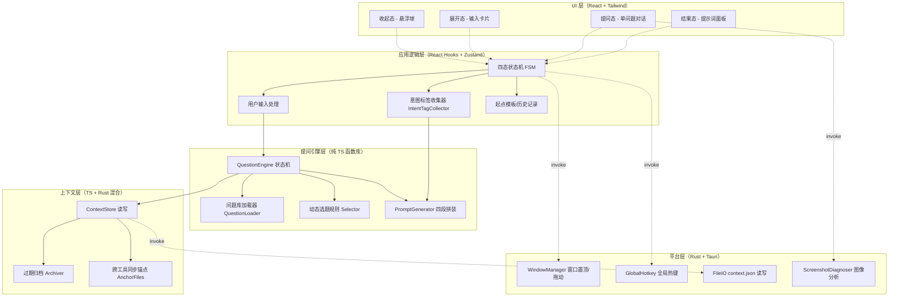
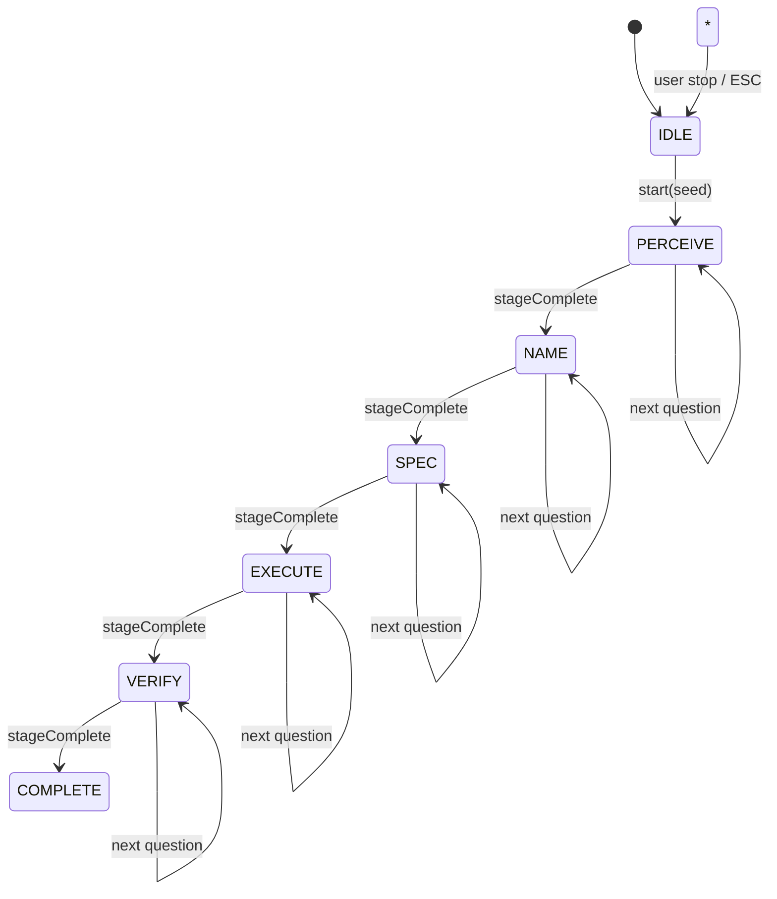
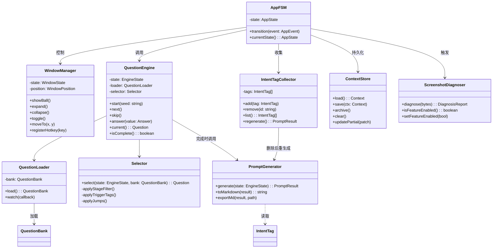
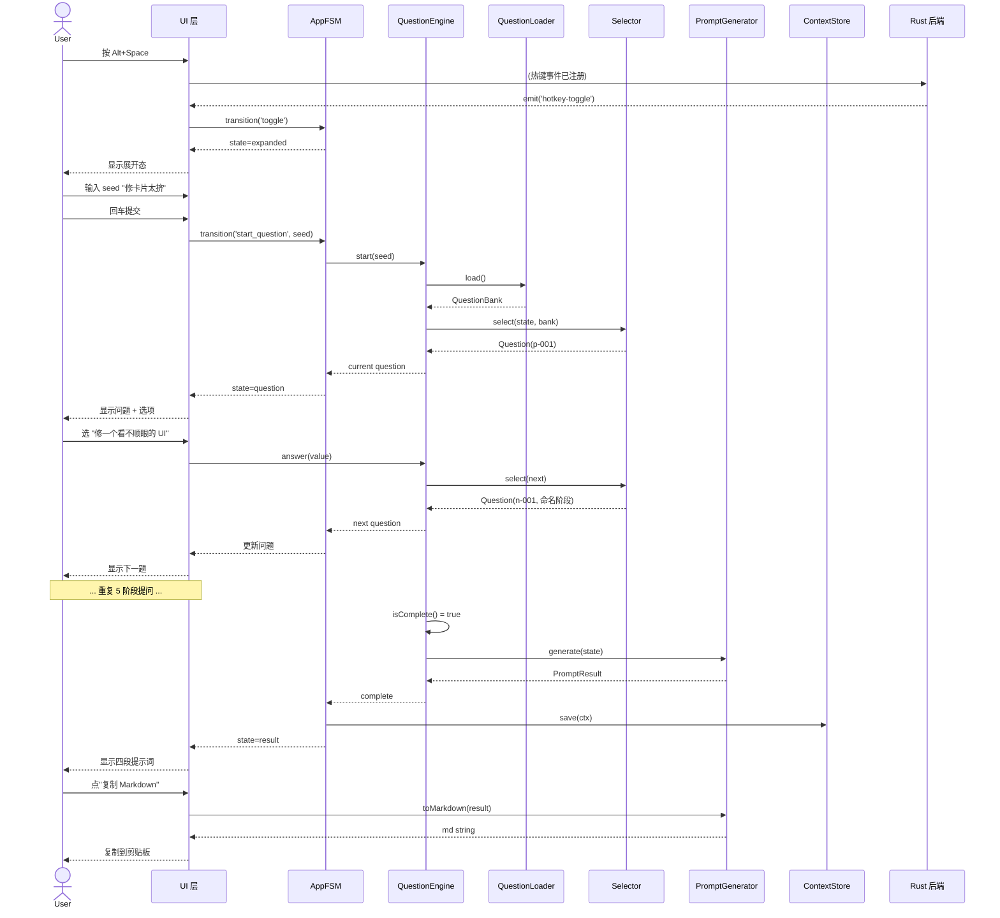
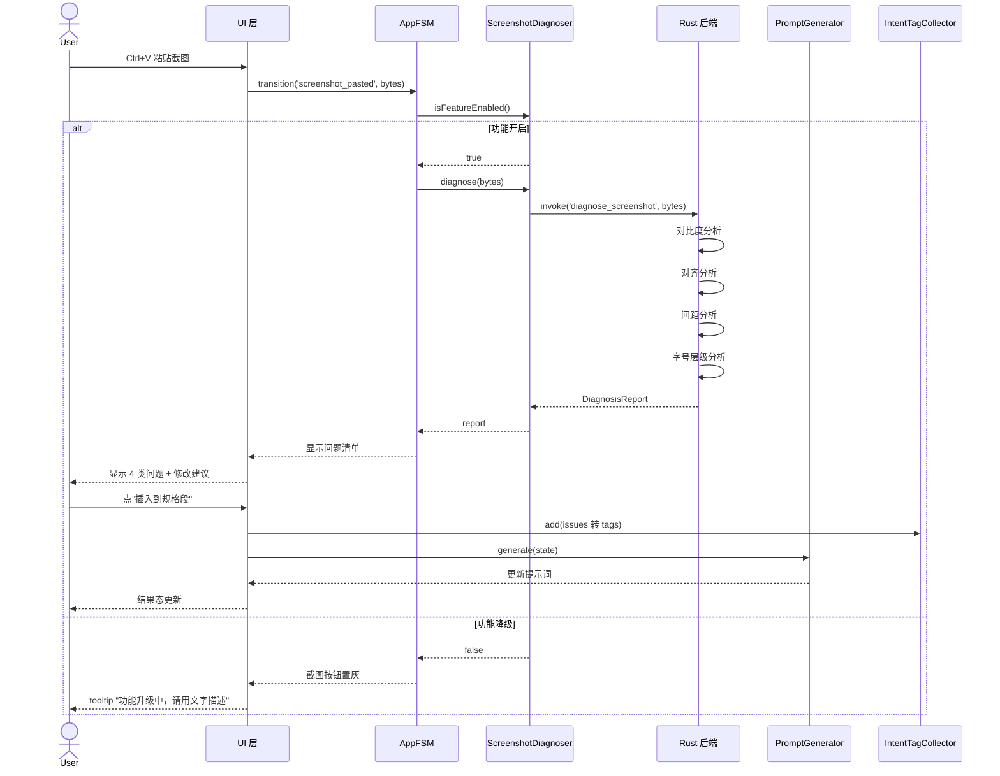
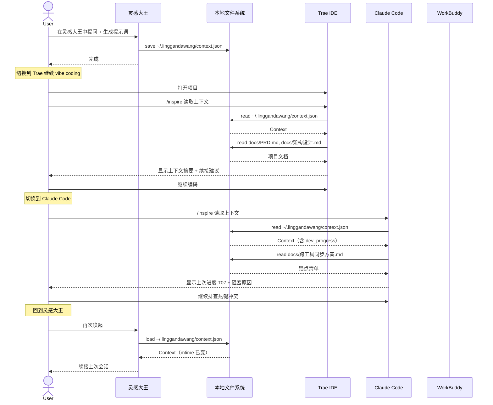

# 灵感大王 架构设计文档

| 字段 | 值 |
|---|---|
| 版本 | v1.0 |
| 产出人 | 高见远（架构师） |
| 日期 | 2026-06-17 |
| 阶段 | Phase 1 - 端侧 Demo |
| 依赖文档 | `docs/PRD.md` v1.0 |
| 状态 | 待团队评审 |

---

## 0. 文档说明

本文档面向工程师寇豆码、PM 许清楚、QA 严过关与主理人，是 Phase 1 端侧 Demo 的**唯一架构事实源**。所有代码实现、任务拆分、跨工具协作约定都以本文档为准。

**结论先行（TL;DR）**：
- 采用 **Tauri 2.0 + React 18 + TypeScript + Tailwind + Zustand** 五件套，Rust 后端最小化，只承担窗口/热键/文件 I/O/截图图像处理四类平台能力。
- 分层架构五层（UI / 应用逻辑 / 提问引擎 / 上下文 / 平台），提问引擎是**纯 TS 函数库**，零外部依赖，便于单测与热更新。
- 提问引擎采用「阶段状态机 + 规则文件 + 意图标签驱动选题」三件套，问题库 YAML 文件可热更新。
- 截图诊断在架构上预留**双开关**（编译期 feature flag + 运行时配置），W3 末 go/no-go 评审准确率 < 60% 一键降级为 P1。
- 跨工具同步以 `docs/` 为单一事实源，`~/.linggandawang/context.json` 承载运行时上下文，`.trae/` `.claude/` 只放工具特定配置。

---

## 1. 架构总览

### 1.1 一句话架构定位

> **一个五层分层架构：UI 层负责四态视觉、应用逻辑层负责状态机与用户输入、提问引擎层是无状态纯函数库、上下文层负责跨工具数据持久化、平台层用最小化 Rust 封装窗口/热键/文件/图像四类系统能力。**

### 1.2 分层架构图



**层级职责一句话**：
- UI 层：只画不存，所有状态来自 Zustand store。
- 应用逻辑层：管状态、收输入、串流程，**不直接碰文件系统**。
- 提问引擎层：纯函数，输入问题库+当前状态，输出下一题/提示词，可独立单测。
- 上下文层：封装所有持久化，对外暴露读写 API。
- 平台层：Rust 后端，**只做浏览器干不了的事**。

### 1.3 Tauri 前后端职责划分

| 职责 | 归属 | 理由 |
|---|---|---|
| 四态 UI 渲染 | 前端 React | 视图频繁变化，DOM 生态成熟 |
| 状态机/选题/拼装 | 前端 TS | 纯逻辑，无 I/O，便于热更新与单测 |
| 问题库 YAML 加载 | 前端 TS（经 Tauri fs API） | 规则文件需热更新，前端读取最直接 |
| 悬浮窗置顶/透明/无边框 | Rust（tauri::Window） | 浏览器无此能力，必须原生 |
| 全局热键 Alt+Space | Rust（tauri-plugin-global-shortcut） | 浏览器无法监听全局热键 |
| 拖动 + 位置持久化 | 前端事件 + Rust fs 持久化 | 拖动用 webview 事件即可，持久化走 Rust |
| context.json 读写 | Rust（std::fs） | 跨平台路径解析、原子写入、权限收敛，Rust 更稳 |
| 截图粘贴 | 前端 clipboard API + Rust 图像处理 | 粘贴入 webview，分析算法走 Rust 性能更好 |
| 截图诊断算法 | Rust（image crate） | 像素遍历性能敏感，Rust 比 JS 快 10× |
| Markdown 导出 | 前端 Blob + Rust fs 写盘 | 拼装在前端，写盘走 Rust |

**设计原则**：**前端能做的不上 Rust，Rust 只接平台能力**。这样减少 Rust 学习曲线对进度的影响，同时保留热更新灵活性。

---

## 2. 技术选型与理由

| 技术 | 版本 | 用途 | 选型理由 | 备选 |
|---|---|---|---|---|
| Tauri | 2.0+ | 桌面应用壳 | 包体 ≤10MB（Electron ≥80MB），内存 ≤150MB 满足 FR-001；Rust 后端可调系统 API；参赛 Demo 体量轻 | Electron（包体大）、Wails（生态新） |
| React | 18.x | UI 框架 | 生态最成熟，hooks 模式契合状态机；评委熟悉度高 | Vue 3、Svelte |
| TypeScript | 5.x | 类型系统 | 提问引擎强类型约束，问题库 schema 类型安全 | - |
| Tailwind CSS | 3.4+ | 原子化样式 | PRD 视觉规范已列 token，Tailwind config 直接映射；深色主题原生支持 | CSS Modules |
| Vite | 5.x | 构建工具 | Tauri 官方推荐，HMR 快，配置简单 | webpack（慢） |
| Zustand | 4.x | 全局状态 | 比 Redux 轻 10×，API 极简，契合中小型应用；无 Provider 嵌套 | Redux Toolkit、Jotai |
| React Hook Form | 7.x | 表单 | 自定义输入回车提交、跳过校验 | Formik |
| Vitest | 1.x | 单测 | Vite 原生集成，提问引擎纯函数易测 | Jest |
| yaml | 2.x | 问题库解析 | 问题库用 YAML 写更可读，支持注释 | JSON（无注释） |
| marked | 12.x | Markdown 渲染 | 结果态提示词预览 | markdown-it |
| Rust toolchain | 1.75+ | 后端语言 | Tauri 标配 | - |
| tauri-plugin-global-shortcut | 2.0 | 全局热键 | Tauri 官方插件 | 自实现 Win32 API |
| tauri-plugin-store | 2.0 | 配置持久化 | 设置项（热键、位置）持久化 | 自实现 JSON |
| image crate | 0.25+ | 截图分析 | 像素遍历、颜色采样、边缘检测 | wasm-bindgen + canvas |
| serde + serde_json | 1.0 | Rust 序列化 | context.json schema 强类型 | - |

**截图诊断方案**：对比度走 WCAG 公式（相对亮度比），对齐走 Sobel 边缘 + 列投影方差，间距走水平/垂直空白带聚类，字号层级走 DOM-like 文本块聚类（基于连通域面积分层）。**全部在 Rust 端实现，前端只展示结果**。性能目标：单图 < 5 秒，1024×768 截图实测目标 < 2 秒。

---

## 3. 核心模块设计

### 3.1 M1 悬浮窗管理器（WindowManager）

| 项 | 内容 |
|---|---|
| 职责 | 窗口置顶、四态切换、拖动、位置持久化、全局热键监听 |
| 公开接口 | `showBall()` / `expand()` / `collapse()` / `toggle()` / `moveTo(x,y)` / `registerHotkey(key)` |
| 依赖 | tauri::Window、tauri-plugin-global-shortcut、tauri-plugin-store |
| 关键数据结构 | `WindowState = 'ball' \| 'expanded' \| 'question' \| 'result'`、`WindowPosition { x, y, screen }` |

**算法要点**：
- 四态切换通过 React 条件渲染 + CSS transform 动画实现，窗口本体不变（避免重建 webview）。
- 拖动用 `data-tauri-drag-region` 属性 + `onMouseDown` 防抖；位置在 `mouseup` 时通过 `invoke('save_window_position')` 持久化。
- 全局热键在 Rust 端注册，触发时通过 `emit('hotkey-toggle')` 推送到前端，前端调用 `toggle()`。
- **降级**：若 `tauri-plugin-global-shortcut` 注册失败（热键冲突），fallback 到窗口内快捷键 + 系统托盘点击。

### 3.2 M2 提问引擎（QuestionEngine）

| 项 | 内容 |
|---|---|
| 职责 | 加载问题库、驱动提问状态机、动态选题、跳过处理 |
| 公开接口 | `start(seedInput: string)` / `next()` / `skip()` / `answer(value: Answer)` / `current()` / `getState()` / `isComplete()` |
| 依赖 | QuestionLoader、Selector、问题库 YAML 文件 |
| 关键数据结构 | `EngineState`、`Question`、`Answer`、`IntentTag`、`Stage = 'perceive'\|'name'\|'spec'\|'execute'\|'verify'` |

**状态机**：



**动态选题规则（Selector）**：
1. **阶段过滤**：仅从当前 stage 的问题池中选。
2. **去重**：排除已问过的问题 ID。
3. **意图标签驱动**：若已收集标签命中某问题的 `trigger_tags`，优先选该问题（把相关问题问透）。
4. **跳转规则**：上一题回答命中 `jumps` 规则时，直接跳到指定问题 ID。
5. **种子输入路由**：用户在展开态输入的 seed 文本，经关键词匹配路由到首阶段具体问题（如"修 UI" → perceive 阶段的 UI 类问题）。
6. **兜底**：按问题库 `order` 字段顺序选。

**跳过逻辑**：用户跳过当前题，记录 `skipped=true`，不产出意图标签，进入下一题。若连续跳过 ≥ 2 题，弹出"是否结束提问生成提示词"二次确认。

### 3.3 M3 提示词生成器（PromptGenerator）

| 项 | 内容 |
|---|---|
| 职责 | 把提问收集到的意图标签 + 回答，拼装成四段结构提示词 |
| 公开接口 | `generate(engineState: EngineState): PromptResult` / `toMarkdown(result): string` / `exportMd(result, filepath)` |
| 依赖 | EngineState、IntentTag[] |
| 关键数据结构 | `PromptResult { action, spec, constraint, verify, rawQuotes }` |

**四段拼装规则**：
- **动作段（action）**：从用户 seed 输入 + perceive 阶段回答提取动词 + 对象。模板：`将 {对象} {动作}`，如"将卡片内边距增加"。
- **规格段（spec）**：从 spec 阶段回答提取量化值，每条意图标签展开为 `{属性}={值}{单位}`。如"紧凑布局" → `卡片内边距=16px；列表行高=40px`。
- **约束段（constraint）**：从 verify 阶段回答 + 用户偏好库（FR-008，P1）提取否定式约束。如"不要使用圆角"、"不要超过 3 种字号"。
- **验证段（verify）**：从 verify 阶段回答生成可观测条件。如"截图后卡片间距视觉上 ≥ 一指宽"。

**用户原话保留**：每段末尾追加 `<!-- 原话：{用户原话} -->` HTML 注释，Markdown 渲染时不可见但文本可追溯。

**评价→规格映射表**：内置 `评价词典`，如：
- "太挤" → 内边距 8→16px、间距 12→20px
- "太丑" → 触发追问"具体是颜色/对齐/字号？"
- "不够高级" → 触发追问"是指留白/对比度/动效？"

### 3.4 M4 上下文暂存（ContextStore）

| 项 | 内容 |
|---|---|
| 职责 | context.json 读写、过期归档、跨工具同步锚点维护 |
| 公开接口 | `load(): Context` / `save(ctx)` / `archive()` / `clear()` / `updatePartial(patch)` |
| 依赖 | Rust fs 命令、Context schema |
| 关键数据结构 | `Context`（见第 4 章 schema） |

**核心算法**：
- **原子写入**：先写 `.tmp` 再 rename，避免崩溃导致文件损坏（Rust 端实现）。
- **过期归档**：`updated_at` 距今 > 24h 时，移到 `~/.linggandawang/archive/{timestamp}.json`，主文件清空保留 schema_version。
- **跨工具同步**：每次 `save` 后，同步刷新 `docs/跨工具同步方案.md` 的"当前进度"段落？**否**——文档是手写事实源，不自动改。`dev_progress` 字段是运行时数据，由 PM/工程师手动维护或通过脚本同步。
- **并发冲突**：单进程运行，无并发；多工具切换时通过文件 mtime 检测，若发现外部修改，下次 load 时以磁盘为准。

### 3.5 M5 截图诊断（ScreenshotDiagnoser）

| 项 | 内容 |
|---|---|
| 职责 | 接收截图、识别 4 类视觉问题、产出可执行清单 |
| 公开接口 | `diagnose(imageBytes): DiagnosisReport` / `isFeatureEnabled()` / `setFeatureEnabled(bool)` |
| 依赖 | image crate、Rust 命令、降级开关 |
| 关键数据结构 | `DiagnosisReport { issues: Issue[] }`、`Issue { type, severity, description, suggestion }` |

**四类识别算法**：

| 类型 | 算法 | 阈值 |
|---|---|---|
| 对比度不足 | WCAG 相对亮度比，对每对相邻文本块计算 | < 4.5 报警（AA 级） |
| 对齐错位 | Sobel 边缘 + 列投影方差，检测元素左边缘是否对齐 | 偏差 > 4px 报警 |
| 间距不统一 | 水平/垂直空白带聚类，间距标准差 / 均值 > 0.4 报警 | 变异系数 > 0.4 |
| 字号层级缺失 | 连通域面积分层聚类，簇数 < 3 报警 | 簇数 < 3 |

**降级开关（双保险）**：
1. **编译期**：Cargo feature flag `screenshot-diagnosis`，W3 评审不过则从 main 移除该 feature，包体减重。
2. **运行时**：`~/.linggandawang/config.json` 中 `features.screenshot_diagnosis: bool`，前端通过 `isFeatureEnabled()` 读取，false 时截图按钮置灰，引导用户走纯文字提问流程。

**降级后的用户路径**：截图按钮 disabled + tooltip 提示"截图诊断功能升级中，请用文字描述视觉问题"，提问引擎感知到截图 disabled 时，在 perceive 阶段插入"请用 3 个词描述你看到的问题"作为兜底问题。

### 3.6 M6 意图标签收集器（IntentTagCollector）

| 项 | 内容 |
|---|---|
| 职责 | 累计收集意图标签、chip 展示、删除后触发重生成 |
| 公开接口 | `add(tag: IntentTag)` / `remove(id)` / `list()` / `regenerate()` |
| 依赖 | QuestionEngine、PromptGenerator |
| 关键数据结构 | `IntentTag { id, label, value, source_question_id, stage, created_at }` |

**关键行为**：
- 每个 chip 显示 `{label}: {value}`，如"布局: 紧凑"。
- 删除某 tag 后，`regenerate()` 调用 PromptGenerator 重新拼装提示词（无需重问，直接基于剩余 tags）。
- **北极星指标埋点**：`list().length` 即挤出的意图标签数，目标 ≥ 3。

---

## 4. 数据结构

### 4.1 问题库 YAML Schema

```yaml
# 问题库根结构
schema_version: "1.0"
bank_id: "frontend-ui-v1"      # 问题库唯一 ID
scene: "frontend-ui"            # 场景：仅前端 UI（D3 决策）
total_questions: 30             # 总题数，PM 维护
stages:                         # 5 个阶段
  - id: perceive                # 感知
    name: "感知阶段"
    order: 1
  - id: name                    # 命名
    name: "命名阶段"
    order: 2
  - id: spec                    # 规格
    name: "规格阶段"
    order: 3
  - id: execute                 # 执行
    name: "执行阶段"
    order: 4
  - id: verify                  # 验证
    name: "验证阶段"
    order: 5
questions:                      # 问题列表
  - id: "p-001"                 # 唯一 ID，阶段前缀 + 序号
    stage: perceive
    order: 1
    text: "你今天想看到什么变化？"
    type: "single-choice"       # single-choice / multi-choice / open / scale
    options:                    # 选项（type 为 open 时为空）
      - label: "修一个看不顺眼的 UI"
        value: "fix-ui"
        tags: ["场景: 修UI"]    # 选中后产出的意图标签
      - label: "给现有功能加一个细节"
        value: "add-detail"
        tags: ["场景: 加细节"]
      - label: "复制一个我喜欢的产品的小特性"
        value: "copy-feature"
        tags: ["场景: 复制特性"]
    allow_custom: true          # 是否允许自定义输入
    placeholder: "或自己描述..."
    trigger_tags: []            # 命中已有标签时优先选本题
    jumps:                      # 跳转规则
      - when_answer: "fix-ui"
        next_question_id: "n-001"
      - when_answer: "add-detail"
        next_question_id: "n-002"
    intent_extraction:          # 自定义输入的意图提取规则
      keywords:
        - keyword: "挤"
          extract_tag: "痛点: 间距太挤"
        - keyword: "丑"
          extract_tag: "痛点: 视觉丑"
    required: false             # 是否必答
    timeout_sec: null           # 超时自动跳过（Demo 不启用）
```

**热更新规则**：
- 问题库文件路径：`src/question-bank/bank.yaml`（开发期）+ `~/.linggandawang/bank.yaml`（运行期覆盖）。
- 加载顺序：内置 bank.yaml → 用户目录 bank.yaml 覆盖（按 `bank_id` 合并 questions）。
- 加载时机：应用启动 + 用户手动"刷新问题库"按钮 + 文件 mtime 变化时（Tauri fs watcher，Demo 可不实现，仅手动刷新）。

### 4.2 context.json 完整 Schema

```json
{
  "$schema": "http://json-schema.org/draft-07/schema#",
  "title": "LinggandawangContext",
  "type": "object",
  "required": ["schema_version", "timestamps"],
  "properties": {
    "schema_version": {
      "type": "string",
      "const": "1.0",
      "description": "Schema 版本，向后兼容判断"
    },
    "project": {
      "type": "object",
      "description": "当前项目信息",
      "properties": {
        "name": { "type": "string", "example": "灵感大王 Demo" },
        "path": { "type": "string", "example": "D:\\AI工作平台\\灵感大王" },
        "type": { "type": "string", "enum": ["frontend", "backend", "fullstack", "other"], "example": "frontend" }
      }
    },
    "current_pain_point": {
      "type": "string",
      "description": "当前痛点一句话描述",
      "example": "首页卡片太挤，想拉开间距但 agent 总改不对"
    },
    "preferences": {
      "type": "array",
      "description": "用户已确认的偏好（长期累积）",
      "items": {
        "type": "object",
        "properties": {
          "key": { "type": "string", "example": "layout" },
          "value": { "type": "string", "example": "compact" },
          "confirmed_at": { "type": "string", "format": "date-time" }
        }
      },
      "example": [
        { "key": "layout", "value": "compact", "confirmed_at": "2026-06-17T10:00:00Z" },
        { "key": "theme", "value": "dark", "confirmed_at": "2026-06-17T10:00:00Z" }
      ]
    },
    "recent_qa": {
      "type": "array",
      "description": "最近 3 条提问回答",
      "maxItems": 3,
      "items": {
        "type": "object",
        "properties": {
          "question_id": { "type": "string" },
          "question_text": { "type": "string" },
          "answer": { "type": "string" },
          "answered_at": { "type": "string", "format": "date-time" }
        }
      }
    },
    "intent_tags": {
      "type": "array",
      "description": "本次会话累计挤出的意图标签",
      "items": {
        "type": "object",
        "properties": {
          "id": { "type": "string" },
          "label": { "type": "string", "example": "布局" },
          "value": { "type": "string", "example": "紧凑" },
          "stage": { "type": "string" },
          "source_question_id": { "type": "string" }
        }
      }
    },
    "last_prompt": {
      "type": "string",
      "description": "最近一次生成的提示词 Markdown 全文"
    },
    "dev_progress": {
      "type": "object",
      "description": "跨工具开发进度同步字段（PM/工程师手动维护）",
      "properties": {
        "current_milestone": { "type": "string", "example": "M3 悬浮窗骨架" },
        "current_task_id": { "type": "string", "example": "T07" },
        "current_task_status": { "type": "string", "enum": ["todo", "in_progress", "blocked", "done"] },
        "blocked_reason": { "type": "string" },
        "last_tool": { "type": "string", "enum": ["trae", "claude-code", "workbuddy", "manual"], "example": "trae" },
        "notes": { "type": "string", "description": "给下一个工具的交接说明" }
      }
    },
    "timestamps": {
      "type": "object",
      "required": ["created_at", "updated_at"],
      "properties": {
        "created_at": { "type": "string", "format": "date-time" },
        "updated_at": { "type": "string", "format": "date-time" },
        "archived_at": { "type": "string", "format": "date-time", "description": "归档时写入" }
      }
    },
    "archived": {
      "type": "boolean",
      "default": false
    }
  }
}
```

**示例值（最小可用）**：

```json
{
  "schema_version": "1.0",
  "project": { "name": "灵感大王 Demo", "path": "D:\\AI工作平台\\灵感大王", "type": "frontend" },
  "current_pain_point": "首页卡片太挤",
  "preferences": [
    { "key": "layout", "value": "compact", "confirmed_at": "2026-06-17T10:00:00Z" }
  ],
  "recent_qa": [
    { "question_id": "p-001", "question_text": "你今天想看到什么变化？", "answer": "修一个看不顺眼的 UI", "answered_at": "2026-06-17T10:01:00Z" }
  ],
  "intent_tags": [
    { "id": "tag-1", "label": "场景", "value": "修UI", "stage": "perceive", "source_question_id": "p-001" }
  ],
  "last_prompt": "",
  "dev_progress": {
    "current_milestone": "M3",
    "current_task_id": "T07",
    "current_task_status": "in_progress",
    "last_tool": "trae",
    "notes": "全局热键注册在 Win11 上偶发冲突，待排查"
  },
  "timestamps": {
    "created_at": "2026-06-17T10:00:00Z",
    "updated_at": "2026-06-17T10:05:00Z"
  },
  "archived": false
}
```

### 4.3 提示词四段结构 TypeScript 类型定义

```typescript
// src/types/prompt.ts

export type PromptStage = 'perceive' | 'name' | 'spec' | 'execute' | 'verify';

export interface IntentTag {
  id: string;
  label: string;        // 标签分类，如"布局"、"颜色"
  value: string;        // 标签值，如"紧凑"、"深色"
  stage: PromptStage;
  source_question_id: string;
  created_at: string;   // ISO 8601
}

export interface PromptSegment {
  title: string;        // 段标题，如"要做什么"
  content: string;      // 段正文，多行字符串
  raw_quote?: string;   // 用户原话注释
}

export interface PromptResult {
  action: PromptSegment;       // 动作段：要做什么
  spec: PromptSegment;         // 规格段：怎么做
  constraint: PromptSegment;   // 约束段：不能怎么
  verify: PromptSegment;       // 验证段：怎么算做好了
  raw_quotes: string[];        // 全部用户原话（用于折叠面板展示）
  intent_tags: IntentTag[];    // 关联的意图标签
  generated_at: string;
}

export interface MarkdownExportOptions {
  include_raw_quotes: boolean; // 是否包含原话注释
  include_tags: boolean;       // 是否包含意图标签清单
  code_block_for_spec: boolean; // 规格段是否用代码块包裹
}
```

### 4.4 意图标签数据结构

```typescript
// src/types/intent-tag.ts

export type IntentTagSource = 'option' | 'custom-input' | 'extracted-keyword' | 'screenshot-diagnosis';

export interface IntentTag {
  id: string;                    // UUID
  label: string;                 // 分类标签
  value: string;                 // 具体值
  stage: PromptStage;
  source_question_id: string;    // 来源问题 ID（截图诊断时为 'screenshot'）
  source_type: IntentTagSource;
  confidence: number;            // 0-1，截图诊断/关键词提取用
  deletable: boolean;            // 是否允许用户删除
  created_at: string;
}

// chip 展示用派生类型
export interface IntentTagChip {
  id: string;
  display_text: string;          // `${label}: ${value}`
  color: 'purple' | 'yellow';    // purple 默认，yellow 截图诊断
  deletable: boolean;
}
```

### 4.5 核心类关系图



---

## 5. 关键时序图

### 5.1 时序图 A：用户唤起 → 提问流程 → 生成提示词（主流程）



### 5.2 时序图 B：截图诊断流程



### 5.3 时序图 C：跨工具上下文暂存与续接



---

## 6. 任务列表（有序，含依赖）

### 6.1 任务总览

| 分组 | 任务数 | 关键路径 |
|---|---|---|
| G1 项目初始化 | T01-T03 | T01 是所有任务起点 |
| G2 悬浮窗骨架 | T04-T07 | T04 → T05 → T07 |
| G3 提问引擎 | T08-T11 | T08 → T09 → T10 |
| G4 提示词生成 | T12-T15 | T12 → T15 |
| G5 上下文暂存 | T16-T18 | T16 |
| G6 截图诊断 | T19-T23 | T19 → T20 → T22 |
| G7 集成打磨 | T24-T27 | T24 |
| G8 打包自测 | T28-T30 | T28 |

**关键路径**（红色加粗，决定 Demo 交付时间）：**T01 → T04 → T05 → T07 → T08 → T09 → T12 → T16 → T24 → T28**

### 6.2 G1 项目初始化

#### T01 Tauri 脚手架与基础配置
- **描述**：用 `create-tauri-app` 初始化项目，集成 React + TS + Vite + Tailwind。
- **输入**：D1 技术栈决策、PRD 视觉规范
- **输出**：可运行的 Tauri 开发环境，`pnpm tauri dev` 能起空白窗口
- **依赖任务**：无
- **预计文件**：`package.json`、`tauri.conf.json`、`vite.config.ts`、`tailwind.config.ts`、`tsconfig.json`、`src/main.tsx`、`src/App.tsx`
- **验收标准**：
  1. `pnpm tauri dev` 启动 < 10 秒
  2. 窗口默认 380×560，深色背景 `#0F0F12`
  3. TypeScript 严格模式开启，无 any 报错
  4. Tailwind 可用，`bg-[#0F0F12]` 生效

#### T02 目录约定与配置文件
- **描述**：按第 8 章共享知识建立目录结构，建立 `.editorconfig`、`.prettierrc`、ESLint 配置。
- **输入**：架构设计第 8 章
- **输出**：完整目录树 + 代码规范配置
- **依赖任务**：T01
- **预计文件**：`src/components/`、`src/hooks/`、`src/stores/`、`src/engine/`、`src/types/`、`src/utils/`、`src-tauri/src/`、`.editorconfig`、`.prettierrc`、`.eslintrc.cjs`
- **验收标准**：目录树与第 8.1 节一致；`pnpm lint` 无报错

#### T03 Zustand 状态管理初始化
- **描述**：创建全局 store 骨架，定义 AppState、WindowState、EngineState 三个 slice。
- **输入**：架构设计第 3、4 章
- **输出**：`src/stores/` 下三个 store 文件 + 类型定义
- **依赖任务**：T01、T02
- **预计文件**：`src/stores/appStore.ts`、`src/stores/windowStore.ts`、`src/stores/engineStore.ts`、`src/types/state.ts`
- **验收标准**：
  1. 三个 store 可独立使用，无循环依赖
  2. DevTools 可观测状态变化
  3. 包含 `transition` action 占位

### 6.3 G2 悬浮窗骨架（M1）

#### T04 Tauri 窗口配置
- **描述**：配置 tauri.conf.json 实现悬浮球窗口：无边框、透明、置顶、可穿透。
- **输入**：FR-001 验收标准
- **输出**：启动后显示无边框透明置顶窗口
- **依赖任务**：T01
- **预计文件**：`tauri.conf.json`、`src-tauri/src/main.rs`、`src-tauri/src/window.rs`
- **验收标准**：
  1. 窗口 `decorations: false`、`transparent: true`、`alwaysOnTop: true`
  2. 内存占用 ≤ 80MB（空白窗口基线）
  3. 全屏应用上方仍可见

#### T05 悬浮球 UI 与四态切换骨架
- **描述**：实现收起态悬浮球 + 四态条件渲染骨架（无业务逻辑，仅视觉切换）。
- **输入**：PRD 4.2 节、视觉规范
- **输出**：可点击切换四态的 UI 骨架
- **依赖任务**：T04、T03
- **预计文件**：`src/components/Ball.tsx`、`src/components/ExpandedCard.tsx`、`src/components/QuestionPanel.tsx`、`src/components/ResultPanel.tsx`、`src/components/MainWindow.tsx`
- **验收标准**：
  1. 悬浮球直径 48px，深紫渐变 `#6E56CF → #8B6FE8`
  2. 悬停放大到 56px + tooltip
  3. 四态切换有过渡动画 ≤ 200ms
  4. ESC 键回到收起态

#### T06 拖动与位置持久化
- **描述**：实现悬浮球拖动 + 位置持久化到 `~/.linggandawang/config.json`。
- **输入**：FR-001 验收标准 2
- **输出**：可拖动、位置记忆的悬浮球
- **依赖任务**：T05
- **预计文件**：`src/components/Ball.tsx`（增强）、`src-tauri/src/config.rs`、`src/hooks/useDrag.ts`
- **验收标准**：
  1. 拖动到任意边缘松手后位置保存
  2. 重启应用位置恢复
  3. 拖动过程无闪烁

#### T07 全局热键 Alt+Space
- **描述**：注册全局热键，触发四态切换。
- **输入**：FR-002 验收标准
- **输出**：Alt+Space 唤起/收起悬浮窗
- **依赖任务**：T04、T05
- **预计文件**：`src-tauri/src/hotkey.rs`、`src-tauri/Cargo.toml`（加 global-shortcut 插件）、`src/hooks/useHotkey.ts`
- **验收标准**：
  1. 在任何应用前台按 Alt+Space 都生效
  2. 唤起响应 < 200ms
  3. 唤起后焦点落到输入框
  4. 热键冲突时记录日志并 fallback 到托盘点击

### 6.4 G3 提问引擎（M2 + 问题库 schema）

#### T08 问题库 schema 加载器
- **描述**：实现 QuestionLoader，从 `src/question-bank/bank.yaml` 加载问题库，校验 schema。
- **输入**：第 4.1 节 schema、第 4.5 节 schema.json
- **输出**：可加载并校验问题库的 loader
- **依赖任务**：T02
- **预计文件**：`src/engine/QuestionLoader.ts`、`src/engine/types.ts`、`src/question-bank/bank.yaml`（PM 提供 v1）
- **验收标准**：
  1. 加载 ≥ 30 条问题无报错
  2. schema 不符时给出明确错误
  3. 支持运行时从 `~/.linggandawang/bank.yaml` 覆盖加载
  4. 提供 `reload()` 手动刷新

#### T09 提问引擎状态机
- **描述**：实现 QuestionEngine 状态机：IDLE → PERCEIVE → NAME → SPEC → EXECUTE → VERIFY → COMPLETE。
- **输入**：第 3.2 节状态机
- **输出**：可驱动提问流程的引擎
- **依赖任务**：T08、T03
- **预计文件**：`src/engine/QuestionEngine.ts`、`src/engine/types.ts`
- **验收标准**：
  1. `start(seed)` 进入 perceive 阶段
  2. `answer()` 推进到下一题
  3. `skip()` 跳过当前题
  4. 5 阶段全部完成 `isComplete() = true`
  5. 单测覆盖率 ≥ 80%

#### T10 动态选题规则
- **描述**：实现 Selector：阶段过滤 + 去重 + 意图标签驱动 + 跳转规则 + 种子路由。
- **输入**：第 3.2 节选题规则
- **输出**：可动态选题的 selector
- **依赖任务**：T09
- **预计文件**：`src/engine/Selector.ts`、`src/engine/seedRouter.ts`
- **验收标准**：
  1. 不重复问同一题
  2. 命中 trigger_tags 优先选
  3. 命中 jumps 直接跳转
  4. seed "修 UI" 路由到 perceive 阶段 UI 问题
  5. 单测覆盖 5 种选题场景

#### T11 跳过逻辑与连续跳过二次确认
- **描述**：实现跳过逻辑，连续跳过 ≥ 2 题弹二次确认。
- **输入**：第 3.2 节跳过逻辑
- **输出**：跳过处理 + 二次确认 UI
- **依赖任务**：T09
- **预计文件**：`src/engine/QuestionEngine.ts`（增强）、`src/components/SkipConfirmDialog.tsx`
- **验收标准**：
  1. 跳过不产出意图标签
  2. 连续 2 次跳过弹窗"是否结束提问"
  3. 确认结束直接进入结果态

### 6.5 G4 提示词生成（M3 + M6）

#### T12 四段结构拼装器
- **描述**：实现 PromptGenerator，从 EngineState 拼装四段提示词。
- **输入**：第 3.3 节拼装规则、第 4.3 节类型
- **输出**：可生成 PromptResult 的 generator
- **依赖任务**：T09
- **预计文件**：`src/engine/PromptGenerator.ts`、`src/engine/评价词典.ts`
- **验收标准**：
  1. 100% 输出包含四段
  2. 评价类语句附带量化规格
  3. 用户原话保留在 raw_quotes
  4. 单测覆盖 ≥ 5 种意图标签组合

#### T13 用户原话保留
- **描述**：在每段末尾追加 HTML 注释保留原话，结果态折叠面板展示。
- **输入**：FR-004 验收标准 3
- **输出**：原话注释 + 折叠 UI
- **依赖任务**：T12
- **预计文件**：`src/engine/PromptGenerator.ts`（增强）、`src/components/RawQuotesPanel.tsx`
- **验收标准**：
  1. Markdown 导出含 `<!-- 原话：... -->`
  2. 折叠面板默认收起
  3. 展开后显示所有原话

#### T14 Markdown 导出
- **描述**：实现 `toMarkdown()` + 一键复制 + 导出 .md 文件。
- **输入**：FR-004 验收标准 4、5
- **输出**：复制按钮 + 导出按钮
- **依赖任务**：T12
- **预计文件**：`src/engine/PromptGenerator.ts`（增强）、`src/components/ResultPanel.tsx`（增强）、`src-tauri/src/file.rs`
- **验收标准**：
  1. 复制到剪贴板成功
  2. 导出 .md 文件对话框
  3. 文件内容与预览一致

#### T15 意图标签收集器 chip UI
- **描述**：实现 IntentTagCollector + chip 展示 + 删除重生成。
- **输入**：第 3.6 节
- **输出**：可删除的 chip 列表
- **依赖任务**：T12
- **预计文件**：`src/engine/IntentTagCollector.ts`、`src/components/IntentTagChips.tsx`
- **验收标准**：
  1. chip 显示 `label: value`
  2. 紫色默认、黄色截图诊断
  3. 删除后提示词重新生成
  4. 北极星埋点上报 list().length

### 6.6 G5 上下文暂存（M4）

#### T16 context.json schema 与读写
- **描述**：实现 ContextStore，Rust 端实现原子写入。
- **输入**：第 4.2 节 schema
- **输出**：可读写 context.json 的 store
- **依赖任务**：T01、T03
- **预计文件**：`src-tauri/src/context.rs`、`src/stores/contextStore.ts`、`src/types/context.ts`
- **验收标准**：
  1. 写入 `~/.linggandawang/context.json`
  2. 原子写入（先 .tmp 再 rename）
  3. schema_version 字段必填
  4. 单测覆盖读写

#### T17 过期归档
- **描述**：updated_at > 24h 时归档到 archive 子目录。
- **输入**：FR-005 验收标准 3
- **输出**：归档逻辑
- **依赖任务**：T16
- **预计文件**：`src-tauri/src/context.rs`（增强）
- **验收标准**：
  1. 24h 后自动归档
  2. 归档文件命名 `{timestamp}.json`
  3. 主文件清空但保留 schema_version

#### T18 手动清空上下文
- **描述**：设置面板提供"清空上下文"按钮。
- **输入**：FR-005 验收标准 4
- **输出**：清空按钮 + 二次确认
- **依赖任务**：T16
- **预计文件**：`src/components/SettingsPanel.tsx`、`src/stores/contextStore.ts`（增强）
- **验收标准**：
  1. 点击后二次确认
  2. 确认后 context.json 清空
  3. UI 显示"已清空"

### 6.7 G6 截图诊断（M5，带 go/no-go 开关）

#### T19 截图粘贴与拖入
- **描述**：监听 Ctrl+V 与文件拖入，获取图像 bytes。
- **输入**：FR-006 验收标准 1
- **输出**：可接收截图的 UI 入口
- **依赖任务**：T05
- **预计文件**：`src/hooks/useScreenshotPaste.ts`、`src/components/ScreenshotDropZone.tsx`
- **验收标准**：
  1. Ctrl+V 粘贴图片成功
  2. 拖入图片文件成功
  3. 预览缩略图

#### T20 对比度识别
- **描述**：Rust 端实现 WCAG 相对亮度比算法。
- **输入**：第 3.5 节算法表
- **输出**：对比度问题清单
- **依赖任务**：T19
- **预计文件**：`src-tauri/src/screenshot/contrast.rs`、`src-tauri/src/screenshot/mod.rs`
- **验收标准**：
  1. 识别对比度 < 4.5 的文本块
  2. 给出"加深标题颜色"建议
  3. 单图 < 2 秒

#### T21 对齐/间距/字号识别
- **描述**：实现剩余 3 类识别算法。
- **输入**：第 3.5 节算法表
- **输出**：3 类问题清单
- **依赖任务**：T20
- **预计文件**：`src-tauri/src/screenshot/alignment.rs`、`src-tauri/src/screenshot/spacing.rs`、`src-tauri/src/screenshot/fontsize.rs`
- **验收标准**：
  1. 对齐偏差 > 4px 报警
  2. 间距变异系数 > 0.4 报警
  3. 字号簇数 < 3 报警
  4. 单图总耗时 < 5 秒

#### T22 go/no-go 降级开关
- **描述**：实现编译期 feature flag + 运行时配置开关。
- **输入**：第 3.5 节降级机制
- **输出**：可一键降级的开关
- **依赖任务**：T20
- **预计文件**：`src-tauri/Cargo.toml`（feature）、`src-tauri/src/screenshot/mod.rs`、`src/stores/featureStore.ts`、`~/.linggandawang/config.json`
- **验收标准**：
  1. feature flag 关闭时编译无截图模块
  2. 运行时开关 false 时 UI 按钮置灰
  3. 降级后提问引擎插入兜底问题

#### T23 一键插入规格段
- **描述**：截图问题清单可一键插入到提示词规格段。
- **输入**：FR-006 验收标准 5
- **输出**：插入按钮
- **依赖任务**：T21、T12
- **预计文件**：`src/components/DiagnosisReport.tsx`、`src/engine/PromptGenerator.ts`（增强）
- **验收标准**：
  1. 点击"插入到规格段"后提示词更新
  2. 插入内容可编辑

### 6.8 G7 集成与打磨

#### T24 四态串联
- **描述**：把 G2-G6 的模块串成完整流程，四态切换无 bug。
- **输入**：所有前置任务
- **输出**：端到端可跑通的主流程
- **依赖任务**：T07、T11、T15、T16、T23
- **预计文件**：`src/App.tsx`、`src/hooks/useFlow.ts`
- **验收标准**：
  1. 唤起 → 提问 → 生成 → 复制 全流程无报错
  2. 全流程 < 60 秒（北极星）
  3. ESC 任意状态回收起态

#### T25 视觉规范落地
- **描述**：按 PRD 4.4 节视觉规范全面校准颜色、字体、圆角、阴影。
- **输入**：PRD 4.4 节
- **输出**：符合视觉规范的 UI
- **依赖任务**：T24
- **预计文件**：`tailwind.config.ts`、`src/styles/tokens.css`、各组件
- **验收标准**：
  1. 所有颜色与 token 一致
  2. JetBrains Mono 用于提示词
  3. 阴影 `0 8px 32px rgba(0,0,0,0.4)`

#### T26 快捷键与设置面板
- **描述**：实现设置面板：热键自定义、清空上下文、问题库刷新。
- **输入**：FR-002 验收标准 1
- **输出**：设置面板
- **依赖任务**：T07、T18
- **预计文件**：`src/components/SettingsPanel.tsx`、`src-tauri/src/config.rs`
- **验收标准**：
  1. 热键可自定义
  2. 设置持久化
  3. 右键菜单入口

#### T27 起点模板与最近提示词
- **描述**：展开态 3 个起点模板按钮 + 底部最近 3 条提示词。
- **输入**：PRD 4.2.2 节
- **输出**：起点模板 + 历史快速复用
- **依赖任务**：T24
- **预计文件**：`src/components/StartTemplates.tsx`、`src/components/RecentPromptsList.tsx`、`src-tauri/src/history.rs`
- **验收标准**：
  1. 3 个模板按钮可点击进入提问态
  2. 最近 3 条可一键复用

### 6.9 G8 打包与自测

#### T28 Tauri 打包
- **描述**：打包为 Windows 安装包，验证离线可用。
- **输入**：D4 决策（完全离线）
- **输出**：`.msi` 或 `.exe` 安装包
- **依赖任务**：T24
- **预计文件**：`tauri.conf.json`（打包配置）、`scripts/build.sh`
- **验收标准**：
  1. 包体 ≤ 15MB
  2. 断网后可正常使用全部 P0 功能
  3. 安装后无依赖缺失

#### T29 自测报告
- **描述**：QA 严过关按验收标准全量自测，产出报告。
- **输入**：所有 FR 验收标准
- **输出**：`deliverables/自测报告.md`
- **依赖任务**：T28
- **预计文件**：`deliverables/自测报告.md`
- **验收标准**：
  1. P0 六项全过
  2. 截图诊断 W3 末 go/no-go 评审记录
  3. 已知问题清单

#### T30 Demo 演练
- **描述**：5 分钟 Demo 流程演练，记录视频。
- **输入**：D4 决策
- **输出**：演练视频 + 流程脚本
- **依赖任务**：T29
- **预计文件**：`deliverables/demo-script.md`、`deliverables/demo-video.mp4`
- **验收标准**：
  1. 5 分钟跑通核心闭环
  2. 无崩溃
  3. 评委可上手体验

---

## 7. 依赖包列表

### 7.1 前端 npm 包

| 名称 | 版本 | 用途 | 必需/推荐 |
|---|---|---|---|
| react | ^18.3 | UI 框架 | 必需 |
| react-dom | ^18.3 | React DOM 渲染 | 必需 |
| @tauri-apps/api | ^2.0 | Tauri 前端 API | 必需 |
| @tauri-apps/plugin-store | ^2.0 | 配置持久化 | 必需 |
| @tauri-apps/plugin-global-shortcut | ^2.0 | 全局热键 | 必需 |
| zustand | ^4.5 | 全局状态管理 | 必需 |
| typescript | ^5.4 | 类型系统 | 必需 |
| tailwindcss | ^3.4 | 原子化样式 | 必需 |
| vite | ^5.2 | 构建工具 | 必需 |
| @vitejs/plugin-react | ^4.2 | Vite React 插件 | 必需 |
| yaml | ^2.4 | 问题库 YAML 解析 | 必需 |
| marked | ^12.0 | Markdown 渲染 | 必需 |
| clsx | ^2.1 | className 拼接 | 推荐 |
| uuid | ^9.0 | 生成意图标签 ID | 推荐 |
| react-hook-form | ^7.51 | 自定义输入表单 | 推荐 |
| vitest | ^1.5 | 单测 | 必需 |
| @testing-library/react | ^15 | React 组件测试 | 推荐 |
| eslint | ^9.2 | 代码规范 | 推荐 |
| prettier | ^3.2 | 格式化 | 推荐 |

### 7.2 Rust crate

| 名称 | 版本 | 用途 | 必需/推荐 |
|---|---|---|---|
| tauri | 2.0 | 应用主框架 | 必需 |
| tauri-plugin-global-shortcut | 2.0 | 全局热键 | 必需 |
| tauri-plugin-store | 2.0 | 配置持久化 | 必需 |
| serde | 1.0 | 序列化框架 | 必需 |
| serde_json | 1.0 | JSON 序列化 | 必需 |
| serde_yaml | 0.9 | YAML 序列化（问题库校验） | 推荐 |
| image | 0.25 | 截图图像处理 | 必需（截图诊断） |
| anyhow | 1.0 | 错误处理 | 必需 |
| thiserror | 1.0 | 自定义错误类型 | 推荐 |
| chrono | 0.4 | 时间处理（过期归档） | 必需 |
| uuid | 1.8 | 生成 ID | 推荐 |
| log | 0.4 | 日志 | 推荐 |
| env_logger | 0.11 | 日志输出 | 推荐 |

---

## 8. 共享知识（跨文件约定）

### 8.1 目录结构约定

```
灵感大王/
├── docs/                          # 单一事实源（文档）
│   ├── PRD.md
│   ├── 架构设计.md                # 本文档
│   └── 跨工具同步方案.md
├── src/                           # 前端源码
│   ├── components/                # React 组件
│   │   ├── Ball.tsx               # 收起态悬浮球
│   │   ├── ExpandedCard.tsx       # 展开态卡片
│   │   ├── QuestionPanel.tsx      # 提问态面板
│   │   ├── ResultPanel.tsx        # 结果态面板
│   │   ├── IntentTagChips.tsx     # 意图标签 chips
│   │   ├── RawQuotesPanel.tsx     # 原话折叠面板
│   │   ├── ScreenshotDropZone.tsx # 截图拖入区
│   │   ├── DiagnosisReport.tsx    # 诊断报告
│   │   ├── StartTemplates.tsx     # 起点模板
│   │   ├── RecentPromptList.tsx   # 最近提示词
│   │   ├── SettingsPanel.tsx      # 设置面板
│   │   ├── SkipConfirmDialog.tsx  # 跳过二次确认
│   │   └── MainWindow.tsx         # 主窗口容器
│   ├── hooks/                     # 自定义 hooks
│   │   ├── useDrag.ts
│   │   ├── useHotkey.ts
│   │   ├── useScreenshotPaste.ts
│   │   └── useFlow.ts
│   ├── stores/                    # Zustand stores
│   │   ├── appStore.ts            # 应用 FSM
│   │   ├── windowStore.ts         # 窗口状态
│   │   ├── engineStore.ts         # 提问引擎状态
│   │   ├── contextStore.ts        # 上下文
│   │   └── featureStore.ts        # 功能开关
│   ├── engine/                    # 提问引擎纯函数库
│   │   ├── QuestionLoader.ts
│   │   ├── QuestionEngine.ts
│   │   ├── Selector.ts
│   │   ├── seedRouter.ts
│   │   ├── PromptGenerator.ts
│   │   ├── IntentTagCollector.ts
│   │   ├── 评价词典.ts
│   │   └── types.ts
│   ├── types/                     # 全局类型
│   │   ├── state.ts
│   │   ├── prompt.ts
│   │   ├── intent-tag.ts
│   │   └── context.ts
│   ├── utils/                     # 工具函数
│   ├── styles/                    # 全局样式
│   │   └── tokens.css             # 视觉 token
│   ├── question-bank/             # 问题库
│   │   ├── schema.json            # schema 定义（见第 4.5 节）
│   │   └── bank.yaml              # 问题库 v1（PM 提供）
│   ├── App.tsx
│   ├── main.tsx
│   └── index.css
├── src-tauri/                     # Rust 后端
│   ├── src/
│   │   ├── main.rs
│   │   ├── window.rs              # 窗口管理
│   │   ├── hotkey.rs              # 全局热键
│   │   ├── config.rs              # 配置持久化
│   │   ├── context.rs             # context.json 读写
│   │   ├── file.rs                # 文件 I/O
│   │   ├── history.rs             # 历史记录
│   │   └── screenshot/            # 截图诊断
│   │       ├── mod.rs
│   │       ├── contrast.rs
│   │       ├── alignment.rs
│   │       ├── spacing.rs
│   │       └── fontsize.rs
│   ├── Cargo.toml
│   └── tauri.conf.json
├── scripts/                       # 脚本
│   └── build.sh
├── assets/                        # 静态资源
├── deliverables/                  # 交付物
├── .trae/rules/                   # Trae 规则
│   └── project_rules.md
├── .claude/                       # Claude Code 配置
│   ├── agents/
│   └── commands/
│       └── inspire.md
└── README.md
```

### 8.2 命名规范

| 类型 | 规范 | 示例 |
|---|---|---|
| 文件名（组件） | PascalCase | `ExpandedCard.tsx` |
| 文件名（非组件） | camelCase 或 kebab-case | `useDrag.ts`、`question-bank/bank.yaml` |
| React 组件 | PascalCase | `ExpandedCard` |
| TypeScript 类型/接口 | PascalCase | `PromptResult`、`IntentTag` |
| 函数/变量 | camelCase | `generatePrompt`、`currentQuestion` |
| 常量 | UPPER_SNAKE_CASE | `STAGE_ORDER`、`DEFAULT_HOTKEY` |
| Rust 模块 | snake_case | `screenshot/contrast.rs` |
| Rust 函数 | snake_case | `save_context` |
| CSS 类名 | kebab-case（Tailwind 优先） | `bg-card` |
| 问题 ID | `{stage}-{order}` | `p-001`（perceive）、`n-002`（name） |
| 任务 ID | `T{两位数}` | `T01`、`T27` |

### 8.3 状态管理约定

| 状态类型 | 归属 store | 是否持久化 | 示例 |
|---|---|---|---|
| 应用 FSM 状态 | appStore | 否 | `state: 'ball' \| 'expanded' \| ...` |
| 窗口位置 | windowStore | 是（config.json） | `position: { x, y }` |
| 提问引擎状态 | engineStore | 否 | `currentQuestion`, `stage`, `answers` |
| 意图标签 | engineStore | 否 | `intentTags[]` |
| 上下文 | contextStore | 是（context.json） | `project`, `preferences` |
| 功能开关 | featureStore | 是（config.json） | `screenshotDiagnosis: bool` |

**原则**：UI 临时态用 `useState`，跨组件共享用 Zustand store，持久化数据经 Rust 后端写盘。

### 8.4 事件总线约定

**不引入独立事件总线库**，使用 Tauri 内置 event 系统：
- Rust → 前端：`window.emit('event-name', payload)` + 前端 `listen('event-name', callback)`
- 前端 → 前端：直接调用 store action，不绕事件
- 前端 → Rust：`invoke('command_name', args)`

**事件清单**：

| 事件名 | 方向 | 触发时机 | payload |
|---|---|---|---|
| `hotkey-toggle` | Rust → 前端 | 全局热键按下 | 无 |
| `window-moved` | Rust → 前端 | 窗口拖动结束 | `{ x, y }` |
| `context-updated` | Rust → 前端 | context.json 外部修改 | `{ mtime }` |
| `question-bank-reloaded` | 前端 → 前端 | 问题库刷新 | `{ count }` |

### 8.5 视觉 token 与 Tailwind 配置约定

`tailwind.config.ts`：

```typescript
import type { Config } from 'tailwindcss'

export default {
  content: ['./src/**/*.{ts,tsx}'],
  darkMode: 'class',
  theme: {
    extend: {
      colors: {
        bg: {
          main: '#0F0F12',      // 主背景
          card: '#16161B',      // 卡片背景
        },
        border: {
          DEFAULT: '#1F1F25',   // 描边
        },
        brand: {
          DEFAULT: '#6E56CF',   // 主色紫
          hover: '#8B6FE8',     // 主色 hover
        },
        accent: {
          yellow: '#FFD580',    // 强调色暖黄
        },
        text: {
          primary: '#EDEDF0',   // 主文字
          secondary: '#8B8B95', // 次文字
        },
      },
      borderRadius: {
        card: '12px',
        btn: '8px',
        chip: '999px',
      },
      boxShadow: {
        card: '0 8px 32px rgba(0,0,0,0.4)',
      },
      fontFamily: {
        ui: ['PingFang SC', 'Inter', 'system-ui', 'sans-serif'],
        mono: ['JetBrains Mono', 'Consolas', 'monospace'],
      },
    },
  },
  plugins: [],
} satisfies Config
```

`src/styles/tokens.css`（CSS 变量，供非 Tailwind 场景使用）：

```css
:root {
  --color-bg-main: #0F0F12;
  --color-bg-card: #16161B;
  --color-border: #1F1F25;
  --color-brand: #6E56CF;
  --color-brand-hover: #8B6FE8;
  --color-accent-yellow: #FFD580;
  --color-text-primary: #EDEDF0;
  --color-text-secondary: #8B8B95;
  --radius-card: 12px;
  --radius-btn: 8px;
  --radius-chip: 999px;
  --shadow-card: 0 8px 32px rgba(0,0,0,0.4);
}
```

---

## 9. 跨工具同步方案

> 详细版见 `docs/跨工具同步方案.md`，本节为概要。

### 9.1 各工具配置目录映射

| 工具 | 配置目录 | 作用 | 是否提交 git |
|---|---|---|---|
| 灵感大王 | `~/.linggandawang/` | 运行时上下文 + 配置 | 否（本地） |
| Trae | `.trae/rules/` | Trae IDE 项目规则 | 是 |
| Claude Code | `.claude/` | Claude Code agents/commands | 是 |
| WorkBuddy | `.workbuddy/`（如有） | WorkBuddy 配置 | 是 |
| 单一事实源 | `docs/` | PRD、架构、跨工具同步方案 | 是 |

### 9.2 上下文锚点清单

每次切换工具必读文件：

1. `docs/PRD.md` — 产品需求
2. `docs/架构设计.md` — 架构与任务
3. `docs/跨工具同步方案.md` — 同步规则
4. `~/.linggandawang/context.json` — 运行时上下文（含 `dev_progress`）
5. `README.md` — 项目简介

### 9.3 进度同步状态字段

在 `context.json` 中维护 `dev_progress`：

```json
"dev_progress": {
  "current_milestone": "M3",
  "current_task_id": "T07",
  "current_task_status": "in_progress",
  "blocked_reason": "热键冲突待排查",
  "last_tool": "trae",
  "notes": "已注册 Alt+Space 但偶发被其他应用抢占，待排查"
}
```

切换工具时，新工具读 `dev_progress` 显示上次进度；离开工具前，更新该字段。

### 9.4 冲突处理规则

- **docs/ 是单一事实源**：PRD、架构、跨工具同步方案只允许在一个工具中修改，修改后其他工具拉取最新。
- **.trae/ .claude/ 只放工具特定配置**：不存放业务事实，避免冲突。
- **context.json 是运行时数据**：以文件 mtime 为准，最新覆盖最旧。
- **代码冲突**：走 git 标准合并流程，不在此文档约定。

### 9.5 工具特定配置初版

#### `.trae/rules/project_rules.md` 初版建议

```markdown
# 灵感大王 Trae 项目规则

## 项目背景
灵感大王是桌面悬浮窗工具，通过反向提问把 vibe coding 新人的模糊灵感挤成精准提示词。

## 必读文档
- docs/PRD.md（产品需求）
- docs/架构设计.md（架构与任务列表）

## 技术栈
Tauri 2.0 + React 18 + TypeScript + Tailwind + Zustand + Rust

## 编码约定
- 前端组件 PascalCase，hooks camelCase
- Rust 模块 snake_case
- 提问引擎是纯函数，禁止副作用
- 所有持久化走 Rust 后端，前端不直接 fs

## 当前任务
请读取 ~/.linggandawang/context.json 的 dev_progress 字段，续接上次任务。

## 禁止
- 不修改 docs/ 下文档（由 PM/架构师维护）
- 不引入未在架构设计第 7 章列出的依赖
- 不绕过 Tauri 直接调用 Node API
```

#### `.claude/commands/inspire.md` 初版建议

```markdown
# /inspire - 读取灵感大王上下文

## 用途
切换到 Claude Code 时，执行 /inspire 读取上次进度并续接。

## 步骤
1. 读取 ~/.linggandawang/context.json
2. 读取 docs/架构设计.md 第 6 章任务列表
3. 定位 dev_progress.current_task_id 对应的任务
4. 输出：当前任务、状态、阻塞原因、上次使用的工具
5. 等待用户确认是否继续

## 输出格式
```
📋 灵感大王上下文续接
- 当前里程碑：{current_milestone}
- 当前任务：{current_task_id} {任务名}
- 状态：{current_task_status}
- 上次工具：{last_tool}
- 阻塞：{blocked_reason || "无"}
- 交接说明：{notes}

是否继续该任务？
```
```

---

## 10. 风险与对策

| # | 风险 | 概率 | 影响 | 对策 |
|---|---|---|---|---|
| R1 | 截图诊断准确率 < 60%，Demo 现场翻车 | 中 | 高 | D2 决策已设 go/no-go 评审；架构双开关（feature flag + 运行时配置）；降级后提问引擎插入兜底问题（"请用 3 个词描述你看到的问题"），保留主流程不崩 |
| R2 | 全局热键 Alt+Space 与系统/其他应用冲突 | 中 | 中 | Tauri 注册失败时 fallback 到托盘点击 + 窗口内快捷键；设置面板提供热键自定义；启动时检测冲突并提示 |
| R3 | Tauri 2.0 生态新，部分插件文档不足 | 中 | 中 | 优先用官方插件（global-shortcut、store）；自实现部分走 Rust 标准 crate；预留 1 天技术调研 buffer |
| R4 | 问题库 v1 质量不达标，北极星「挤出 ≥3 标签」达不到 | 低 | 高 | PM W1 末交付 ≥30 条；架构师评审；问题库热更新可迭代；W4 内测收集真实反馈 |
| R5 | Demo 现场 5 分钟跑不完核心闭环 | 中 | 高 | 关键路径任务预留 buffer；T30 演练任务强制跑 ≥3 次；准备 demo-script.md 严格按脚本走；演示用预置数据避免现场输入 |

**Top 1 风险（R1）降级路径详解**：

```
W3 末 go/no-go 评审
├─ 准确率 ≥ 60% → 保留 P0，进入 G7 集成
├─ 准确率 40-60% → 降级 P1，保留代码但默认关闭运行时开关
└─ 准确率 < 40% → 移除编译期 feature，包体减重，主流程纯文字提问
```

降级后用户路径无感知中断：截图按钮置灰 + tooltip 提示，提问引擎在 perceive 阶段插入"请用 3 个词描述你看到的问题"兜底问题，意图标签收集器照常工作，提示词生成不受影响。

---

## 11. 待明确事项

以下问题需 PM 许清楚或用户进一步澄清：

| # | 问题 | 提出人 | 期望澄清时间 | 影响范围 |
|---|---|---|---|---|
| Q1 | 问题库 v1 的 30 条是否覆盖 5 个阶段平均分配，还是按 perceive/spec 加重？ | 架构师 | W1 末 PM 交付前 | Selector 选题策略、T10 测试用例 |
| Q2 | context.json 的 `preferences` 字段是长期累积还是仅当前会话？PRD 未明确 | 架构师 | W2 中对齐前 | ContextStore 过期策略、T16 实现 |
| Q3 | 起点模板的 3 个按钮点击后是直接进入提问态，还是先填入 seed 再让用户确认？ | 架构师 | W2 末前 | T27 实现、seedRouter 路由逻辑 |
| Q4 | 截图诊断的"对齐"识别，是否需要识别具体哪些元素（如"卡片左边缘"），还是只报"存在错位"？ | 架构师 | W3 末 go/no-go 前 | T21 算法精度、issue 描述模板 |
| Q5 | Demo 阶段是否需要"历史记录"（FR-010 P1）作为底部最近 3 条的来源？还是用内存中的会话级缓存？ | 架构师 | W2 末前 | T27 实现复杂度 |
| Q6 | 大赛现场是否允许评委亲自操作 Demo？若允许，是否需要"演示模式"防误触？ | PM/主理人 | W4 前 | T24 集成、T30 演练脚本 |
| Q7 | `~/.linggandawang/bank.yaml` 运行期覆盖问题库，是否需要 UI 入口让用户导入自定义问题库？ | 架构师 | W3 前 | T26 设置面板 |

---

## 附录 A：变更记录

| 版本 | 日期 | 变更 | 作者 |
|---|---|---|---|
| v1.0 | 2026-06-17 | 初版 | 高见远 |

---

**文档结束。等待团队评审。**
