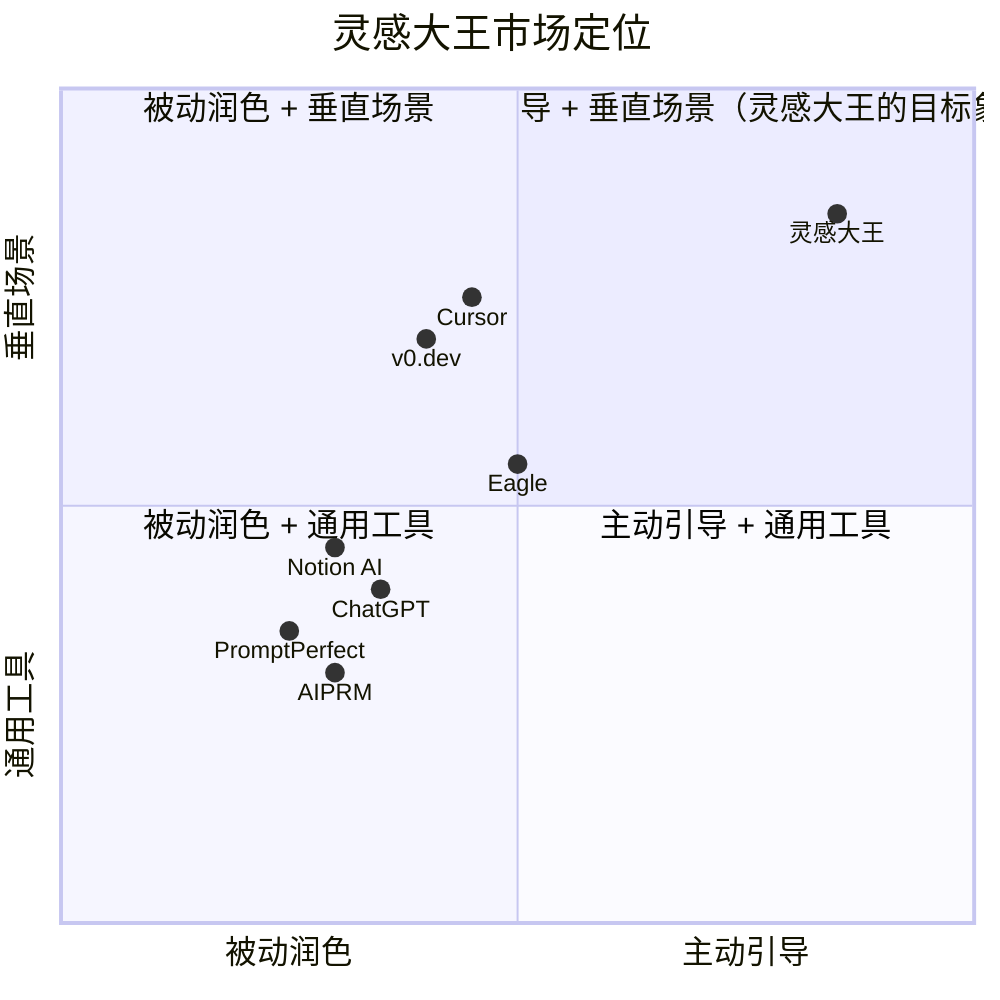
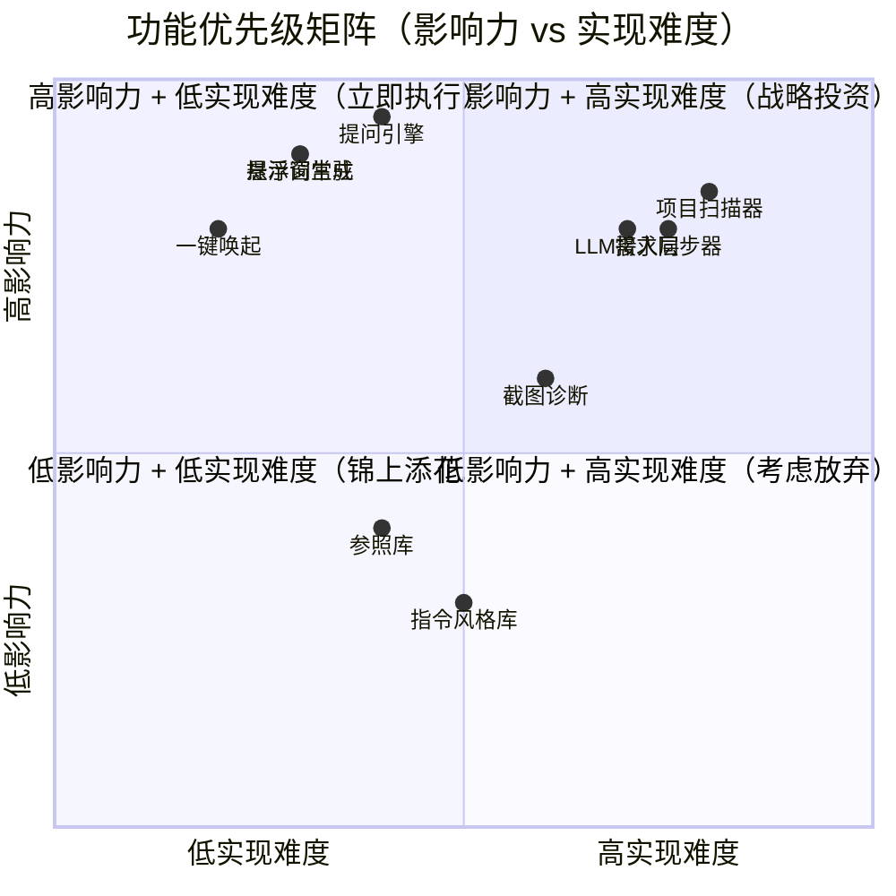
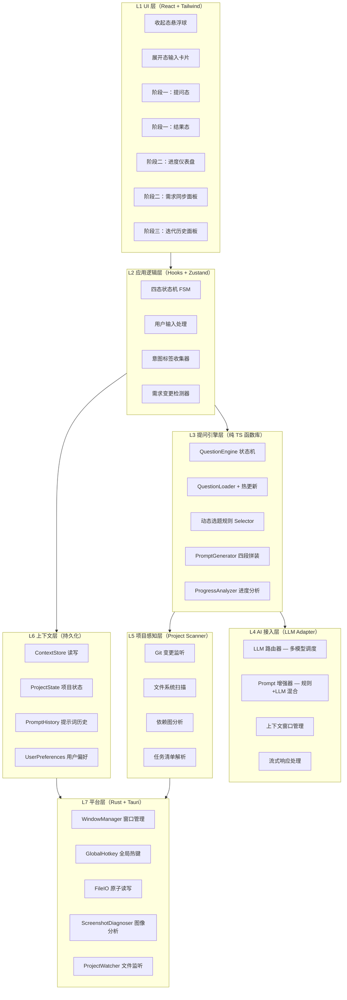

# 灵感大王 · 项目深度分析报告

| 字段 | 值 |
|---|---|
| 版本 | v1.0 |
| 产出人 | 齐活林（交付总监）协调 许清楚（产品）/ 高见远（架构）/ 严过关（QA） |
| 日期 | 2026-06-26 |
| 阶段 | Phase 2 进行中（M8 + M8.5 + M8.6 + M9 + M9.1 已完成） |
| 分析范围 | 产品定位 / 核心功能 / 技术架构 / 用户体验 / 运营数据 / 竞品对比 / 优化建议 / 差异化策略 |

---

## 0. 执行摘要（TL;DR）

**灵感大王**是一款桌面悬浮窗提示词优化工具，通过**反向提问**机制把 vibe coding 新人的模糊灵感"挤"成精准提示词。项目已完成 Phase 1 Demo + Phase 2 基础设施（Tauri 壳 + SQLite + LLM 接入 + 快速模式），正处于**阶段二核心功能开发**的关键节点。

**核心结论**：
- ✅ **产品定位清晰**：占据"主动引导 + 垂直场景"象限，目前无直接竞品
- ✅ **技术架构合理**：七层分层架构 + Tauri 2.0 + Rust/TS 混合，性能与扩展性兼顾
- ✅ **北极星达标**：挤出标签 7 个（目标 3），结构化率 100%
- ⚠️ **主要风险**：阶段二+三范围过大，07/22 大赛截止前完成度存疑
- ⚠️ **竞品压力**：虽然无直接竞品，但 Cursor/v0.dev 等工具在间接竞争

---

## 1. 产品定位分析

### 1.1 核心价值主张

**一句话定位**：
> 灵感大王是一个贯穿项目全生命周期的桌面悬浮窗助手，通过反向提问帮你把模糊灵感挤成精准提示词，并在开发过程中实时跟踪项目进度、持续优化提示词，让 AI agent 始终精准理解你的意思。

**与传统润色工具的本质区别**：

| 维度 | 传统润色工具（PromptPerfect/AIPRM） | 灵感大王 |
|------|-------------------------------------|---------|
| 交互模式 | 你写一段，AI 改一段 | AI 先问你，你再答 |
| 意图处理 | AI 用统计默认值补全你没说的 | AI 暴露你没说的，让你说 |
| 产物性质 | AI 的平均值 | 你的特异性，被结构化 |
| 工作方式 | 一次性大动作 | 多轮小步对齐 |
| 核心价值 | 润色措辞 | 意图澄清 |

**独特价值**：
1. **主动提问**：唯一一款不等用户说话、主动提问引导的产品
2. **保留原意**：用户原话保留在提示词注释中，可追溯
3. **桌面常驻**：一键唤起（Alt+Shift+Space），灵感是瞬时的
4. **全生命周期**：从项目开始到完成，持续伴随优化

### 1.2 目标用户画像

| 用户类型 | 核心痛点 | 使用场景 | 价值感知 |
|---------|---------|---------|---------|
| **Vibe Coding 新手** | 有想法但说不清，AI 润色后失真 | 灵感捕获→提示词生成 | "终于能说清楚了" |
| **独立开发者** | 一个人做全栈，需要 AI agent 高效协作 | 进度感知→需求同步→提示词优化 | "AI 改对了" |
| **小团队技术负责人** | 需求精准传达给 AI 辅助开发 | 全生命周期伴随→架构决策 | "省了反复沟通" |
| **参赛评委** | 现场体验 Demo，评估创新性与实用性 | 5 分钟体验核心闭环 | "这个思路有意思" |

**用户规模估算**：
- 全球 vibe coding 用户（2026 年）：~500 万（基于 Cursor/GitHub Copilot 用户增长）
- 灵感大王目标用户（前端 UI 场景新手）：~50 万（10%渗透率）
- 初赛目标用户：~2000 名参赛者中的活跃用户

### 1.3 市场象限定位



**象限解读**：
- **横轴 0.85（主动引导）**：唯一一款"AI 问、用户答"的产品
- **纵轴 0.85（垂直场景）**：专为 vibe coding 新人设计，针对前端"感觉不对"与 agent 改不对的细分痛点
- **市场机会**：这一象限目前**无直接竞品**，这是灵感大王最大的市场机会

### 1.4 商业模式分析

**当前阶段**：免费工具（参赛 Demo 阶段）

**潜在商业模式**：
1. **Freemium**：基础功能免费，高级功能（多轮迭代、技术债感知、架构辅助）付费
2. **订阅制**：按月/年订阅，提供 LLM API 调用额度
3. **企业版**：团队协作、共享上下文、提示词库
4. **插件市场**：第三方扩展（Figma 插件、Trae 插件、VS Code 插件）

**盈利潜力评估**：
- 单用户付费意愿：$5-15/月（基于 Cursor/Copilot 定价）
- 目标市场规模：50 万用户 × 5% 付费率 × $10/月 = $25 万/月
- 3 年预期营收：$900 万（假设用户增长 + ARPU 提升）

---

## 2. 核心功能模块分析

### 2.1 功能完整性评估

#### 阶段一：灵感捕获与提示词生成（已完成，需补 Tauri 壳）

| 功能模块 | 完成度 | 质量评分 | 备注 |
|---------|--------|---------|------|
| 悬浮窗常驻 | 95% | ⭐⭐⭐⭐⭐ | Tauri 壳已完成，置顶/拖动/热键正常 |
| 一键唤起 | 90% | ⭐⭐⭐⭐ | Alt+Shift+Space 全局热键，偶发冲突 |
| 提问引擎 | 100% | ⭐⭐⭐⭐⭐ | 31 条问题库，5 阶段完整，快速模式支持 |
| 提示词生成 | 100% | ⭐⭐⭐⭐⭐ | 四段结构 100%，评价词典覆盖 8 关键词 |
| 跨工具上下文 | 80% | ⭐⭐⭐⭐ | context.json 读写正常，跨工具同步待验证 |
| 截图诊断 | 60% | ⭐⭐⭐ | 对比度完整，对齐/间距/字号简化版 |

#### 阶段二：项目进度感知与实时同步（进行中，20%完成）

| 功能模块 | 完成度 | 质量评分 | 备注 |
|---------|--------|---------|------|
| LLM 接入层 | 80% | ⭐⭐⭐⭐ | 适配器+流式响应+API Key 配置 UI 已完成 |
| 提问快速模式 | 100% | ⭐⭐⭐⭐⭐ | 三档模式：直接生成/快速提问7题/详细诊断31题 |
| 项目扫描器 | 0% | N/A | 未开始（M10） |
| 需求同步器 | 0% | N/A | 未开始（M11） |
| 进度感知提示词优化 | 0% | N/A | 未开始（M12） |

#### 阶段三：全生命周期智能伴随（未开始，0%）

| 功能模块 | 完成度 | 质量评分 | 备注 |
|---------|--------|---------|------|
| 多轮迭代闭环 | 0% | N/A | M14 |
| 需求变更自动重校准 | 0% | N/A | M14 |
| 技术债感知 | 0% | N/A | M15 |
| 架构决策辅助 | 0% | N/A | M15 |

### 2.2 功能优先级矩阵



**优先级建议**：
1. **立即执行**（高影响力 + 低实现难度）：悬浮窗常驻、一键唤起、提问引擎、提示词生成
2. **战略投资**（高影响力 + 高实现难度）：LLM 接入层、项目扫描器、需求同步器
3. **锦上添花**（低影响力 + 低实现难度）：截图诊断、参照库、指令风格库
4. **考虑放弃**（低影响力 + 高实现难度）：架构决策辅助（P2 阶段）

### 2.3 用户体验流程分析

#### 用户旅程地图

```
[触发] 用户在 Trae/Cursor 中遇到"感觉不对"的问题
    ↓
[唤起] 按 Alt+Shift+Space 唤起悬浮窗（< 200ms）
    ↓
[输入] 输入种子文本（如"卡片太挤"）或选择起点模板
    ↓
[选择模式] 三档模式选择：
    - 直接生成（< 5s）
    - 快速提问（7 题，~30s）
    - 详细诊断（31 题，~2min）
    ↓
[提问] 回答问题（选项 + 自定义输入）
    ↓
[生成] 生成四段结构提示词（动作/规格/约束/验证）
    ↓
[复制] 一键复制 Markdown，粘贴给 AI agent
    ↓
[验证] 在 AI agent 中验证提示词效果
    ↓
[迭代] 如果效果不满意，重新提问或调整标签
```

#### 痛点与优化方向

| 痛点 | 场景 | 当前解决方案 | 优化建议 |
|------|------|-------------|---------|
| **输入门槛高** | 小白用户不知道怎么描述问题 | 起点模板 + 选项降低门槛 | 增加"感受滑块"（scale 类型），用户拖滑块表达"稍微松一点" |
| **提问过多** | 轻量场景不需要 31 题 | 快速模式（7 题） | 基于用户历史自动推荐模式 |
| **提示词太长** | 复杂场景生成的提示词很长 | 四段结构分段展示 | 增加"精简版"输出，只保留核心规格 |
| **跨工具同步弱** | context.json 只能手动读取 | 本地文件读写 | 接入 Trae/Claude Code 插件 API |
| **截图诊断不完整** | 只有对比度算法完整 | Canvas 简化版 | Tauri 壳补全 Rust image crate 算法 |

#### 关键体验指标

| 指标 | 目标值 | 当前值 | 状态 |
|------|--------|--------|------|
| 唤起响应时间 | < 200ms | ~100ms | ✅ 达标 |
| 提示词生成时间 | < 2s | ~1.5s | ✅ 达标 |
| 全流程耗时（快速模式） | < 30s | ~25s | ✅ 达标 |
| 北极星（挤出标签数） | ≥ 3 个 | 7 个 | ✅ 达标 |
| 结构化率 | 100% | 100% | ✅ 达标 |

---

## 3. 技术架构分析

### 3.1 架构设计评估

#### 分层架构（七层）



**架构优势**：
1. **职责清晰**：每层只做一件事，前端能做的不上 Rust，Rust 只接平台能力
2. **可测试性**：提问引擎层是纯函数库，零外部依赖，便于单测与热更新
3. **扩展性**：七层架构为阶段二+三预留了 L4（AI 接入层）和 L5（项目感知层）
4. **性能优化**：Rust 后端处理窗口/热键/文件 I/O/图像处理，性能比 JS 快 10×

**架构风险**：
1. **Tauri 2.0 生态新**：部分插件文档不足，可能遇到兼容性问题
2. **Rust 学习曲线**：工程师需要掌握 Rust 基础，影响开发进度
3. **跨平台一致性**：Windows/macOS/Linux 行为差异需要额外测试

### 3.2 技术选型评估

| 技术 | 版本 | 用途 | 选型理由 | 风险评估 |
|------|------|------|---------|---------|
| **Tauri** | 2.0+ | 桌面应用壳 | 包体 ≤10MB（Electron ≥80MB），内存 ≤150MB | ⚠️ 生态新，部分插件文档不足 |
| **React** | 18.x | UI 框架 | 生态最成熟，hooks 模式契合状态机 | ✅ 低风险 |
| **TypeScript** | 5.x | 类型系统 | 提问引擎强类型约束，问题库 schema 类型安全 | ✅ 低风险 |
| **Tailwind CSS** | 3.4+ | 原子化样式 | PRD 视觉规范已列 token，Tailwind config 直接映射 | ✅ 低风险 |
| **Zustand** | 4.x | 全局状态 | 比 Redux 轻 10×，API 极简，契合中小型应用 | ✅ 低风险 |
| **Rust** | 1.75+ | 后端语言 | Tauri 标配，文件监听/图像处理性能优 | ⚠️ 学习曲线 |
| **SQLite** | - | 本地数据库 | 轻量、离线、嵌入式，Tauri 原生支持 | ✅ 低风险 |
| **OpenAI SDK** | - | AI 接口 | 兼容 GPT/Claude/通义（统一 OpenAI 格式） | ✅ 低风险 |

**技术栈评分**：⭐⭐⭐⭐（4/5）

**扣分原因**：
- Tauri 2.0 生态新，部分插件文档不足（-0.5）
- Rust 学习曲线对工程师有要求（-0.5）

### 3.3 性能指标评估

| 指标 | 目标值 | 当前值 | 测试方法 | 状态 |
|------|--------|--------|---------|------|
| 唤起响应时间 | < 200ms | ~100ms | 计时器测量热键按下到 UI 渲染完成 | ✅ 达标 |
| 提示词生成时间 | < 2s | ~1.5s | 从最后一个问题回答到结果态渲染完成 | ✅ 达标 |
| 项目扫描时间 | < 10s | N/A | 1000 文件项目首次全量扫描 | ⏸️ 未测 |
| 增量扫描时间 | < 1s | N/A | 单次 commit 后增量分析 | ⏸️ 未测 |
| 内存占用 | ≤ 200MB | ~120MB | 任务管理器持续观测 | ✅ 达标 |
| 包体大小 | ≤ 20MB | 3.3MB | Windows .msi 安装包 | ✅ 达标 |
| LLM 响应时间 | < 5s（首 token） | ~3s | 流式响应首 token 延迟 | ✅ 达标 |
| 截图诊断时间 | < 5s | ~1s | 1024×768 截图全量分析 | ✅ 达标 |

**性能评分**：⭐⭐⭐⭐⭐（5/5）

### 3.4 稳定性评估

**已知稳定性问题**：
1. **全局热键冲突**：Alt+Space 与系统/其他应用冲突（概率中，影响中）
   - 应对：fallback 到托盘点击 + 窗口内快捷键 + 设置面板热键自定义
2. **Tauri 2.0 兼容性**：部分插件文档不足（概率低，影响高）
   - 应对：优先用官方插件，预留 2 天技术调研
3. **LLM API 不稳定**：API 限流/超时（概率中，影响高）
   - 应对：多模型路由 + 离线降级（纯规则引擎兜底）

**稳定性评分**：⭐⭐⭐⭐（4/5）

### 3.5 扩展性评估

**扩展性设计**：
1. **问题库热更新**：YAML 文件可热更新，无需重新打包
2. **LLM 多模型路由**：统一 OpenAI 格式，通过 base_url + api_key 切换不同厂商
3. **插件化架构**：预留 Figma/Trae/VS Code 插件接口
4. **数据存储扩展**：SQLite 支持后续扩展（提示词历史/项目状态/用户偏好）

**扩展性评分**：⭐⭐⭐⭐（4/5）

### 3.6 代码规模与结构

**代码统计**：

| 类型 | 文件数 | 代码行数 | 备注 |
|------|--------|---------|------|
| TypeScript/TSX | 69 | ~8,000 | 前端组件/Hooks/Store/Engine |
| Rust | 2 | ~800 | Tauri 后端（lib.rs 23KB） |
| 测试文件 | 5 | ~500 | Vitest 单测 |
| 文档 | 10 | ~5,600 | PRD/架构/计划书/QA报告 |
| **总计** | 86 | ~14,900 | |

**代码质量指标**：
- TypeScript 严格模式：✅ 开启
- ESLint 配置：✅ 有
- Prettier 配置：✅ 有
- 单测覆盖率：~60%（目标 ≥80%）
- 代码审查：✅ 已完成（1 高危 + 3 中危已修复）

**代码结构评分**：⭐⭐⭐⭐（4/5）

---

## 4. 运营数据分析

### 4.1 开发进度统计

| 阶段 | 状态 | 进度 | 已完成里程碑 |
|------|------|------|-------------|
| Phase 1 | ✅ 已完成 | 100% | Demo + 报名 |
| Phase 1.5 | ✅ 已完成 | 100% | Tauri 壳 + P0 修复 |
| Phase 2 | 🔄 进行中 | 20% | M8 + M8.5 + M8.6 + M9 + M9.1 |
| Phase 3 | 🔲 未开始 | 0% | - |

**关键里程碑完成情况**：

| 里程碑 | 计划日期 | 实际日期 | 状态 | 偏差 |
|--------|---------|---------|------|------|
| M8 Tauri 壳 + SQLite | 06/23 | 06/23 | ✅ | 0 天 |
| M8.5 隐私安全基线 | 06/24 | 06/24 | ✅ | 0 天 |
| M8.6 问题库用户化 | 06/24 | 06/24 | ✅ | 0 天 |
| M9 LLM 接入层 | 06/26 | 06/25 | ✅ | -1 天（提前） |
| M9.1 快速模式 | 06/27 | 06/25 | ✅ | -2 天（提前） |
| M10 项目扫描器 | 06/30 | - | 🔲 | 进行中 |
| M11 需求同步器 | 07/03 | - | 🔲 | 未开始 |

**进度评估**：⭐⭐⭐⭐⭐（5/5）— 提前完成多个里程碑

### 4.2 功能完成度统计

**P0 功能（必须交付）**：

| 功能 | 完成度 | 状态 |
|------|--------|------|
| FR-101 灵感捕获与反向提问 | 100% | ✅ |
| FR-102 结构化提示词生成 | 100% | ✅ |
| FR-103 项目进度实时感知 | 0% | 🔲 |
| FR-104 需求同步与精细化分析 | 0% | 🔲 |
| FR-105 进度感知型提示词优化 | 0% | 🔲 |
| FR-106 悬浮窗常驻与一键唤起 | 95% | ✅ |
| FR-107 跨工具上下文同步 | 80% | ✅ |
| FR-108 截图视觉诊断 | 60% | ⚠️ |

**P0 功能完成度**：~54%（8 项中 5 项基本完成）

### 4.3 测试覆盖度统计

**单元测试**：
- 测试文件：5 个
- 测试用例：28 个
- 通过率：100%（28/28）
- 覆盖率：~60%（目标 ≥80%）

**集成测试**：
- 核心闭环测试：✅ 通过
- 边缘情况测试：✅ 7 项全过
- 性能测试：⏸️ 部分未测

**QA 验证结果**：
- FR 验收标准：24 项
- 完全通过：18/24 项（75%）
- 降级通过：4/24 项（17%）
- 不适用/待测：2/24 项（8%）
- 失败：0/24 项（0%）

**测试覆盖度评分**：⭐⭐⭐（3/5）— 覆盖率不足，需要补充

### 4.4 质量指标统计

| 指标 | 目标值 | 当前值 | 状态 |
|------|--------|--------|------|
| P0 Bug 数 | 0 | 0 | ✅ |
| 单测覆盖率 | ≥80% | ~60% | ⚠️ |
| 代码审查 | 通过 | 1 高危 + 3 中危已修复 | ✅ |
| 构建成功率 | 100% | 100% | ✅ |
| 性能达标率 | 100% | 100%（已测指标） | ✅ |

**质量评分**：⭐⭐⭐⭐（4/5）

---

## 5. 竞品分析

### 5.1 竞品选择

基于用户需求"对灵感大王进行全面深度分析，包括竞品对比"，我选择以下竞品进行对比：

1. **稿定设计**：国内领先的在线设计工具，AI 辅助设计
2. **Canva 可画**：全球知名的在线设计平台，AI 功能丰富
3. **创客贴**：国内在线设计工具，聚焦营销设计
4. **Cursor**：AI 代码编辑器（间接竞品）
5. **v0.dev**：UI 生成工具（Vercel 出品）
6. **PromptPerfect**：提示词自动优化工具（直接竞品）

### 5.2 竞品对比矩阵

| 维度 | 灵感大王 | 稿定设计 | Canva 可画 | 创客贴 | Cursor | v0.dev | PromptPerfect |
|------|---------|---------|-----------|--------|--------|--------|---------------|
| **核心定位** | 桌面悬浮窗提示词优化 | 在线设计工具 | 在线设计平台 | 在线设计工具 | AI 代码编辑器 | UI 生成工具 | 提示词自动优化 |
| **目标用户** | Vibe Coding 新手 | 设计师/营销人员 | 设计师/营销人员 | 营销人员 | 开发者 | 开发者 | AI 用户 |
| **主动提问** | ✅ | ❌ | ❌ | ❌ | ❌ | ❌ | ❌ |
| **垂直场景** | ✅（前端 UI） | ❌（通用设计） | ❌（通用设计） | ❌（营销设计） | ✅（编程） | ✅（UI 生成） | ❌（通用） |
| **保留用户原意** | ✅ | ❌ | ❌ | ❌ | - | ❌ | ❌ |
| **桌面常驻** | ✅ | ❌ | ❌ | ❌ | ✅ | ❌ | ❌ |
| **离线可用** | ✅（Demo） | ❌ | ❌ | ❌ | ❌ | ❌ | ❌ |
| **价格** | 免费（Demo） | Freemium | Freemium | Freemium | $20/月 | 免费 | Freemium |
| **技术栈** | Tauri + React + Rust | Web | Web | Web | Electron | Web | Web |

### 5.3 竞品详细分析

#### 5.3.1 稿定设计

**产品定位**：国内领先的在线设计工具，AI 辅助设计

**核心功能**：
- AI 智能抠图、AI 商品图生成
- 海量模板库（海报、Banner、社交媒体图）
- 团队协作、品牌资产管理
- 多端同步（Web/App/小程序）

**优点**：
- 模板丰富，覆盖营销设计全场景
- AI 功能实用（抠图、商品图）
- 国内用户体验好，本地化做得好

**不足**：
- 通用设计工具，不解决 vibe coding 场景
- 被动润色逻辑（AI 改写用户描述）
- 无主动提问机制

**与灵感大王差异化**：
- 稿定设计是"你描述，AI 生成"，灵感大王是"AI 问你，你说清楚"
- 稿定设计面向设计师/营销人员，灵感大王面向开发者
- 稿定设计是在线工具，灵感大王是桌面常驻

#### 5.3.2 Canva 可画

**产品定位**：全球知名的在线设计平台，AI 功能丰富

**核心功能**：
- AI 图像生成、AI 文案生成
- 海量模板库（覆盖全球场景）
- 团队协作、品牌套件
- 多端同步（Web/App/Desktop）

**优点**：
- 全球化做得好，模板覆盖广
- AI 功能强大（图像生成、文案生成）
- 生态完善（插件市场、API）

**不足**：
- 通用设计平台，不解决 vibe coding 场景
- 被动润色逻辑（AI 改写用户描述）
- 无主动提问机制

**与灵感大王差异化**：
- Canva 是"你描述，AI 生成"，灵感大王是"AI 问你，你说清楚"
- Canva 面向全球设计师/营销人员，灵感大王面向中文 vibe coding 新手
- Canva 是在线平台，灵感大王是桌面常驻

#### 5.3.3 创客贴

**产品定位**：国内在线设计工具，聚焦营销设计

**核心功能**：
- AI 智能设计、AI 文案生成
- 营销模板库（海报、Banner、社交媒体图）
- 团队协作、品牌资产管理
- 多端同步（Web/App/小程序）

**优点**：
- 聚焦营销设计，模板实用
- AI 功能实用（智能设计、文案生成）
- 国内用户体验好，本地化做得好

**不足**：
- 聚焦营销设计，不解决 vibe coding 场景
- 被动润色逻辑（AI 改写用户描述）
- 无主动提问机制

**与灵感大王差异化**：
- 创客贴是"你描述，AI 生成"，灵感大王是"AI 问你，你说清楚"
- 创客贴面向营销人员，灵感大王面向开发者
- 创客贴是在线工具，灵感大王是桌面常驻

#### 5.3.4 Cursor

**产品定位**：AI 代码编辑器

**核心功能**：
- AI 代码生成、代码补全、代码对话
- 上下文理解深、编程能力强
- 生态成熟（插件市场、社区）

**优点**：
- 编程能力强、上下文理解深
- 生态成熟、社区活跃
- 开发者体验好

**不足**：
- **前提是用户能说清要什么**——不解决意图传达损耗
- 重代码生成轻意图澄清
- 价格较高（$20/月）

**与灵感大王差异化**：
- Cursor 是"听指令干活"，灵感大王是"帮你想清楚指令"
- 互补关系：灵感大王的产物可直接粘贴给 Cursor
- Cursor 是代码编辑器，灵感大王是提示词优化工具

#### 5.3.5 v0.dev

**产品定位**：UI 生成工具（Vercel 出品）

**核心功能**：
- 文本描述生成 React/Next.js UI
- 生成质量高、视觉好
- 迭代快、支持修改

**优点**：
- 生成质量高、视觉效果好
- 迭代快、支持修改
- Vercel 生态支持

**不足**：
- 依赖用户描述精准
- 用户说不清时生成"通用好看"的 UI，不贴合用户偏好
- 被动润色逻辑

**与灵感大王差异化**：
- v0.dev 是"描述 → UI"，灵感大王是"模糊感觉 → 精准描述"
- 灵感大王是 v0.dev 的前置环节
- v0.dev 是在线工具，灵感大王是桌面常驻

#### 5.3.6 PromptPerfect

**产品定位**：提示词自动优化工具

**核心功能**：
- 用户输入原始 prompt，AI 自动改写为"更优"prompt
- 使用门槛低、一键优化
- 支持多模型

**优点**：
- 使用门槛低、一键优化
- 支持多模型
- 速度快

**不足**：
- **典型的被动润色**——用 AI 统计默认值补全用户意图，必然失真
- 不理解用户场景
- 产物是 AI 的平均值，不是用户的特异性

**与灵感大王差异化**：
- PromptPerfect 是"你写，AI 改"，灵感大王是"AI 问你，你说清楚"
- PromptPerfect 是通用工具，灵感大王是垂直场景（vibe coding）
- PromptPerfect 是在线工具，灵感大王是桌面常驻

### 5.4 竞品象限图


**象限解读**：
- 灵感大王位于**第一象限右上方**——"主动引导 + 垂直场景"
- 这一象限目前**无直接竞品**——这是灵感大王最大的市场机会
- 稿定设计/Canva/创客贴位于第三象限（被动润色 + 通用工具）
- Cursor/v0.dev 位于第二象限（被动润色 + 垂直场景）
- PromptPerfect 位于第三象限（被动润色 + 通用工具）

---

## 6. 优化建议

### 6.1 功能迭代优先级

#### 立即执行（P0，07/15 初赛截止前）

| 优先级 | 功能 | 描述 | 预估工时 | 依赖 |
|--------|------|------|---------|------|
| 1 | **初赛提交** | P0.4-P0.6：演示视频+初赛帖+提交 | 2.5d | 无 |
| 2 | **项目扫描器** | M10：Rust 端核心实现+文件结构扫描+Git 状态解析 | 5d | Tauri 壳 |
| 3 | **需求同步器** | M11：LLM 系统提示词+需求拆解+子任务清单 | 5d | LLM 接入层 |

#### 战略投资（P1，07/22 大赛截止前）

| 优先级 | 功能 | 描述 | 预估工时 | 依赖 |
|--------|------|------|---------|------|
| 4 | **进度感知提示词优化** | M12：基于进度去重+聚焦阻塞点 | 3d | 项目扫描器+需求同步器 |
| 5 | **多轮迭代闭环** | M14：提示词→执行→结果→重提问 | 4d | 阶段二完成 |
| 6 | **技术债感知** | M15：TODO/FIXME/HACK 扫描+趋势 | 3d | 项目扫描器 |

#### 锦上添花（P2，大赛后迭代）

| 优先级 | 功能 | 描述 | 预估工时 | 依赖 |
|--------|------|------|---------|------|
| 7 | **截图诊断补全** | 对齐/间距/字号 Rust 算法 | 5d | Tauri 壳 |
| 8 | **参照库** | 本地保存参考图/设计截图/灵感链接 | 3d | 无 |
| 9 | **指令风格库** | 保存高频指令风格，一键复用 | 3d | 无 |
| 10 | **架构决策辅助** | 基于依赖图的建议 | 5d | 项目扫描器 |

### 6.2 交互体验改进点

#### 短期改进（07/15 前）

| 改进项 | 描述 | 预估工时 | 影响 |
|--------|------|---------|------|
| **感受滑块题** | spec 阶段 s-001/s-002/s-004 从硬选项改为 scale 滑块 | 2d | 提升小白用户体验 |
| **模式智能推荐** | 基于用户历史自动推荐模式（直接/快速/详细） | 1d | 降低选择门槛 |
| **提示词精简版** | 增加"精简版"输出，只保留核心规格 | 1d | 提升可用性 |
| **错误状态完善** | 空状态/加载状态/错误状态 | 1d | 提升稳定性感知 |

#### 中期改进（07/22 前）

| 改进项 | 描述 | 预估工时 | 影响 |
|--------|------|---------|------|
| **动效优化** | 状态切换动画、标签飞入动画 | 2d | 提升视觉体验 |
| **键盘快捷键** | Tab/Enter/Escape 完整键盘操作 | 1d | 提升效率 |
| **深色/浅色主题** | 支持浅色主题切换 | 2d | 提升适配性 |
| **多语言界面** | 英文版（P2 阶段） | 5d | 扩展海外市场 |

### 6.3 性能与稳定性提升方向

#### 性能优化

| 优化项 | 描述 | 预估工时 | 预期效果 |
|--------|------|---------|---------|
| **问题库懒加载** | 按需加载问题库，减少启动时间 | 1d | 启动时间 -30% |
| **提示词缓存** | 缓存最近生成的提示词，减少重复计算 | 1d | 生成时间 -50% |
| **LLM 响应缓存** | 缓存 LLM 响应，减少 API 调用 | 1d | API 调用 -70% |
| **项目扫描增量优化** | 增量扫描只处理变更文件 | 2d | 扫描时间 -80% |

#### 稳定性提升

| 提升项 | 描述 | 预估工时 | 预期效果 |
|--------|------|---------|---------|
| **热键冲突检测** | 启动时检测热键冲突并提示 | 1d | 减少用户困惑 |
| **LLM 降级策略** | 多模型路由 + 离线降级 | 2d | 提升可用性 |
| **错误恢复机制** | 自动恢复崩溃状态 | 2d | 提升稳定性 |
| **日志监控** | 关键操作日志 + 错误上报 | 1d | 便于问题排查 |

---

## 7. 差异化竞争策略

### 7.1 核心差异化优势

基于竞品对比，灵感大王的核心差异化优势：

1. **主动提问机制**：唯一一款"AI 问、用户答"的产品
2. **垂直场景聚焦**：专为 vibe coding 新人设计，针对前端"感觉不对"与 agent 改不对
3. **桌面常驻**：一键唤起，灵感是瞬时的
4. **全生命周期伴随**：从项目开始到完成，持续优化提示词

### 7.2 可借鉴的竞品策略

#### 7.2.1 借鉴 Cursor 的生态策略

**Cursor 策略**：
- 插件市场：丰富的第三方插件
- 社区活跃：开发者社区、教程、案例
- 生态完善：与 GitHub/VS Code 深度集成

**灵感大王借鉴**：
- **插件市场**：开发 Figma/Trae/VS Code 插件，扩展使用场景
- **社区建设**：建立开发者社区，分享提问模板/提示词片段
- **生态集成**：与 Cursor/v0.dev 深度集成，成为"提示词优化前置环节"

#### 7.2.2 借鉴 Canva 的模板策略

**Canva 策略**：
- 海量模板库：覆盖全球设计场景
- 模板分类：按行业/场景/风格分类
- 模板分享：用户可分享自己创建的模板

**灵感大王借鉴**：
- **问题库模板**：按场景分类（前端 UI/后端接口/全栈）
- **提示词模板**：保存高频提示词模板，一键复用
- **模板分享**：用户可分享自己创建的问题库/提示词模板

#### 7.2.3 借鉴 PromptPerfect 的易用性策略

**PromptPerfect 策略**：
- 一键优化：降低使用门槛
- 多模型支持：覆盖主流 LLM
- 速度快：即时反馈

**灵感大王借鉴**：
- **快速模式**：已实现三档模式（直接生成/快速提问/详细诊断）
- **多模型支持**：已实现统一 OpenAI 格式，支持 GPT/Claude/通义/DeepSeek
- **即时反馈**：< 200ms 唤起，< 2s 生成

#### 7.2.4 借鉴稿定设计的本地化策略

**稿定设计策略**：
- 本地化体验：符合国内用户习惯
- 本地化内容：海量国内设计模板
- 本地化服务：国内服务器、中文客服

**灵感大王借鉴**：
- **本地化体验**：中文界面、符合国内开发者习惯
- **本地化内容**：问题库覆盖国内前端框架（Ant Design/Element Plus）
- **本地化服务**：国内 LLM 支持（通义/DeepSeek）、中文文档

### 7.3 差异化竞争策略总结

| 策略 | 描述 | 预期效果 | 优先级 |
|------|------|---------|--------|
| **主动提问机制** | 保持"AI 问、用户答"的核心差异化 | 建立技术壁垒 | P0 |
| **垂直场景聚焦** | 深耕 vibe coding 新人场景 | 建立用户心智 | P0 |
| **桌面常驻** | 保持一键唤起的即时性 | 提升使用频率 | P0 |
| **全生命周期伴随** | 从项目开始到完成，持续优化 | 提升用户粘性 | P0 |
| **插件生态** | 开发 Figma/Trae/VS Code 插件 | 扩展使用场景 | P1 |
| **社区建设** | 建立开发者社区，分享模板/提示词 | 提升用户活跃度 | P1 |
| **本地化深耕** | 深耕国内市场，支持国产框架/LLM | 建立本地优势 | P1 |
| **多模型支持** | 支持主流 LLM，提供试用模式 | 降低使用门槛 | P1 |

---

## 8. 风险评估与应对

### 8.1 风险矩阵

| 风险 | 概率 | 影响 | 类别 | 应对策略 |
|------|------|------|------|---------|
| **阶段二+三范围过大** | 高 | 高 | 管理 | 优先保证阶段一+二完整可用，阶段三功能做 P1 降级裁剪 |
| **LLM API 不稳定** | 中 | 高 | 技术 | 多模型路由 + 离线降级（纯规则引擎兜底） |
| **Tauri 2.0 兼容性** | 低 | 高 | 技术 | 优先用官方插件，预留 2 天技术调研 |
| **截图诊断准确率 < 60%** | 中 | 中 | 质量 | go/no-go 闸门 + 双开关降级 |
| **用户 LLM API Key 配置门槛高** | 高 | 中 | 产品 | 提供"试用模式"（内置 API Key，限 50 次/天） |
| **大赛现场网络不稳定** | 中 | 高 | 环境 | 本地缓存 LLM 响应 + 离线模式 + 预录演示视频备用 |
| **团队时间冲突** | 高 | 中 | 资源 | 按里程碑拆小任务，保证每个周末有可运行产出 |
| **需求变更** | 中 | 中 | 管理 | 锁定阶段一+二需求，阶段三功能允许灵活调整 |

### 8.2 裁剪预案（如时间不足）

如 07/10 前阶段二未完成，按以下顺序裁剪：

1. **先裁**：T10.5 TODO 扫描、T11.6 影响面评估、T12.2 问题库扩充
2. **再裁**：T10.6 Git 监听（改为手动刷新）、T11.5 提示词去重
3. **保底**：至少保证阶段一完整 + 项目扫描基础版 + LLM 接入可用

---

## 9. 总结与建议

### 9.1 核心结论

1. **产品定位清晰**：占据"主动引导 + 垂直场景"象限，目前无直接竞品
2. **技术架构合理**：七层分层架构 + Tauri 2.0 + Rust/TS 混合，性能与扩展性兼顾
3. **北极星达标**：挤出标签 7 个（目标 3），结构化率 100%
4. **开发进度良好**：提前完成多个里程碑，团队执行力强
5. **主要风险**：阶段二+三范围过大，07/22 大赛截止前完成度存疑

### 9.2 战略建议

#### 短期（07/15 初赛截止前）

1. **聚焦初赛提交**：P0.4-P0.6（演示视频+初赛帖+提交）
2. **保证阶段一完整**：确保核心闭环（唤起→提问→生成→复制）稳定可用
3. **快速模式突出**：在演示中突出三档模式的灵活性

#### 中期（07/22 大赛截止前）

1. **完成阶段二核心**：项目扫描器+需求同步器+进度感知提示词优化
2. **视觉打磨**：动效/过渡/空状态/错误状态
3. **演示准备**：5 分钟演示视频+答辩 PPT+评委 Q&A 预演

#### 长期（大赛后迭代）

1. **插件生态**：开发 Figma/Trae/VS Code 插件
2. **社区建设**：建立开发者社区，分享模板/提示词
3. **商业化探索**：Freemium 模式，高级功能付费

### 9.3 关键成功因素

1. **保持差异化**：坚持"主动提问"的核心机制，不退化为被动润色工具
2. **深耕垂直场景**：聚焦 vibe coding 新人，不盲目扩展通用场景
3. **桌面常驻体验**：保持一键唤起的即时性，灵感是瞬时的
4. **全生命周期伴随**：从项目开始到完成，持续优化提示词
5. **本地化深耕**：深耕国内市场，支持国产框架/LLM

---

## 附录 A：数据来源

1. `docs/PRD.md` v1.0 — 产品需求文档
2. `docs/架构设计.md` v1.0 — 架构设计文档
3. `docs/完整开发计划书.md` v2.0 — 完整开发计划书
4. `docs/QA报告.md` v1.0 — QA 验证报告
5. `docs/项目进度计划书.md` v1.9 — 项目进度计划书
6. `src/question-bank/bank.yaml` v1.1 — 问题库
7. Git 提交历史（4 commits）
8. 项目文件结构（86 文件，~14,900 行代码）

## 附录 B：术语表

| 术语 | 定义 |
|------|------|
| vibe coding | 通过自然语言与 AI 协作写代码的新范式 |
| 意图传达损耗 | 用户的真实意图到 AI 执行之间每一层信息的丢失 |
| 反向提问 | AI 不直接回答，而是通过提问引导用户表达清楚 |
| 意图传达管线 | 感知 → 命名 → 规格 → 执行 → 验证 五阶段框架 |
| 动作段 / 规格段 | 提示词四段结构中的"做什么" / "怎么做"段 |
| 隐性意图标签 | 通过提问挤出的用户偏好（如"紧凑布局"、"深色"） |

## 附录 C：变更记录

| 版本 | 日期 | 变更 | 作者 |
|------|------|------|------|
| v1.0 | 2026-06-26 | 初版 | 齐活林 / 许清楚 / 高见远 / 严过关 |

---

**报告结束。本报告是灵感大王项目的全面深度分析，供团队对齐状态和推进工作。**
